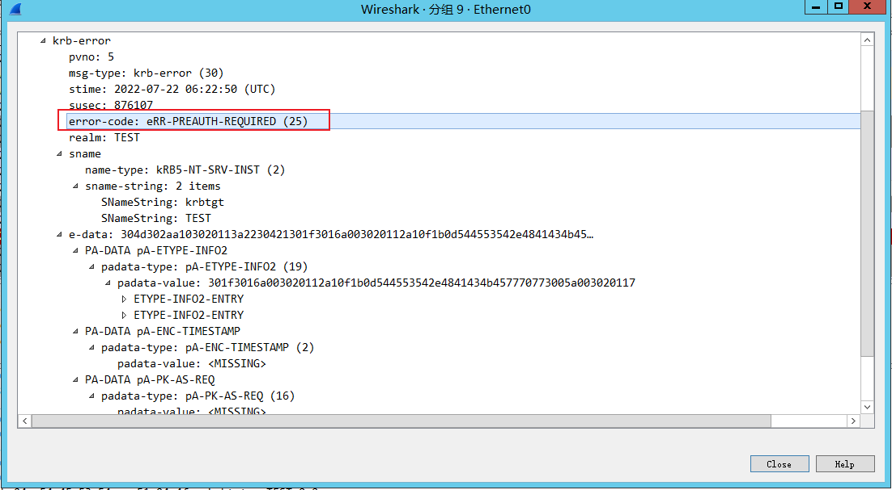

# 前言

之前《理解Windows认证》对整体的windows认证有了一个整体的框架，但是很多细节都没有。这次看了

`https://daiker.gitbook.io/windows-protocol/`在数据包层面加深认识

# Kerberos协议的概述

**简化的kerberos认证过程：**


1. AS_REQ: Client向KDC发起AS_REQ,请求凭据是Client hash加密的时间戳

2. AS_REP: KDC使用Client hash进行解密，如果结果正确就返回用krbtgt hash加密的TGT票据，TGT里面包含PAC,PAC包含Client的sid，Client所在的组。

3. TGS_REQ: Client凭借TGT票据向KDC发起针对特定服务的TGS_REQ请求

4. TGS_REP: KDC使用krbtgt hash进行解密，如果结果正确，就返回用服务hash 加密的TGS票据(这一步不管用户有没有访问服务的权限，只要TGT正确，就返回TGS票据)

5. AP_REQ: Client拿着TGS票据去请求服务

6. AP_REP: 服务使用自己的hash解密TGS票据。如果解密正确，就拿着PAC去KDC那边问Client有没有访问权限，域控解密PAC。获取Client的sid，以及所在的组，再根据该服务的ACL，判断Client是否有访问服务的权限。

# AS_REQ


完整的`AS_REQ`由四部分组成，下面是对每一部分的具体说明

## 1.pvno

`kerberos`版本号

## 2.msg-type

类型，AS_REQ对应的就是KRB_AS_REQ(0x0a)

## 3.padata

主要是一些认证信息。一个列表，包含若干个认证消息用于认证r。每个认证消息有type和value。


在AS_REQ阶段主要用到的Type有两个

1. `ENC_TIMESTAMP`

这个是预认证，就是用用户hash加密时间戳，作为value 发送给AS服务器。然后AS服务器那边有用户hash，使用用户hash进行解密，获得时间戳，如果能解密，且时间戳在一定的范围内，则证明认证通过

2. `PA_PAC_REQUEST`

这个是启用PAC支持的扩展。PAC包含在AS_REQ的响应body(AS_REP)。这里的value对应的是`include=true`或者`include=false`(KDC根据include的值来判断返回的票据中是否携带PAC)。

其余的Type:

```
NONE = 0,
TGS_REQ = 1,
AP_REQ = 1,
ENC_TIMESTAMP = 2,
PW_SALT = 3,
ENC_UNIX_TIME = 5,
SANDIA_SECUREID = 6,
SESAME = 7,
OSF_DCE = 8,
CYBERSAFE_SECUREID = 9,
AFS3_SALT = 10,
ETYPE_INFO = 11,
SAM_CHALLENGE = 12,
SAM_RESPONSE = 13,
PK_AS_REQ_19 = 14,
PK_AS_REP_19 = 15,
PK_AS_REQ_WIN = 15,
PK_AS_REQ = 16,
PK_AS_REP = 17,
PA_PK_OCSP_RESPONSE = 18,
ETYPE_INFO2 = 19,
USE_SPECIFIED_KVNO = 20,
SVR_REFERRAL_INFO = 20,
SAM_REDIRECT = 21,
GET_FROM_TYPED_DATA = 22,
SAM_ETYPE_INFO = 23,
SERVER_REFERRAL = 25,
TD_KRB_PRINCIPAL = 102,
PK_TD_TRUSTED_CERTIFIERS = 104,
PK_TD_CERTIFICATE_INDEX = 105,
TD_APP_DEFINED_ERROR = 106,
TD_REQ_NONCE = 107,
TD_REQ_SEQ = 108,
PA_PAC_REQUEST = 128,
S4U2SELF = 129,
PA_PAC_OPTIONS = 167,
PK_AS_09_BINDING = 132,
CLIENT_CANONICALIZED = 133
```

## 4.req_body


- `kdc-options` 一些`flag` 字段

```
VALIDATE = 0x00000001,
RENEW = 0x00000002,
UNUSED29 = 0x00000004,
ENCTKTINSKEY = 0x00000008,
RENEWABLEOK = 0x00000010,
DISABLETRANSITEDCHECK = 0x00000020,
UNUSED16 = 0x0000FFC0,
CANONICALIZE = 0x00010000,
CNAMEINADDLTKT = 0x00020000,
OK_AS_DELEGATE = 0x00040000,
UNUSED12 = 0x00080000,
OPTHARDWAREAUTH = 0x00100000,
PREAUTHENT = 0x00200000,
INITIAL = 0x00400000,
RENEWABLE = 0x00800000,
UNUSED7 = 0x01000000,
POSTDATED = 0x02000000,
ALLOWPOSTDATE = 0x04000000,
PROXY = 0x08000000,
PROXIABLE = 0x10000000,
FORWARDED = 0x20000000,
FORWARDABLE = 0x40000000,
RESERVED = 0x80000000
```

- `cname`

  `PrincipalName` 类型。`PrincipalName`包含type和value。

  - `KRB_NT_PRINCIPAL = 1 means just the name of the principal 如dailker`
  - `KRB_NT_SRV_INST = 2 service and other unique instance (krbtgt) 如krbtgt，cifs`
  - `KRB_NT_ENTERPRISE_PRINCIPAL = 10 如 user@domain.com`

- `sname`

  `PrincipalName` 类型

  在`AS_REQ`里面`sname`是`krbtgt`，类型是`KRB_NT_SRV_INST`

- `realm`   域名

- `from`     发送时间

- `till`        

  到期时间，`rubeus`和`kekeo`都是`20370913024805Z`，这个可以作为`特征`来检测工具。

- `nonce`

  随机生成的一个数`kekeo/mimikatz` `nonce`是`12381973`，`rubeus nonce`是`1818848256`，这个也可以用来作为`特征`检测工具。

- `etype` 加密类型，有:

```
des_cbc_crc = 1,
des_cbc_md4 = 2,
des_cbc_md5 = 3,
des3_cbc_md5 = 5,
des3_cbc_sha1 = 7,
dsaWithSHA1_CmsOID = 9,
md5WithRSAEncryption_CmsOID = 10,
sha1WithRSAEncryption_CmsOID = 11,
rc2CBC_EnvOID = 12,
rsaEncryption_EnvOID = 13,
rsaES_OAEP_ENV_OID = 14,
des_ede3_cbc_Env_OID = 15,
des3_cbc_sha1_kd = 16,
aes128_cts_hmac_sha1 = 17,
aes256_cts_hmac_sha1 = 18,
rc4_hmac = 23,
rc4_hmac_exp = 24,
subkey_keymaterial = 65
```

- `addresses` 用户机器的`NetBios`用户名

# AS_REP

KDC使用用户 hash进行解密，如果结果正确返回用`krbtgt hash`加密的TGT票据，TGT里面包含PAC,PAC包含用户的sid，用户所在的组。


详细的`AS_REP`数据包


（接下来只对没有说到的进行介绍）

## 1.msg-type

AS_REQ的响应body对应的就是KRB_AS_REP(0x0b)

## 2.crealm 

所在域的域名

## 3.cname

发起请求的用户名

## 4.ticket

这个ticket用于TGS_REQ的认证。是加密的，用户不可读取里面的内容。在AS_REQ请求里面是，是使用krbtgt的hash进行加密的，因此如果我们拥有krbtgt的hash就可以自己制作一个ticket，既黄金票据。

## 5.enc_part

这部分使用用户`hash`是可以解密的，解密能够得到`session key`，作为下阶段的认证秘钥

# 工具生成的票据

凭据里面最核心的东西是session-key和加密的ticket。

正常我们用工具生成的凭据是`.ccache`和`.kirbi`后缀的，用`mimikatz，kekeo，rubeus`生成的凭据是以`.kirbi`后缀的。`impacket` 生成的凭据的后缀是`.ccache`。两种票据主要包含的都是`session-key`和加密的`ticket`，因此可以相互转化。

以kirbi为例介绍下该结构体:

```
 KRB-CRED::= [APPLICATION 22] SEQUENCE {
   pvno[0] INTEGER(5),
   msg-type[1] INTEGER(22),
   tickets[2] SEQUENCE OF Ticket,
   enc-part[3] EncryptedData -- EncKrbCredPart
}
```

其中ticket来自于KRB_AS_REP部分的ticket

```
EncKrbCredPart  ::= [APPLICATION 29] SEQUENCE {
   ticket-info     [0] SEQUENCE OF KrbCredInfo,  //这里就只用到这个
   nonce           [1] UInt32 OPTIONAL,
   timestamp       [2] KerberosTime OPTIONAL,
   usec            [3] Microseconds OPTIONAL,
   s-address       [4] HostAddress OPTIONAL,
   r-address       [5] HostAddress OPTIONAL
}
```

ticket-info部分的主要内容是session-key，来自于用户hash解密enc_part的部分

```
KrbCredInfo     ::= SEQUENCE {
  key             [0] EncryptionKey,      sessionKey
  prealm          [1] Realm OPTIONAL,  //对应的是realm
  pname           [2] PrincipalName OPTIONAL, // 对应的是cname
  flags           [3] TicketFlags OPTIONAL, 
  authtime        [4] KerberosTime OPTIONAL, //not require
  starttime       [5] KerberosTime OPTIONAL, // 
  endtime         [6] KerberosTime OPTIONAL,
  renew-till      [7] KerberosTime OPTIONAL,
  srealm          [8] Realm OPTIONAL, //对应的是realm
  sname           [9] PrincipalName OPTIONAL, // 对应的是sname
  caddr           [10] HostAddresses OPTIONAL
}
```

# 相关的安全问题


## 1.Pass the hash 和 Pass the key

在进行认证的时候，是用用户hash加密时间戳，即使在使用密码进行登录的情况下，也是先把密码加密成hash，再进行认证。因此在只有用户hash，没有明文密码的情况下也是可以进行认证的。不管是rubeus还是impacket里面的相关脚本都是支持直接使用hash进行认证。其中，如果hash的ntlm hash，然后加密方式是rc4，这种就算做是`pass the hash`，如果是hash是aes key(使用`sekurlsa::ekeys`导出来)，就算是`pass the key`。在很多地方，不支持rc4加密方式的时候，使用pass the key不失为一种好方法。

## 2.用户名枚举

当用户名密码不正确时，`krb-error`返回的错误码不同

- 当用户名存在，密码错误的情况下



- 当用户名不存在时


由此通过识别错误码不同，即可进行用户名枚举

## 3.Password  Spraying

在已知用户名存在时

- 密码错误的情况


- 密码正确的情况下：

详细的`AS_REP`数据包


这个时候就可以进行密码爆破了，但是在实践中，许多渗透测试人员和攻击者通常都会使用一种被称为“密码喷洒（Password Spraying）”的技术来进行测试和攻击。对密码进行喷洒式的攻击，这个叫法很形象，因为它属于自动化密码猜测的一种。这种针对所有用户的自动密码猜测通常是为了避免帐户被锁定，因为针对同一个用户的连续密码猜测会导致帐户被锁定。所以只有对所有用户同时执行特定的密码登录尝试，才能增加破解的概率，消除帐户被锁定的概率。普通的爆破就是用户名固定，爆破密码，但是密码喷洒，是用固定的密码去跑用户名。

## 4.AS-REPRoasting

对于域用户，如果设置了选项”Do not require Kerberos preauthentication”，此时向域控制器的88端口发送AS_REQ请求，对收到的AS_REP内容(enc-part底下的ciper，因为这部分是使用用户hash加密session-key，我们通过进行离线爆破就可以获得用户hash)重新组合，能够拼接成”Kerberos 5 AS-REP etype 23”(18200)的格式，接下来可以使用hashcat对其破解，最终获得该用户的明文口令

## 5.黄金票据

在AS_REP里面的ticket的encpart是使用krbtgt的hash进行加密的，如果我们拥有krbtgt的hash，就可以给我们自己签发任意用户的TGT票据，这个票据也被称为黄金票据。

# 相关工具

## DomainPasswordSpray

DomainPasswordSpray是用PowerShell编写的工具，用于对域用户执行密码喷洒攻击。默认情况下，它将利用LDAP从域中导出用户列表，然后扣掉被锁定的用户，再用固定密码进行密码喷洒。