# 前言

在`AS_REQ&AS_REP`的过程中，如果用户顺利的通过验证，会获得一个`TGT票据`，去向KDC申请特定服务的访问权限，KDC校验TGT票据，如果校验通过的话，会向用户发送一个TGS票据，之后用户再拿着TGS去访问特定的服务。这一阶段，微软引进了两个扩展S4U2SELF和S4U2PROXY。

# TGS_REQ

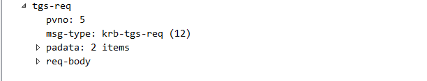

## 1.msg-type

类型，TGS_REQ对应的就是KRB_TGS_REQ(0x0c)

## 2.padate

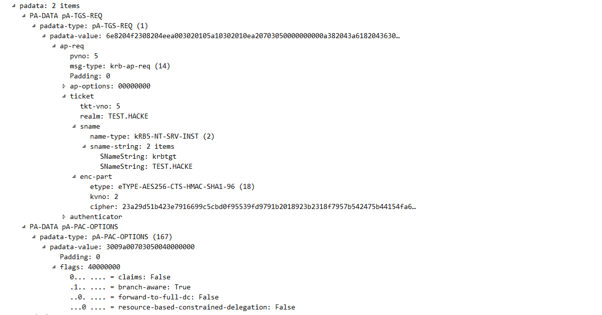

正常的TGS_REQ的请求需要用到有:

- AP_REQ:

这个是TGS_REQ必须携带的部分，这部分会携带AS_REP里面获取到的TGT票据，就放在这个结构体里面。

KDC校验TGT票据，如果票据正确，就返回TGS票据。

- PA_FOR_USER

类型是S4U2SELF,值是一个唯一的标识符，该标识符指示用户的身份。该唯一标识符由用户名和域名组成。

- PA_PAC_OPTIONS

类型是 PA_PAC_OPTIONS

值是以下flag的组合

```
-- Claims(0)

-- Branch Aware(1)

-- Forward to Full DC(2)

-- Resource-based Constrained Delegation (3)
```

如果是基于资源的约束委派，就需要指定Resource-based Constrained Delegation位。

## 3.req.body

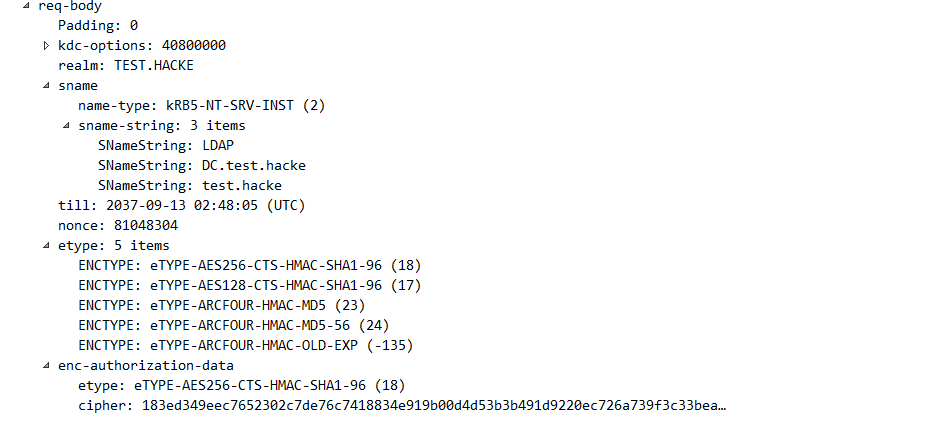

- sname

这个是要请求的服务，TGS_REP获得的ticket是用该服务用户的hash进行加密的。有个比较有意思的特性是，如果指定的服务是krbtgt，那么拿到的TGS票据是可以当做TGT票据用的。

# TGS_REP

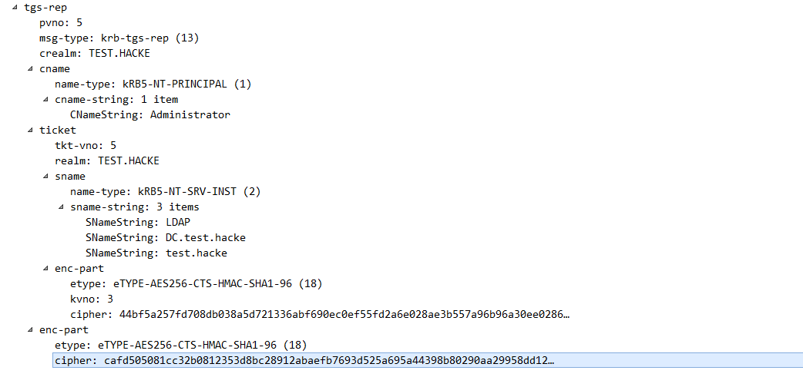

## 1.msg-type

AS_REQ的响应body对应的就是KRB_TGS_REQ(0x0d)

## 2.ticket

这个ticket用于AP_REQ的认证。其中里面的enc_part是加密的，用户不可读取里面的内容。在AS_REQ请求里面是，是使用krbtgt的hash进行加密的，而在TGS_REQ里面是使用要请求的服务的hash加密的。因此如果我们拥有服务的hash就可以自己制作一个ticket，既白银票据。

## 3.enc_part

注意，这个enc_part不是ticket里面的enc_part，这部分是可以解密的，key是上一轮AS_REP里面返回的session_key,也就是导入凭据里面的 session_key，解密后得到encryptionkey，encryptionkey这个结构里面最重要的字段也是session_key(但是这个session_key 不同于上一轮里面的session_key)，用来作为作为下阶段的认证密钥。

# 委派

## 提出问题

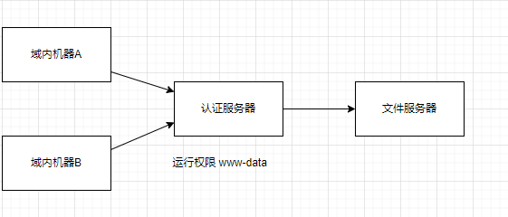

假设域内机器想要访问文件服务器，必须要经过认证服务器的认证，通过认证服务器去进行访问，这样会产生一个问题，如果文件服务器想要鉴定用户权限，给不同的用户查看不同的文件资源，但是所有用户都是通过认证服务器去访问文件服务器的，因此访问文件服务器的权限都是`www-data`根本实现不了刚才描述的功能

这只是个小例子，在域认证的时候也面临着相同的问题，那应该如何解决这个问题呢？

## 解决问题

因此微软引入了`S4U2SELF`和`S4U2proxy`两个`kerberos`协议认证的扩展，提出了委派机制。

**委派：**域委派是指将域内用户的权限委派给服务账户，使得服务账号能够以用户的权限在域内展开活动。

根据刚才假设的场景来说，就是域内用户A/B通过认证服务器，请求文件服务器时，将自身的权限委派给认证服务器，使得认证服务器可以使用对应用户的权限来对文件服务器进行操作，成功解决了上述问题


## 与委派相关的用户

- 委派的前提是被委派的用户未设置成不能被委派

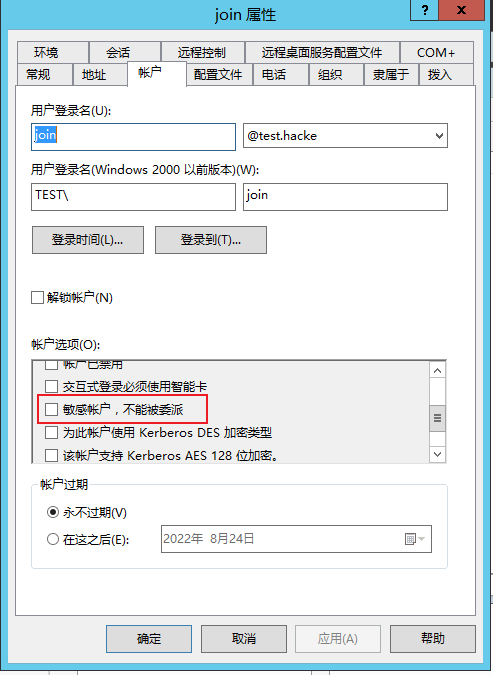

- 接受委派的用户只能是**服务账户**或者**计算机用户**。

## 非约束委派

非约束性委派配置如下：

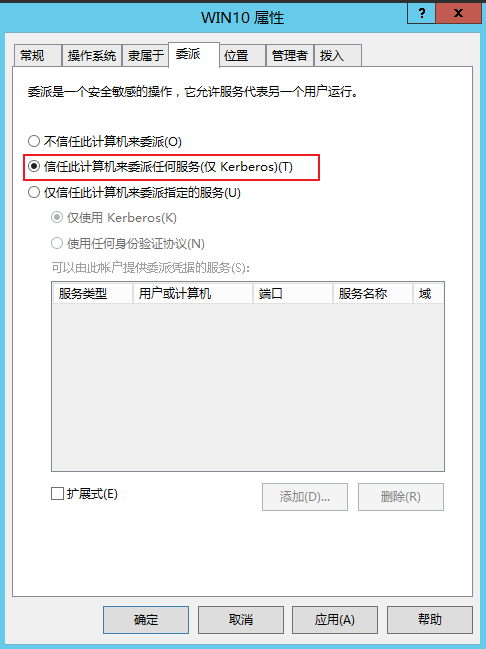

如果服务被配置了非约束委派，那么该服务可以接受任何用户的委派去请求其他所有服务。在协议层面的实现就是，某个用户委托该服务区访问某个服务，那么该用户会将TGT发送到该服务并缓存在LSASS中，方便以后使用。然后该服务模拟用户去请求服务。

配置了非约束委派的用户的userAccountControl 属性有个FLAG位 TrustedForDelegation

## 约束性委派

微软很早就意识到非约束委派并不是特别安全，在 Windows 2003上发布了"约束"委派。 其中包括一组 Kerberos 协议扩展，就是之前提到的两个扩展 S4U2Self 和 S4U2Proxy。配置它后，约束委派将限制指定服务器可以代表用户执行的服务。这需要域管理员特权(其实严谨一点是SeEnableDelegation特权，该特权很敏感，通常仅授予域管理员)才能为服务配置域帐户，并且将帐户限制为单个域。

约束委派配置如下：

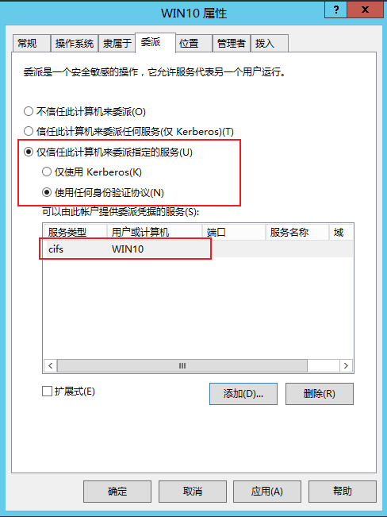

计算机用户(既Win-10$) 被配置了约束的委派，那么`Win-10$`可以接受任何用户的委派的去请求特定的服务。具体过程是收到用户的请求之后，首先代表用户获得针对服务自身的可转发的kerberos服务票据(S4U2SELF)，拿着这个票据向KDC请求访问特定服务的可转发的TGS(S4U2PROXY)，并且代表用户访问特定服务，而且只能访问该特定服务。

相较于非约束委派，约束委派最大的区别也就是配置的时候**选择某个特定的服务，而不是所有服务。**

配置了约束委派的用户的userAccountControl 属性有个FLAG位 TrustedToAuthForDelegation 。

**约束委派的四个主要角色：**

1. 访问服务的用户(这里面是administrator)

2. 接受委派的服务1(这里面是win-10$）

3. 要访问的服务2(这里面是CIFS/Win-10)

4. KDC（Key Distribution Center）密钥分发中心 kerberos 

**完整的流程为：**

1. 服务1 使用自己的hash向KDC申请一个TGT票据，注意在KDC Option里面选择FORWARDABLE标志位，这样的话请求的TGT票据就是可转发的TGT票据。
2. 服务1 代表用户申请一个获得针对服务1自身的kerberos服务票据(这一步就是S4U2SELF，后面会展开说)，这一步生成的TGS票据是可转发的TGS票据。

3. 服务1可以使用来自用户的授权( 在S4U2SELF阶段获得的可转发的TGS)，然后用该TGS(放在AddtionTicket里面)向KDC请求访问服务2的TGS

## 基于资源的约束委派

为了配置受约束的委派，必须拥有SeEnableDelegation特权，该特权很敏感，通常仅授予域管理员。为了使用户/资源更加独立，Windows Server 2012中引入了基于资源的约束委派。基于资源的约束委派允许资源配置受信任的帐户委派给他们。基于资源的约束委派将委派的控制权交给拥有被访问资源的管理员。

基于资源的约束委派只能在运行Windows Server 2012 R2和Windows Server 2012的域控制器上配置，但可以在混合模式林中应用。

**主要是有四个角色的存在：**

1. 访问服务的用户(这里面是administrator)
2. 接受委派的服务1(这里面是JACKSON-PC$）
3. 要访问的服务2(这里面是CIFS/WIN-JQO4OSMOGK2.JMU.com)
4. KDC（Key Distribution Center）密钥分发中心` kerberos `

首先先做一些配置。在服务2上 配置服务1 到服务2的基于资源的约束委派(不同于传统的约束委派需要域管的权限才能配置，只有拥有服务2 的权限就可以配置基于资源的约束委派)

**整个的完整流程：**

1. 服务1 使用自己的hash向KDC申请一个TGT票据。
2. 服务1 代表用户申请一个获得针对服务1自身的`kerberos`服务票据，这一步就是S4U2SELF，这一步就区别传统的约束委派，在S4U2SELF里面提到，返回的TGS可转发的一个条件是服务1配置了传统的约束委派，`kdc`会检查服务1 的`TrustedToAuthForDelegation`位和`msDS-AllowedToDelegateTo`  这个字段，由于基于资源的约束委派，是在服务2配置，服务2的马上到！`S-AllowedToActOnBehalfOfOtherIdentity`属性配置了服务1 的`sid`，服务1并没有配置`TrustedToAuthForDelegation`位和`msDS-AllowedToDelegateTo` 字段。因此这一步返回的TGS票据是不可转发的。
3. 服务1可以使用来自用户的授权( 在S4U2SELF阶段获得的不可转发的TGS)，然后用该TGS(放在AddtionTicket里面)向KDC请求访问服务2的可转发的TGS

# S4U2Proxy

当用户去带着ST1去访问服务A的时候，服务A如果需要访问服务B，就会使用S4U2Proxy协议将用户发送来的ST1转发给TGS并请求一个ST2。此时TGS会检查服务A的委派属性，如果服务A能够委派给服务B，那么就会返回ST2给服务A，此后服务A会拿着ST2以momo的身份去访问服务B。
**其实约束委派就是限制了S4U2proxy扩展的范围。配置它后，约束委派将限制服务A能委派的服务范围。而且用的是ST，不至于像TGT那样权限那么大。**

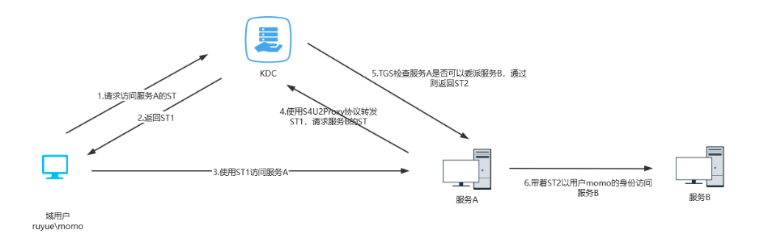

s4u2proxy 使得服务1可以使用来自用户的授权( 在S4U2SELF阶段获得)，然后用该TGS(放在AddtionTicket里面)向KDC请求访问服务2的TGS，并且代表用户访问服务2，而且只能访问服务2

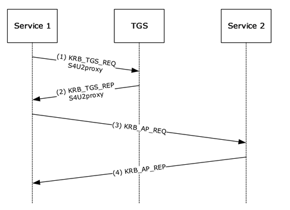

# S4U2SELF

上图中用户是通过Kerberos协议与服务A进行认证的，而当用户以其他方式(如NTLM认证，基于表单的认证等方式)与Web服务器进行认证后，用户是无法向Web服务器提供请求该服务的服务票据ST1的，因而服务器A也无法进一步使用S4U2Proxy协议请求访问服务B。
S4U2Self协议便是解决该问题的方案，**被设置为约束性委派的服务能够调用S4U2Self向TGS为任意用户请求访问自身的可转发的服务票据，此后，便可通过S4U2Proxy使用这张TGS向域控制器请求访问B的票据。**
PS:其实就是如果用户momo通过其他认证渠道过了服务器A的认证，那么服务器A就会通过S4U2Self协议让TGS生成一个momo访问它的ST（ST生成只需要服务账号密码的HASH），即前面的ST1。然后后面的流程都一样了。（常规的kerberos认证是用户需要向TGS证明自己的身份，而这里就是用户直接向服务A去证明自己的身份，不用管kerberos认不认，只要服务A认了就行）

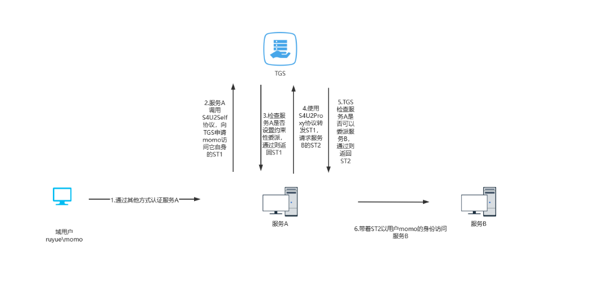

S4U2self 使得服务可以代表用户获得针对服务自身的kerberos服务票据。这使得服务可以获得用户的授权( 可转发 的用户TGS票据)，然后将其用于后期的认证(主要是后期的s4u2proxy)，这是为了在用户以不使用 Kerberos 的方式对服务进行身份验证的情况下使用。**这里面很重要的一点是服务代表用户获得针对服务自身的kerberos票据这个过程，服务是不需要用户的凭据的**

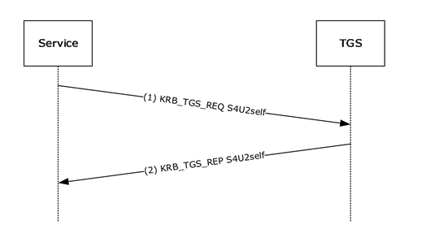

# 相关的安全问题

## pass the ticket

Kerbreos 除了第一步AS_ERQ是使用时间戳加密用户hash验证之外，其他的步骤的验证都是通过票据，这个票据 可以是TGT票据或者TGS票据。因为票据里面的内容主要是session_key和ticket(使用服务hash加密的，服务包括krbtgt)，拿到票据之后。我们就可以用这个票据来作为下阶段的验证了。

## kerberosting

正因为TGS_REP里面ticket里的enc_part(是ticket里面的enc_part,不是最外层的enc_part,最外层的enc_part是使用AS_REP里面的session_key加密的，这个session_key我们已经有了，没有意义)是使用要请求的服务的hash加密的，所以我们可以通过爆破获得服务的hash。这个问题存在的另外一个因素是因为用户向KDC发起TGS_REQ请求，不管用户对服务有没有访问权限，只要TGT正确，那么肯定会返回TGS。其实AS_REQ里面的服务就是krbtgt，也就是说这个同样用于爆破AS_REP里面的ticket部分的encpart得到krbtgt的hash，但是之所以在网上没见到这种攻击方式是因为krbtgt的密码是随机生成的，也跑不出来.

## 白银票据

在TGS_REP里面的ticket的encpart是使用服务的hash进行加密的，如果我们拥有服务的hash，就可以给我们自己签发任意用户的TGS票据，这个票据也被称为白银票据。相较于黄金票据，白银票据使用要访问服务的hash，而不是krbtgt的hash，由于生成的是tgs票据，不需要跟域控打交道，但是白银票票据只能访问特定服务。但是要注意的一点是，伪造的白银票据没有带有有效KDC签名的PAC。如果将目标主机配置为验证KDC PAC签名，则银票将不起作用。

## 非约束委派攻击

非约束委派的安全问题就是如果我们找到配置了非约束的委派的账户，比如这里面的`Win-10$`，并且通过一定手段拿下该账户的权限，然后诱导域管访问该`Win-10$`，这个时候域管会将自己TGT发送到`Win-10$`并缓存到LSASS中，那我们就可以从LSASS中导出域管的TGT票据（这里的TGT票据就相当于一个金票），然后通过PTT，从而拥有域管的权限。

**找到配置了非约束的委派的账户:**

因为配置非约束的委派的账户的UserAccount 配置了TRUSTED_FOR_DELEGATION flag位，TRUSTED_FOR_DELEGATION 对应是 0x80000 ，也就是 524288 。

所以对应的LDAP过滤规则是

```
(&(objectCategory=computer)(objectClass=computer)(userAccountControl:1.2.840.113556.1.4.803:=524288))
```

**具体过程：**

1. 通过一定手段拿下这台配置了非约束委派的账户的权限(比如这里面的`JACKSON-PC$`)

2. 通过一定手段(比如通过打印机的那个漏洞)诱导域管访问我们拿下的配置了非约束委派的账户

3. 最后导出票据然后进行pass the ticket

## 约束委派攻击

约束委派的安全问题就是如果我们找到配置了约束委派的服务账号，比如这里面的`JACKSON-PC$`，并且通过一定手段拿下该账号所在的机子。我们就可以利用这个服务账号代表任意用户(**这里面很重要的一点是服务代表用户获得针对服务自身的kerberos票据这个过程，服务是不需要用户的凭据的**)进行s4u2self获得一个可转发的票据，然后把获取到的票据用于s4u2proxy(作为AddtionTicket)，从未获取一个可转发的TGS，服务就可以代替任意用户访问另外一个服务

相较于非约束的委派，约束的委派并不需要用户过来访问就可以代表该用户，但是只能访问特定的服务(对于 HOST SPN，则可以实现完全的远程接管。 对于 MSSQLSvc SPN，则可以拿到 DBA 权限。 对于 CIFS SPN 则可以实现完全的远程文件访问。对于 HTTP SPN 则可能实现接管远程网络服务，而对于 LDAP 则可以执行 DCSync;) ，对于 HTTP 或 SQL 服务帐户，即使它们没有提升目标服务器上的管理员权限，也可能使用 Rotten Potato 进一步滥用，提权至 SYSTEM 的权限)，不像非约束的委派哪个可以访问任意服务。

1. 找到配置约束委派的服务账号1

因为配置约束的委派的机子的UserAccount 配置了TRUSTED_TO_AUTH_FOR_DELEGATION flag位，TRUSTED_TO_AUTH_FOR_DELEGATION 对应是 0x1000000 ，也就是 1677721

所以对应的LDAP过滤规则是

```
(&(objectCategory=computer)(objectClass=computer)(userAccountControl:1.2.840.113556.1.4.803:=16777216))
```

2. 找到该服务账号委派1委派的服务账户2

约束的资源委派，除了配置TRUSTED_TO_AUTH_FOR_DELEGATION 之外，还有个地方是存储对哪个spn 进行委派的，位于msDS-AllowedToDelegateTo ，查询该服务账号的msDS-AllowedToDelegateTo位

3. 通过一定手段拿下这个服务账户1
4. 发起一个从服务1到服务2的正常的约束委派的流程，从而访问服务2

使用约束委派也可以很方便得留下后门，如果我们配置了服务1到服务2的约束委派，那么只要我们控制服务1，也就可以访问服务2。服务2可以是任何服务。比如服务2是krbtgt，那么只要我们控制着服务1，那么模拟任意用户最后生成的TGS就是任意用户的TGT，这算是一种变形的黄金票据。如果服务2是CIFS/域控计算账户，那么只要我们控制着服务1，是不是就可以随时从域控里面提取任意用户的hash。思路挺多的，懂得约束委派的原理就可以自己扩展。

## 基于资源的约束委派攻击

基于资源的约束委派具有传统的约束委派的所有安全问题，但是相较于传统的约束委派。基于资源的约束委派的利用又相对较为简单。

主要体现为，普通的约束委派的配置需要SeEnableDelegation权限，而这个权限通常仅授予Domain Admins。因此我们对普通的约束委派的利用，往往在于寻找域内已有的约束委派，再利用。但是对于基于资源的约束委派，假如我们已经拥有服务账号1，那么只要我们具备用户2的LDAP权限，这样就可以配置服务1对服务2的约束委派(在服务账户2的用户属性上配置马上到！S-AllowedToActOnBehalfOfOtherIdentity为1的sid)，服务1就可以控制服务2。

**所以基于资源的约束委派的利用，就有一种新的攻击思路**

1. 我们拥有一个任意的服务账户1 或者计算机账户1

这一步不难，我们我们拥有域内机器，提升到system权限，该计算机用户，用户名为计算机账号$就是服务账号。

2. 我们获得服务账户2 的LDAP权限，这一步可以结合ntlm relay，从其他协议relay 而来
3. 配置服务1对服务2的约束委派
4. 发起一个从服务1到服务2的正常的约束委派的流程，从而访问服务2
