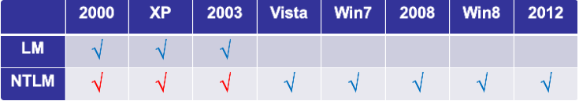
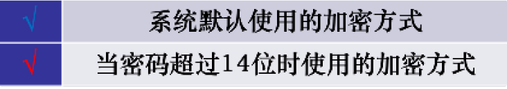
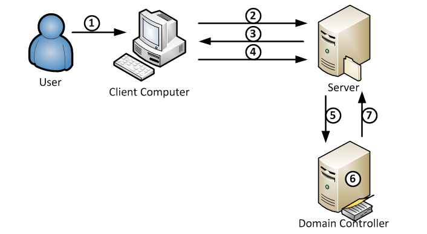
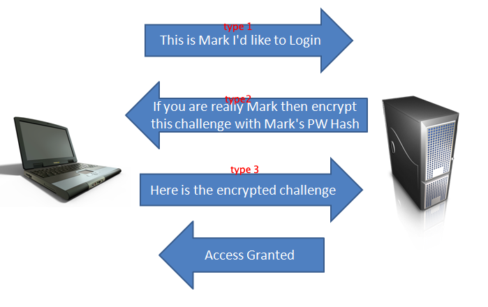
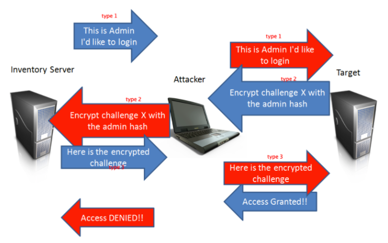

# LM Hash & NTML Hash

windows内部是不保存明文密码的，只保存密码的hash。

其中本机用户的密码hash是放在 本地的SAM文件 里面，域内用户的密码hash是存在域控的NTDS.DIT文件 里面。那hash的格式是怎么样的呢?

在Windows系统导出密码的时候，经常看到这样的密码格式

```
Administrator:500:AAD3B435B51404EEAAD3B435B51404EE:31D6CFE0D16AE931B73C59D7E0C089C0:::
```

- `AAD3B435B51404EEAAD3B435B51404EE`是LM Hash
- `31D6CFE0D16AE931B73C59D7E0C089C0`是NTLM Hash

## LM Hash

全称是LAN Manager Hash, windows最早用的加密算法，由IBM设计。

LM Hash的计算:

1. 用户的密码转换为大写，密码转换为16进制字符串，不足14字节将会用0来再后面补全。
2. 密码的16进制字符串被分成两个7byte部分。每部分转换成比特流，并且长度位56bit，长度不足使用0在左边补齐长度
3. 再分7bit为一组,每组末尾加0，再组成一组
4. 上步骤得到的二组，分别作为key 为 "`KGS!@#$%`"进行DES加密。
5. 将加密后的两组拼接在一起，得到最终LM HASH值。

```python
#coding=utf-8
import re
import binascii
from pyDes import *
def DesEncrypt(str, Des_Key):
    k = des(binascii.a2b_hex(Des_Key), ECB, pad=None)
    EncryptStr = k.encrypt(str)
    return binascii.b2a_hex(EncryptStr)

def group_just(length,text):
    # text 00110001001100100011001100110100001101010011011000000000
    text_area = re.findall(r'.{%d}' % int(length), text) # ['0011000', '1001100', '1000110', '0110011', '0100001', '1010100', '1101100', '0000000']
    text_area_padding = [i + '0' for i in text_area] #['00110000', '10011000', '10001100', '01100110', '01000010', '10101000', '11011000', '00000000']
    hex_str = ''.join(text_area_padding) # 0011000010011000100011000110011001000010101010001101100000000000
    hex_int = hex(int(hex_str, 2))[2:].rstrip("L") #30988c6642a8d800
    if hex_int == '0':
        hex_int = '0000000000000000'
    return hex_int

def lm_hash(password):
    # 1. 用户的密码转换为大写，密码转换为16进制字符串，不足14字节将会用0来再后面补全。
    pass_hex = password.upper().encode("hex").ljust(28,'0') #3132333435360000000000000000
    print(pass_hex) 
    # 2. 密码的16进制字符串被分成两个7byte部分。每部分转换成比特流，并且长度位56bit，长度不足使用0在左边补齐长度
    left_str = pass_hex[:14] #31323334353600
    right_str = pass_hex[14:] #00000000000000
    left_stream = bin(int(left_str, 16)).lstrip('0b').rjust(56, '0') # 00110001001100100011001100110100001101010011011000000000
    right_stream = bin(int(right_str, 16)).lstrip('0b').rjust(56, '0') # 00000000000000000000000000000000000000000000000000000000
    # 3. 再分7bit为一组,每组末尾加0，再组成一组
    left_stream = group_just(7,left_stream) # 30988c6642a8d800
    right_stream = group_just(7,right_stream) # 0000000000000000
    # 4. 上步骤得到的二组，分别作为key 为 "KGS!@#$%"进行DES加密。
    left_lm = DesEncrypt('KGS!@#$%',left_stream) #44efce164ab921ca
    right_lm = DesEncrypt('KGS!@#$%',right_stream) # aad3b435b51404ee
    # 5. 将加密后的两组拼接在一起，得到最终LM HASH值。
    return left_lm + right_lm

if __name__ == '__main__':
    hash = lm_hash("123456")
```

**LM加密算法存在一些固有的漏洞**

1. 首先，密码长度最大只能为14个字符
2. 密码不区分大小写。在生成哈希值之前，所有密码都将转换为大写
3. 查看我们的加密过程，就可以看到使用的是分组的DES，如果密码强度是小于7位，那么第二个分组加密后的结果肯定是`aad3b435b51404ee`，如果我们看到lm hash的结尾是`aad3b435b51404ee`，就可以很轻易的发现密码强度少于7位
4. 一个14个字符的密码分成7 + 7个字符，并且分别为这两个半部分计算哈希值。这种计算哈希值的方式使破解难度大大降低，这使得14个字符的密码的有效强度等于，7个字符的密码的两倍，该密码的复杂度明显低于 `95**14` 14个字符的密码的理论强度。
5. Des密码强度不高

## NTLM Hash

为了解决LM加密和身份验证方案中固有的安全弱点，Microsoft 于1993年在Windows NT 3.1中引入了NTLM协议。下面是各个版本对LM和NTLM的支持。





也就是说从Windows Vista 和 Windows Server 2008开始，默认情况下只存储NTLM Hash，LM Hash将不再存在。(因此后面我们介绍身份认证的时候只介绍Net-ntlm，不再介绍net-lm)如果空密码或者不储蓄LM Hash的话，我们抓到的LM Hash是`AAD3B435B51404EEAAD3B435B51404EE`。这里的LM Hash并没有价值。

**NTLM Hash的计算:**

1. 先将用户密码转换为十六进制格式。

2. 将十六进制格式的密码进行Unicode编码。

3. 使用MD4摘要算法对Unicode编码数据进行Hash计算 

```python
python2 -c 'import hashlib,binascii; print binascii.hexlify(hashlib.new("md4", "p@Assword!123".encode("utf-16le")).digest())'
```

# NTLM身份验证

NTLM验证是一种Challenge/Response (挑战/响应)验证机制，由三种消息组成:通常称为type 1(协商)，类型type 2(质询)和type 3(身份验证)。



1. 用户登录客户端电脑

2. (type 1)客户端向服务器发送type 1(协商)消息,它主要包含客户端支持和服务器请求的功能列表。

3. (type 2)服务器用type 2消息(质询)进行响应，这包含服务器支持和同意的功能列表。但是，最重要的是，它包含服务器产生的Challenge。

4. (type 3)客户端用type 3消息(身份验证)回复质询。用户接收到步骤3中的challenge之后，使用用户hash与challenge进行加密运算得到response，将response,username,challeng发给服务器。消息中的response是最关键的部分，因为它们向服务器证明客户端用户已经知道帐户密码。

5. 服务器拿到type 3之后，使用challenge和用户hash进行加密得到response2与type 3发来的response进行比较。如果用户hash是存储在域控里面的话，那么没有用户hash，也就没办法计算response2。也就没法验证。这个时候用户服务器就会通过netlogon协议联系域控，建立一个安全通道,然后将type 1,type 2，type3 全部发给域控(这个过程也叫作Pass Through Authentication认证流程)

6. 域控使用challenge和用户hash进行加密得到response2，与type 3的response进行比较

# Net-ntlm hash

在type3中的响应，有六种类型的响应：

- LM(LAN Manager)响应 - 由大多数较早的客户端发送，这是“原始”响应类型。

- NTLM v1响应 - 这是由基于NT的客户端发送的，包括Windows 2000和XP。

- NTLMv2响应 - 在Windows NT Service Pack 4中引入的一种较新的响应类型。它替换启用了 NTLM版本2的系统上的NTLM响应。

- LMv2响应 - 替代NTLM版本2系统上的LM响应。

- NTLM2会话响应 - 用于在没有NTLMv2身份验证的情况下协商NTLM2会话安全性时，此方案会更改LM NTLM响应的语义。

- 匿名响应 - 当匿名上下文正在建立时使用; 没有提供实际的证书，也没有真正的身份验证。“存 根”字段显示在类型3消息中。

这六种使用的加密流程一样，都是前面我们说的Challenge/Response 验证机制,区别在Challenge和加密算法不同。

## NTLM V1 和 NTLM V2 的区别

- v2是16位的Challenge，而v1是8位的Challenge
- v1是将 16字节的NTLM hash空填充为21个字节，然后分成三组，每组7比特，作为3DES加密算法的三组密钥，加密Server发来的Challenge。 将这三个密文值连接起来得到response。
- v2的算法是：
  - 将`Unicode`后的大写用户名和`Unicode`后的身份验证目标拼在一起。用户名将转换为大写，而身份验证目标区分大小写，并且必须与`TargetName`字段中显示的大小写匹配。使用16字节NTLM哈希作为密钥，得到一个值。
  - 构建一个blob信息
  - 使用16字节NTLMv2哈希作为密钥，将HMAC-MD5消息认证代码算法加密一个值(来自type 2的Challenge与Blob拼接在一起)。得到一个16字节的`NTProofStr`。
  - 将`NTProofStr`与Blob拼接起来形成得到response。
  - 至于选择哪个版本的响应由`LmCompatibilityLevel`决定。


Challenge/Response验证机制里面type3 response里面包含Net-ntlm hash，NTLM v1响应和NTLMv2响应对应的就是Net-ntlm hash分为Net-ntlm hash v1和Net-ntlm hash v2。

```
Net-ntlm hash v1的格式为：
username::hostname:LM response:NTLM response:challenge
Net-ntlm hash v2的格式为：
username::domain:challenge:HMAC-MD5:blob
```

# SSP&SSPI

- SSPI(Security Support Provider Interface)

这是 Windows 定义的一套接口，此接口定义了与安全有关的功能函数， 用来获得验证、信息完整性、信息隐私等安全功能，就是定义了一套接口函数用来身份验证，签名等，但是没有具体的实现。

- SSP(Security Support Provider)

SSPI 的实现者，对SSPI相关功能函数的具体实现。微软自己实现了如下的 SSP，用于提供安全功能：

1. NTLM SSP

2. Kerberos

3. Cred SSP

4. Digest SSP

5. Negotiate SSP

6. Schannel SSP

7. Negotiate Extensions SSP

8. PKU2U SSP

在系统层面，SSP就是一个dll，来实现身份验证等安全功能，实现的身份验证机制是不一样的。比如 NTLM SSP 实现的就是一种 Challenge/Response 验证机制。而 Kerberos 实现的就是基于 ticket 的身份验证机制。我们可以编写自己的 SSP，然后注册到操作系统中，让操作系统支持更多的自定义的身份验证方法。

# LmCompatibilityLevel

此安全设置确定网络登录使用的质询/响应身份验证协议。此选项会影响客户端使用的身份验证协议的等级、协商的会话安全的等级以及服务器接受的身份验证的等级，其设置值如下:

- 发送 LM NTLM 响应: 客户端使用 LM 和 NTLM 身份验证，而决不会使用 NTLMv2 会话安全；域控制器接受 LM、NTLM 和 NTLMv2 身份验证。

- 发送 LM & NTLM - 如果协商一致，则使用 NTLMv2 会话安全: 客户端使用 LM 和 NTLM 身份验证，并且在服务器支持时使用 NTLMv2 会话安全；域控制器接受 LM、NTLM 和 NTLMv2 身份验证。

- 仅发送 NTLM 响应: 客户端仅使用 NTLM 身份验证，并且在服务器支持时使用 NTLMv2 会话安全；域控制器接受 LM、NTLM 和 NTLMv2 身份验证。

- 仅发送 NTLMv2 响应: 客户端仅使用 NTLMv2 身份验证，并且在服务器支持时使用 NTLMv2 会话安全；域控制器接受 LM、NTLM 和 NTLMv2 身份验证。

- 仅发送 NTLMv2 响应\拒绝 LM: 客户端仅使用 NTLMv2 身份验证，并且在服务器支持时使用 NTLMv2 会话安全；域控制器拒绝 LM (仅接受 NTLM 和 NTLMv2 身份验证)。

- 仅发送 NTLMv2 响应\拒绝 LM & NTLM: 客户端仅使用 NTLMv2 身份验证，并且在服务器支持时使用 NTLMv2 会话安全；域控制器拒绝 LM 和 NTLM (仅接受 NTLMv2 身份验证)。

默认值：

- Windows 2000 以及 Windows XP: 发送 LM & NTLM 响应

- Windows Server 2003: 仅发送 NTLM 响应

- Windows Vista、Windows Server 2008、Windows 7 以及 Windows Server 2008 R2及以上: 仅发送 NTLMv2 响应

# 相关安全问题

## pass the hash

也叫hash传递攻击,简称PTH。在type3计算response的时候，客户端是使用用户的hash进行计算的，而不是用户密码进行计算的。因此在模拟用户登录的时候。是不需要用户明文密码的，只需要用户hash。微软在2014年5月13日发布了针对Pass The Hash的更新补丁kb2871997，

当使用本地管理员组的非RID 500帐户进行pth登录，发现ntlm认证通过之后，对ADMIN$没有写入权限。那么是什么阻止了我们对本地管理员组的非RID500帐户使用哈希传递？为什么RID 500帐户具有特殊情况？除此之外，为什么本地管理员成员的域帐户也可以免除这种阻止行为。(事实上，之前在winrm进行远程登录的时候我也遇到相关的问题，winrm远程登录只能使用RID 500帐户与本地管理员成员的域用户登录，不能使用本地管理员组的非RID500账户)所有这些问题的真正罪魁祸首是**远程访问上下文中的用户帐户控制（UAC）令牌筛选。**

对于远程连接到Windows Vista +计算机的任何非RID 500本地管理员帐户，无论是通过WMI，PSEXEC还是其他方法(有个例外，那就是通过RDP远程)，即使用户是本地管理员，返回的令牌都是已过滤的管理员令牌

通俗点来说就是管理员组的非RID500账户登录之后是没有过UAC的，所有特权都被移除。而RID500账户登录之后也以完全管理特权（"完全令牌模式"）运行所有应用程序，实际是不用过UAC的，这个可以自己测试下。

**对于本地“管理员”组中的域用户帐户，文档指出：**

> 当具有域用户帐户的用户远程登录Windows Vista计算机并且该用户是Administrators组的成员时，域用户将在远程计算机上以完全管理员访问令牌运行，并且该用户的UAC被禁用在该会话的远程计算机上。

如果`HKLM\SOFTWARE\Microsoft\Windows\CurrentVersion\Policies\System\LocalAccountTokenFilterPolicy`项存在(默认不存在)且配置为1，将授予来自管理员所有本地成员的远程连接完整的高完整性令牌。这意味着未过滤非RID 500帐户连接，并且可以成功传递哈希值！

默认情况下这个注册表项是不存在的，我们可以用以留作后门，但是有意思的是，我们之前提过一嘴的，在配置winrm的时候，也会遇到同样的问题，本地管理员组的非RID500账户不能登录，于是有些运维在搜寻了一堆文章后，开启该注册表项是最快捷有效的问题:)。

## 利用ntml进行信息收集

在type2返回Challenge的过程中，同时返回了操作系统类型，主机名，netbios名等等。这也就意味着如果我们在能跟服务器进行ntlm 交流中，给服务器发送一个type1的请求，服务器返回type2的响应，这一步，我们就可以得到很多信息。前面我们说过ntlm是一个嵌入式的协议，消息的传输依赖于使用ntlm的上层协议，比如SMB,LDAP,HTTP等。我们以SMB为例。在目标主机开放了445或者139的情况，通过给服务器发送一个type1的请求，然后解析type2的响应。就可以收集到一些信息。

## ntml relay

### ntml_relay的一般认证过程

ntlm 认证的 type1,type2,type 3：



当出现一个中间人时：



看图已经能够很清晰得理解ntlm_relay的一般过程，作为中间人，攻击者将来自客户端的包(type 1)转发给服务端，将来自服务端的challenge(type 2)转发给客户端，然后客户端计算完response 之后，再把response(type 3) 转发给服务端，服务端验证rsponse通过之后，授予攻击者访问的权限。

###  ntlm_relay or smb_relay

我们之前反复在说一件事,ntlm是一个嵌入式的协议，消息的传输依赖于使用ntlm的上层协议，比如SMB,LDAP,HTTP等。那ntlm的上层协议是smb的情况下,ntlm_relay就是smb_relay。那如果上层协议是http，我们也可以叫做http_relay，但是都统称ntlm_relay。

### 跨协议的relay

ntlm是一个嵌入式的协议，消息的传输依赖于使用ntlm的上层协议，比如SMB,LDAP,HTTP等,那不管上层协议是啥，ntlm的认证总归是type 1,type 2,type3 。所以我们就不局限于之前提到的smb到smb这种relay，可以在一个协议里面提取ntlm认证信息，放进另外一个协议里面，实现跨协议的relay。

###  relay or reflet


如上图，如果Inventory Server和Target是同一台机子，那么也就是说我们攻击者拿到Inventory Server发来的请求之后，发回给Inventory Server进行认证。这个就是reflect。在工作组环境里面，工作组中的机器之间相互没有信任关系，每台机器的账号密码只是保存在自己的SAM文件中，这个时候relay到别的机器，除非两台机器的账号密码一样，不然没有别的意义了，这个时候的攻击手段就是将机器reflect回机子本身。因此微软在ms08-068中对smb reflect到smb 做了限制。CVE-2019-1384(Ghost Potato)就是绕过了该补丁。
