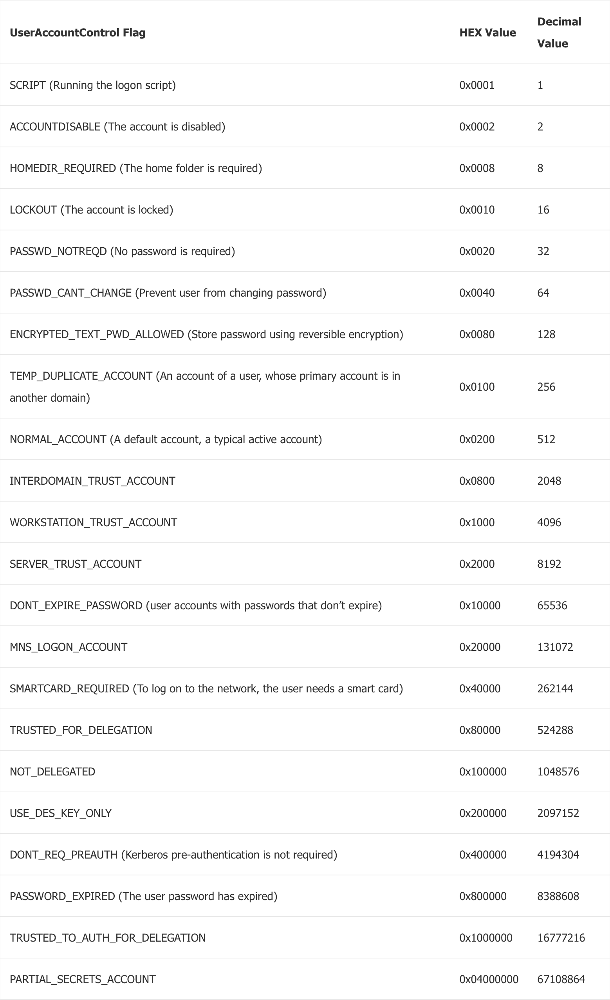
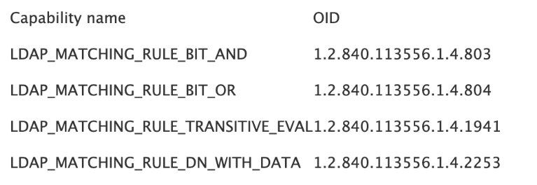
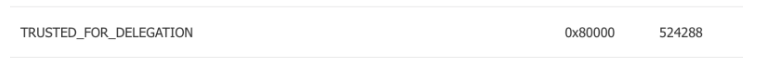
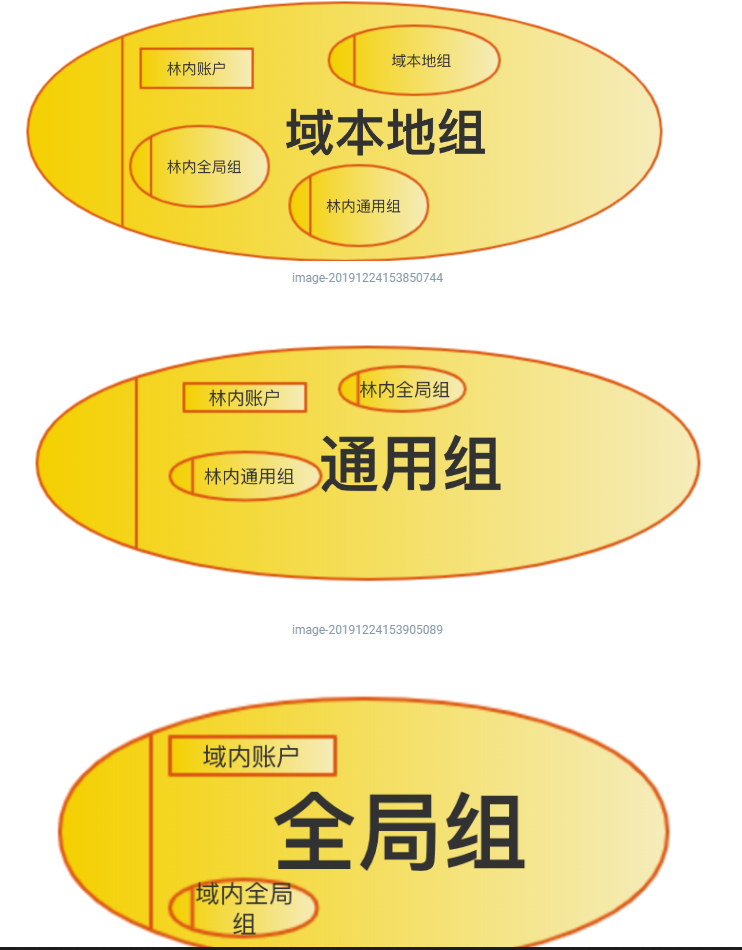

# 一些LDAP高级搜索语法

## LDAP查找中的位操作

在LDAP 里面，有些字段是位字段，这里以userAccountControl举例，关于这个字段的详细意义，后面会详细介绍，这里先把他当做一个普通的位字段，不去考虑他的具体含义，这里先看下他的内容。

他的属性类位于架构分区的`CN=User-Account-Control,CN=Schema,CN=Configuration,DC=test,DC=hacke,DC.test.hacke [DC.test.hacke]`

`attributeSyntax`是`2.5.5.9`，`oMSyntax`是2

查表可知是32位的Integer类型。

之所以我们说他是位字段，是因为他是由一个个位构成。

比如说一个账户，他的LOCKOUT，以及NOT_DELEGATED，其他的位都没有，那这个用户的属性`userAccountControl`的值就为0x100000+0x0010。是个32 位 int 类型。

那现在的难题就变成。如果我要搜索域内所有设置了NOT_DELEGATED的所有对象。那在上一篇文章里面我们学到的LDAP语法就显得力不从心。因为上一篇文章的语法只能对某个属性进行过滤，还不能对属性里面的某个具体位进行过滤，

LDAP的语法支持按位搜索，执行过滤器以搜索位字段，必须遵循以下语法：

- `   <属性名称>：<BitFilterRule-ID> := <十进制比较值>`

其中的`<BitFilterRule-ID>`，内容如下:

我们最常的是AND ，也就是`1.2.840.113556.1.4.803`，比如：我们想查询哪些对象设置了`TRUSTED_FOR_DELEGATION`

`TRUSTED_FOR_DELEGATION`对应的十进制比较值位524288

根据语法，我们就可以构造以下过滤规则

`(userAccountControl:1.2.840.113556.1.4.803:=524288)`

## LDAP 查找中的objectCategory和objectClass

**（1） objectClass:**

在前面一节里面说过,在对象的`objectClass` 属性里面，可以看到这个对象是哪个类的实例，以及这个类的所有父类，比如说`CN=jane,CN=Users,DC=test,DC=local`的`objectClass`是`top,person,organizationalPerson,user`。那我们通过过滤语句`(objectClass=user)`,`(objectClass=organizationalPerson)`都能找到这个对象。

所有的类都是`top`类的子类。因此当我们过滤`(objectClass=top)`可以找到域内的所有对象。

**（2） objectCategory**

在Windows Server 2008之前默认不对objectClass 属性进行索引。最初认为对多值属性(例如object Class)进行索引会导致性能下降。如此一来，Windows 2000 附带了未索引的objectClass 属性和另一个已建立索引的单值属性，称为objectCategory。

接下来介绍下`objectCategory`这个属性。对象类的每个实例还具有一个objectCategory属性，该属性是一个单值属性。并且建立了索引。其中包含对象是其实例的类或其父类之一的专有名称。

比如说`CN=jane,CN=Users,DC=test,DC=hacke`.他的`objectCategory`是`CN=Person,CN=Schema,CN=Configuration,DC=test,DC=hacke`

但是这样，又有点不方便，需要记住记住类的DN，所以LDAP在实现上实现了个小技巧。对象类有个属性`lDAPDisplayName`，指定他的显示名。事实上，我们看`objectClass`属性里面的类以及父类(比如top.person)，他的名字都是这个类的`lDAPDisplayName`

创建对象时，系统会将其objectCategory属性设置为由其对象类的`defaultObjectCategory`属性指定的值。无法更改对象的objectCategory属性。

如果我们想过滤所有objectCategory的属性为`CN=Person,CN=Schema,CN=Configuration,DC=test,DC=local`的对象，这个很简单。

`(objectCategory="CN=Person,CN=Schema,CN=Configuration,DC=test,DC=local")`

`CN=Person,CN=Schema,CN=Configuration,DC=test,DC=hacke`的`lDAPDisplayName`是`person`.所以LDAP在实现上，支持用类的`lDAPDisplayName`作为搜索条件。所以如果我们想找所有`CN=Person,CN=Schema,CN=Configuration,DC=test,DC=hacke`的实例，可以我简化为以下过滤规则。

`(objectCategory=person)`

**(3) objectClass 与objectCategory的结合使用**

如果想确保查询在所有版本的Active Directory上都能正常运行，建议使用 objectClass 和objectCategory结合。如果在目录中已经索引了ObjectClass ，或者所有域控制器都在运行Windows Server 2008或更高版本，则可以随意􏰁使用 objectClass，而不必担心会对性能产生影响。

这里我们介绍下objectClass 和objectCategory的集合使用。前面我们分别介绍了objectClass 以及objectCategory，但是没讲怎么把他们结合在一起使用。

我们这里再来理一理思路。

`CN=jane,CN=Users,DC=test,DC=hacke`这个对象。

他的`objectClass`是`top,person,organizationalPerson,user`。

他的`objectCategory`是`person`。

一个对象的`objectClass` 是一个类的对象类，以及这个对象类的所有父类。

一个对象的`objectCategory` 是一个类的对象类或者这个对象类的所有父类。

所以说一个对象的`objectCategory` 必定是`objectClass` 中的其中一个。

user，person，organizationalPerson类将其defaultObjectCategory设置为person。这允许像（objectCategory= person）这样的搜索过滤器通过单个查询定位所有这些类的实例。

比如说，我们要定位所有的user 类的实例。(`CN=jane,CN=Users,DC=test,DC=local`就是user类的一个对象)

user 类的继承关系如下:

`top => person => organizationalPerson => user`

那`person`,`organizationalPerson`,`user`都将其defaultObjectCategory设置为person。因此我们可以先过滤:

`(objectCategory=person)`

但是这样的结果并不精准。我们使用objectClass进一步在过滤后的结果进行过滤:

`(&(objectCategory=person)(objectClass=user))`

这样就能精准匹配到了。其实说通俗点就是，objectCategory建立索引，所以查询时间比较快。我们通过objectCategory划分一个大的范围，然后通过objectClass进行精准匹配。

当然如果在目录中已经索引了ObjectClass ，或者所有域控制器都在运行Windows Server 2008或更高版本，我们直接使用 objectClass(`(objectClass=user)`)也能很精准地匹配并且不用考虑效率问题。

# 组

## 组介绍

在域内，我们无时无刻不在跟组打交道，比如我们熟悉的域管，就是一个组。按照用途来分，组分为通讯组和安全组。对于通讯组，我们接触的比较多的就是邮件组，将若干个人划分到一个通讯组，给这个通讯组发件，那组内用户都能收到。但是通讯组不能控制对资源的访问，我们并不是很在意。这篇文章侧重介绍安全组。

安全组是权限的集合。举个例子，运维需要对公司的网络进行管理，需要一些特殊的管理权限，我们就可以设置个组，对组配置权限。然后将运维拉近组里面，组里面的运维就拥有了该权限。安全组可以根据作用范围划分为。

- 全局组 (Global group)

- 通用组(Universal group)
- 域本地组(Domain Local group)

## 查询组

## 组范围

之前说过安全组可以根据作用范围划分为：

- 全局组 (Global group)
- 通用组(Universal group)
- 域本地组(Domain Local group)

| 组类型   | 可以授予权限                         | 可包含                                                       | 可包含于                                                     | 成员是否在全局编录复制 |
| -------- | ------------------------------------ | ------------------------------------------------------------ | ------------------------------------------------------------ | ---------------------- |
| 全局组   | 在同一林中或信任域或林中的任何域上。 | 来自同一域的帐户。 来自同一域的其他全局组                    | 来自同一林中任何域的通用组。 来自同一域的其他全局组。 来自同一林中任何域或任何信任域的域本地组。 | 无                     |
| 通用组   | 在同一林或信任林中的任何域上。       | 来自同一林中任何域的帐户。 来自同一林中任何域的全局组。 来自同一林中任何域的其他通用组。 | 同一林中的其他通用组。 在同一个林或信任林中域本地组。        | 是                     |
| 域本地组 | 在同一个域中                         | 来自任何域或任何受信任域的帐户。 来自任何域或任何受信任域的全局组。 来自同一林中任何域的通用组。 来自同一域的其他域本地组。 | 来自同一域的其他域本地组。                                   | 无                     |

- 域本地组(Domain Local group)

顾名思义，就是本域内的本地组。不适用于林，适用于本域。可包含林内的账户，通用组，全局组。其他域内的通用组要在本域拥有权限，一般都是加入这个域的域本地组。比如说一个林里面，只有林根域有`Enterprise Admins`这个组，这是个通用组。然后其他子域 的域本地组`Administrators`会把林根域的`Enterprise Admins`加进里面，所以林根域的`Enterprise Admins`组用户才在整个林内具备管理员权限。如果想要一个只允许访问同一个域中的资源的组，那么使用域本地组即可。

- 通用组(Universal group)

上面已经简单提过了通用组，典型例子是`Enterprise Admins`这个组。在林的场景下比较有用。组内成员会在GC内复制。如果你想要一个可以访问林中任何东西的组，并且可以在林中包含任何账户，请使用通用组。

- 全局组 (Global group)

全局组比较复杂，前面说了。在单域内用域本地组，在林中使用通用组。全局组应该说是一种比较折中的方案，他可以在林中使用，但是只能包含本域内的账户。全局组的使用范围是本域以及受信任关系的其他域。最为常见的全局组是Domain Admin，也就是我们常说的域管。因为全局组只能包含本域内账户，因此来自一个域的账户不能嵌套在另一个域中的全局组中，这就是为什么来自同一个域的用户不符合在外部域中的域管的成员资格（由于其全局范围的影响)。

## 常见组介绍

- administrator

域本地组。具备系统管理员的权限，拥有对整个域最大的控制权，可以执行整个域的管理任务。Administrators包括`Domain Admins`和`Enterprise Admins`。

- Domain Admins

全局组。我们常说的域管组。默认情况下，域内所有机器会把Domain Admins加入到本地管理员组里面。

- Enterprise Admins

通用组。在林中，只有林根域才有这个组，林中其他域没有这个组，但是其他域默认会把这个组加入到本域的Administrators里面去。

- Domain Users

全局组。包括域中所有用户帐户,在域中创建用户帐户后，该帐户将自动添加到该组中。默认情况下，域内所有机器会把Domain Users加入到本地用户组里面，也就是为什么默认情况底下，啥都不配置。域用户可以登录域内任何一台普通成员机器。

## AGDLP

安全组是权限的集合，所以在微软的建议中，并不建议给赋予单个用户权限，而是赋予一个组权限，然后将成员拉近组。下面介绍下AGDLP策略：

- A表示用户账号，Account

- G表示全局组，Global group 

- U表示通用组，Universal Group

- L表示本地组， local group

- DL表示域本地组，Domain local group

- P表示资源权限，Resource Permissions

有几种常见的权限划分方式：

- `AGP`，将用户账号添加到全局组，然后赋予全局组权限
- `AGLP`，将用户账号添加到全局组，将全局组添加到本地组，然后赋予本地组权限
- `ADLP`，将用户账号添加到域本地组，然后赋予域本地组权限
- `AGDLP`，将用户账号添加到全局组，将全局组添加到域本地组，然后服务域本地组权限
- `AGUDLP`，将用户账号添加到全局组，将全局组添加到通用组，将通用组添加到域本地组，然后赋予域本地组权限

# 组织单位

## OU介绍

组织单位(Organization Unit)，简称OU，是一个容器对象，将域中的对象组织成逻辑组，帮助网络管理员简化管理组。组织单位包含下列类型的对象：用户，计算机，工作组，打印机，安全策略，其他组织单位等。可以在组织单位基础上部署组策略，统一管理组织单位中的域对象。 在企业域环境里面，我们经常看到按照部门划分的一个个OU。

## OU和容器的区别

组织单位（OU）是专用容器，与常规容器的区别在于管理员可以将组策略应用于OU，然后系统将其下推到OU中的所有计算机。您不能将组策略应用于容器。需要注意的是`Domain Computers`是一个普通容器，而`Domain Controllers`是一个OU，因此可以可以将组策略应该于`Domain Controllers`，不可以将组策略应用于`Domain Computers`

**上面说的`Domain Computers`和`Domain Controllers`特指根域的,不是User容器底下的，那个是组**

## OU跟组的区别

组织单位跟组是两个完全不同的概念。很多人经常会把这两个弄混。组是权限的集合。OU是管理对象的集合。举个前面举过的例子，运维需要对公司的网络进行管理，需要一些特殊的管理权限，我们就可以设置个组，对组配置权限。然后将运维拉近组里面，组里面的运维就拥有了该权限。比如我们需要对财务部里面的用户进行统一管理，那我们可以设置个OU，然后把财务部的用户拉近这个OU，这样就可以进行集中管理，比如说下发组策略。说通俗点，组是管理的集合，OU是被管理的集合。

## OU委派

考虑这样一种需求，如果我们想允许某个用户把其他用户拉近OU，而不赋予这个用户域管权限，我们可以在这个OU给这个用户委派 添加成员的权限。组织单位的委派其实就是赋予某个域内用户对OU的某些管理权限。这些权限体现在ACL里面。