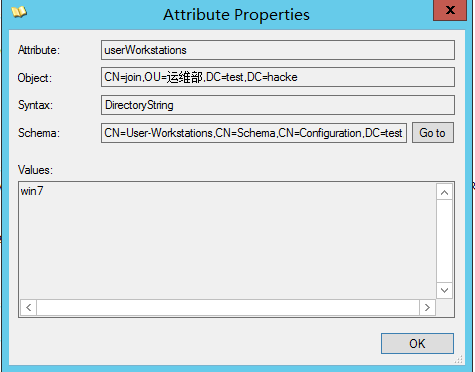
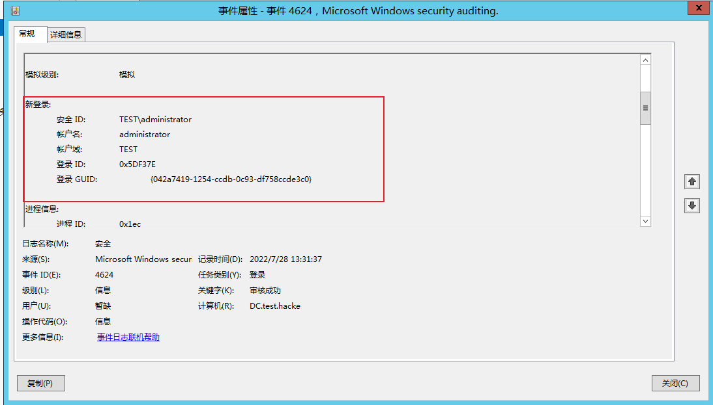

# 域用户

## 查询域用户

当我们拥有一个域用户的时候，想要枚举域内的所有用户，主要有两个方法：

- 通过`SMAR`协议查询

samr 也不算是一种专门的协议，就是一个RPC接口，我们平时使用的`net user /domain`就是使用samr 进行查询的。

在impacket 里面有一个脚本`samrdump.py`就是专门调用samr 去查询域用户的。

在`impacket`里面有一个脚本`samerdump.py`就是专门调用samr去查询域用户的

- 通过Ldap 语法查询

域用户存储于活动目录数据库里面，对其他用户可见。可以通过Ldap 去查询。

# 机器用户

默认情况底下，加入域的机器默认在`CN=Computer`这个容器里面，域控默认在`Domain Controllers`这个OU里面。有些域内会通过`redircmp`进行修改


## 机器用户跟system用户的关系

考虑到这样一个场景，如果拿到一台域内机器，然后发现没有域内用户。 这个时候有很多人用mimikatz 抓一下，没抓到域用户，就束手无策了

我们随便点开一台`Domain Computer`，这里以WIN7这台机子做为测试，看他的对象类：


发现他是computer 类的实例。而computer 类的user 类的子类。域用户是user类的实例。之前我们说过类是属性的集合。子类继承了父类的所有属性，因此域用户该有的属性，计算用户都有，甚至我们可以说，机器用户就是一种域用户。

那回到之前的那个问题，如果拿到一台域内机器，然后发现没有域内用户的情况。我们上面说了，机器用户其实就是一个域用户，那我们怎么使用这个机器用户呢。其实本地用户SYSTEM就对应于域内的机器用户，在域内的用户名就是机器名+$,比如win7，他的机器名是WIN7，那他在域内的登录名就是win7$,可以通过`sAMAccountName`查看：


所以我们可以将当前用户提到system(非管理员需要配合提权漏洞，管理员组的非administrators需要bypassuac，administrator提到system。这个网上有很多方法，psexec，mimikatz等等)。就可以在域内充当机器用户了。

# 域用户账户与机器用户的对应关系

## 域用户默认能登录域内的任何一台普通机器

在域成员机器的本地安全策略里面，默认情况底下，本地用户组允许本地登录。其中包括Domain Users组。


而域内用户默认都在Domain Users组里面，因为域用户默认都在Domain Users组里面，而Domain Users在Users组里面。默认情况底下Users组内的成员允许本地登录。所以域内成员默认都能登录域内任何一台机器。

一般有两种修改方案：

- 在域用户这边做限制：设置域用户只允许登录到某台机器
- 在机器这面做限制，这个可以通过下发组策略实现，因为一般都会把常登陆这台机器的域用户加入到Administrators组里面。不允许User组里面用户本地登录。把下图的Users删除掉。这样登陆这台机器的域用户，因为在Administrators组里面，也可以登录。而其他域用户也不能登录

## 查询域用户能够登录的主机

域用户默认能本地登录域内的任何一台主机。为了缓解这个问题。上一小节我们提出了两种解决方案。也会带来新的问题。我们可以根据这个找到域用户能够登录的主机。限制了域用户只能登录到某台主机之后，在LDAP里面，会设置一个字段，userWorkStation。这个字段保存了这个域用户只能登录到某台机器。而这个字段对于域内任何用户都是可读的，我们可以通过读域用户的userWorkStation来查看域用户限制登录到那一台机子。那个用户也就能够登录那台机子。



只有被限制的用户存在这个字段，不存在这个字段，默认可以登录域内任意机器。

## 查询域用户正在登录的主机

检查远程机器注册表项里`HKEY_USERS`来查询谁正在登陆机器，比如我们远程登录`win7`的注册表，看到`HKEY_USERS`底下的key有`S-1-5-21-3085413993-1079497289-2414748430-1604`，将Sid转换为用户名为`TEST\wpw`，由此可知该用户正在`win7`这台机器上登录


Sid转化为用户名，可以使用`Pstools/PsGetSid` （也可以使用这款工具通过用户名获取SID）：


远程查看注册表项这个操作可以通过API（`netwkstauserenum`、` netsessionenum
`）实现，我们可以遍历域内所有机器，查询机器正在登陆的用户。

**需要注意：**

- 默认PC机器，是没有开启注册表远程连接的。Server 机器，默认开启远程连接。
-  域内任何用户，即使配置了，不能本地登录域内机器A，但是只要域内机器A开启远程注册表连接，我们就可以连接上机器A的注册表，从而枚举正在登陆的用户

**可利用工具：**` psloggedon.exe` 、`netsess.exe`、`PVEFindADUser.exe`、`hunter.exe`

## 查询域用户登录过的主机

1. 通过查看Outlook的邮件头

​       当用户a 在公司内部使用outlook 给你发一封邮件的时候，我们可以在改邮件的头部看到用户a的内网IP

2. 导出DC日志

这个要求我们有域控权限，比如说我们在拿到域控之后想找到域内某个用户的主机。

域内用户A在机器B正常登录的时候，由于本地没有域用户A的hash。机器B会去域控那边做验证，登录成功的话，在域控那边，会有个4624的日志，登录类型为3。打开控制面板->系统与安全->事件查看器->windows日志->安全


点击查看，可以看到相关的登录信息：



值得注意的是，在域内可能存在多台域控，日志并不同步，请将每一台域控的日志都导出来。导出日志和查看日志有很多方式，这里提供一个实现。

```
# 导出日志，wevtutil是自带的
wevtutil epl Security C:\Users\Administrator\Desktop\1.evtx /q:"*[System[(EventID=4624)] and EventData[Data[@Name='LogonType']='3']]" //导出日志

# 将日志拷贝到我们的电脑.使用LogParser开始提取日志
LogParser.exe -i:EVT -o:CSV "SELECT TO_UPPERCASE(EXTRACT_TOKEN(Strings,5,'|')) as USERNAME,TO_UPPERCASE(EXTRACT_TOKEN(Strings,18,'|')) as SOURCE_IP FROM 1.evtx" >log.csv // 提取日志
```

