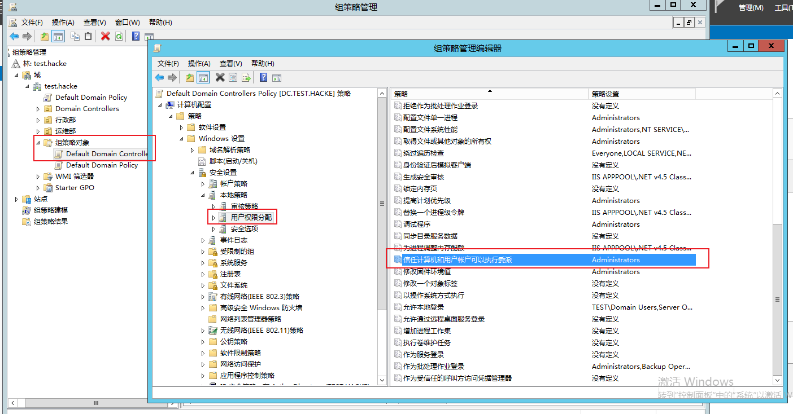
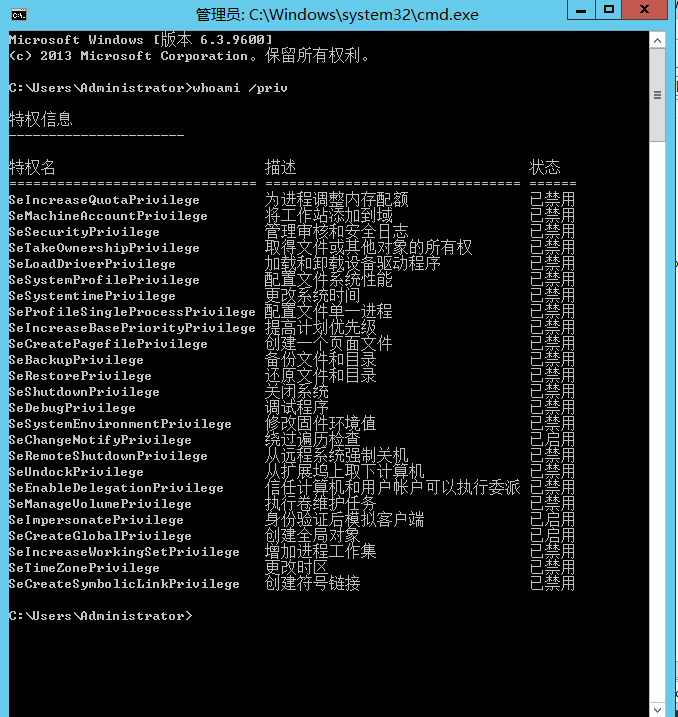

# windows访问控制模型

在 Active Directory 中设置权限，其方式与在文件中设置权限的方式几乎相同。权限控制都是使用windows 访问控制模型。这里简单提一下windows 访问控制模型。

windows访问控制模型是由两部分组成：

- 访问令牌（Access Token），包含用户的标识(User SID,Group SIDS)，以及特权列表。

- 安全描述符（security identifiers）。被访问的安全对象的相关安全信息。这里的安全对象包括但不限于;
  - NTFS卷上的文件和目录
  - 注册表项
  - 网络共享
  - 服务
  - Active Directory对象
  - 进程

（这里面的安全对象特指Active Directory对象，也就是AD树上的每个条目）

在域里面用户的身份上用sid 来表示而不是用用户名来查看，我们可以通过查看用户属性objectsid来查看一个用户的sid。

大体的流程是。当对象A来访问B的时候，A会出示自己的Access Token,然后包含自己的用户sid，自己所在的组的sid，以及特权列表。B这个安全对象，有自己的ACL。

- B首先判断是不是需要特权才能访问，如果需要特权，则查看A的Access Token看有没有那个特权。

- B通过A的Access Token，来判断A的用户 sid以及组sids，跟自己的ACL做比对，来判断是否让A进行访问。

# ACL简介

## ACL简介

**ACL主要有两个作用:**

- 权限访问控制：一个用户能不能访问安全对象
- 日志记录功能：访问是否成功

根据ACL的两个作用，ACL包含DACL和SACL：

- DACL：起到的作用是权限访问控制，也就是判断一个用户能不能访问安全对象它由若干条ACE构成，DACL是怎么判断用户是否能访问呢？

​		举个例子：

```
用户A：
	sid：50
	group sid：10
	group sid：11
	group sid：12
用户B：
	sid：51
	group sid：10
	group sid：11
	group sid：13
用户C：
	sid：52
	group sid：17
	group sid：18
	group sid：19
安全对象D的DACL：
	ACE：允许sid 为50的对象访问
	ACE：拒绝sid 为13的对象访问
```

​	SRM对ACL的解析是

1. 明确定义的DENYACE
2. 明确定义的ALLOWACE
3. 继承的DENYACE
4. 继承的ALLOWACE

在不考虑特权的情况下：

- 

  - 当A 访问安全对象D的时候：D 查看A的用户sid，以及组sids。首先到第二条(因为DENY优先于第一条的allow)进行匹配，没匹配上，然后到第一条ACE进行判断。允许sid 为50 的对象进行访问。A的用户sid 为50，因此允许A 对象访问。

  - 当B 访问安全对象D的时候：D 查看B的用户sid，以及组sids。首先到第二条进行匹配，拒绝sid 为13的对象访问，发现B 的其中一个组sid 为13，拒绝B访问。

  - 当C 访问安全对象D的时候：D 查看C的用户sid，以及组sids。首先到第二条ACE进行判断。没匹配上，然后匹配第一条，又没匹配上，因此拒绝C访问。


**当每条ACE都没匹配上的时候，是拒绝访问的**，由此有两种情况：

- 

  - ACE 条目的数量为0 的情况，这种情况底下，有DACL,但是ACE条目的数量为0，是不允许任何用户访问的

  - 没有DACL的情况，这种情况，是允许任何用户访问的

- SACL：SACL的作用是记录访问成功与否，SACL也是由一条一条的ACE构成，每条ACE的内容是某个用户访问成功/失败 某个权限。当访问跟满足这条ACE的时候就会被记录下来。

## ACE简介

DACL 是由一条条的ACE构成。SACL也是由一条条的ACE构成。

可以把一条ACE归纳为四个方面：

- 谁对你有权限
- 是允许还是拒绝
- 有什么权限
- 这个权限能不能被继承

允许sid 为50 的用户访问。这个表述其实就解决了前面两个。谁对你有权限，是允许还是拒绝。

- 有什么权限，大致可以分为三个大的权限：
  - 通用权限，就是对这个条目的通用权限，通用读，通用写等。
  - 对某个属性的权限，一个条目包含若干个属性，通用属性是对整个条目的权限。域内的ACL同时也支持某个属性的权限。
  - 扩展权限，全面说的都是读写执行权限，但是域内的安全对象相对较为复杂，读写执行权限是不够用的，域内的ACL也支持扩展权限，比如强制更改密码。

- 这个权限能不能被继承，


如上图所示，如果我们将权限作用作用于`OU=IT`,如果设置这个权限能够继承的话，那这个权限能够作用于`CN=it-1`。

## SDDL简介

- 存储位置  nTSecurityDescriptor

- 存储格式 SDDL(Security Descriptor Definition Language)


上面`Values`对应的值就是SSDL

```
SSDL大致可以分为四部分：
O:DA  ——> ower

G:DU  -->Primary Group 

D:
(A;CIID;GW;;;S-1-5-21-1812960810-2335050734-3517558805-1103)
(OA;;WP;bf967950-0de6-11d0-a285-00aa003049e2;bf967a86-0de6-11d0-a285-00aa003049e2;S-1-5-21-1812960810-2335050734-3517558805-1133)

S:
(OU;CIIOIDSA;WP;f30e3bbe-9ff0-11d1-b603-0000f80367c1;bf967aa5-0de6-11d0-a285-00aa003049e2;WD)(OU;CIIOIDSA;WP;f30e3bbf-9ff0-11d1-b603-0000f80367c1;bf967aa5-0de6-11d0-a285-00aa003049e2;WD)
```

**DACL和SACL,都是由一条一条的ACE构成(在SDDL里面一个括号代表一条ACE)**

举一个例子：

```
(A;CIID;GW;;;S-1-5-21-1812960810-2335050734-3517558805-1103)
```

- 在通用权限的情况下

  ```
  (
  A;  ACE类型（允许/拒绝/审核）
  CI; ACE标志（继承和审核设置）
  GW; 权限（增量权限列表）
  ; 对象类型（GUID）
  ; 继承的对象类型（GUID）
  S-1-5-21-1812960810-2335050734-3517558805-1103 受托人SID
  )

- 可以看到

  - 谁对你有权限，sid 为 S-1-5-21-1812960810-2335050734-3517558805-1103的用户

  - 是允许还是拒绝，根据ACE类型可以看到是允许

  - 有什么权限，GW 表示是通用权限

  - 这个权限能不能被继承，CI 表示权限可以被继承

- 扩展权限

  ```
  (
  OA; ACE类型（允许/拒绝/审核）
  ; ACE标志（继承和审核设置）
  CR; 权限（增量权限列表）
  00299570-246d-11d0-a768-00aa006e0529; 对象类型（GUID）
  ; 继承的对象类型（GUID）
  S-1-5-21-1812960810-2335050734-3517558805-1178 受托人SID
  )
  ```

  这个是扩展权限的，相较于通用权限，对某个属性的权限，以及扩展权限这两种权限的话，我们可以看到主要是多了个`GUID(00299570-246d-11d0-a768-00aa006e0529)`,我们查下这个`GUID(00299570-246d-11d0-a768-00aa006e0529)`是强制更改密码，因此这个权限是扩展权限，强制更改密码。

  对于某个具体属性的权限或者扩展权限，是哪个属性或者是哪个扩展权限，体现在对象类型里面，类型是GUID。

  对于扩展权限，都存储在`CN=Extended-Rights,CN=Configuration,DC=test,DC=local`里面,具体在rightsGuid这个属性里面，是字符串属性

​	

# 特权

A访问B,首先判断安全对象B是不是需要特权才能访问，如果需要特权，则查看A的Access Token看有没有那个特权。

如果我们需要赋予域用户特权一般都是通过组策略下发。比如说默认情况底下的`Default Domain Controllers Policy(GUID={6AC1786C-016F-11D2-945F-00C04FB984F9})`这条组策略会把SeEnableDelegationPrivilege这个特权赋予`Administrators`



而查询一个用户具备的特权，可以用`whoami /priv`来查看




**然后这里着重介绍一个特权`SeEnableDelegationPrivilege`,其实特权这个东西不止是域，在整个windows安全体系里面都很重要**

## SeEnableDelegationPrivilege

在介绍非约束委派和约束委派时，一般来说利用思路都是找到域内非约束委派用户或者约束委派用户，然后加以利用，因为，默认情况底下，在域内只有`SeEnableDelegationPrivilege`权限的用户才能设置委派。而这个权限默认域内的`Administrators`组的用户才能拥有，所以我们一般都是使用`SeEnableDelegationPrivilege`这个权限来留后门。

我们赋予bob `SeEnableDelegationPrivilege`特权(这一步需要通过组策略来实现，而且需要域管权限)

可以通过图形化的组策略管理编辑器进行编辑


这一步会同步到`C:\Windows\SYSVOL\sysvol\test.hacke\Policies\{6AC1786C-016F-11D2-945F-00C04fB984F9}\MACHINE\Microsoft\Windows NT\SecEdit`的GptTmpl.inf里面去，所以这里我们也可以直接编辑GptTmpl.inf，将bob的sid 添加进去。


bob这个用户就拥有`SeEnableDelegationPrivilege`特权了(这一步有个地方要注意，由于是通过组策略的方法，不会立刻更新，可以通过`gpupdate /force` 手动更新)。

接下来我们使用bob这个用户来设置约束委派。

前提条件是：

- bob拥有`SeEnableDelegationPrivilege`特权
- 以及bob 对自己有GenericAll / GenericWrite权限(这个默认是没有的)


- 给bob 设置spn，因为只有拥有spn的用户才能设置委派
- 修改bob的userAccountControl,加上TRUSTED_TO_AUTHENTICATE_FOR_DELEGATION

- 修改bob的msDS-AllowedToDelegateTo

# ACL

## 一些比较有攻击价值的ACL权限介绍

下面介绍一些比较有实战价值的权限，可以用以在域渗透的时候寻找攻击路径或者用于充当后门。

（1） 对某些属性的WriteProperty ，有以下属性

- member(bf9679c0-0de6-11d0-a285-00aa003049e2)
- servicePrincipalName(28630EBB-41D5-11D1-A9C1-0000F80367C1)
- GPC-File-Sys-Path(f30e3bc1-9ff0-11d1-b603-0000f80367c1)

（2） 扩展权限有

- User-Force-Change-Password(0299570-246d-11d0-a768-00aa006e0529)

  可以在不知道当前目标用户的密码的情况下更改目标用户的密码

- DS-Replication-Get-Changes(1131f6aa-9c07-11d1-f79f-00c04fc2dcd2) 和 DS-Replication-Get-Changes-All(1131f6ad-9c07-11d1-f79f-00c04fc2dcd2)

  对域对象具有这两个扩展权限的用户具备dcsync 权限    (**在域环境中，不同域控制器（DC）之间，每 15 分钟都会有一次域数据的同步。当一个域控制器（DC 1）想从其他域控制器（DC 2）获取数据时，DC 1 会向 DC 2 发起一个 GetNCChanges 请求，该请求的数据包括需要同步的数据。如果需要同步的数据比较多，则会重复上述过程。DCSync 就是利用的这个原理，通过 Directory Replication Service（DRS） 服务的 GetNCChanges 接口向域控发起数据同步请求**)

## AdminSDHolder

AdminSDHolder是位于Active Directory中的系统分区（CN=AdminSDHolder,CN=System,DC=test,DC=loca）中的一个对象。


这个的作用就是，他会作为域内某些特权组的安全模版。所谓安全模版，就是说有一个进程(SDProp),每隔60分钟运行一次，将这个对象的ACL复制到某些特权组成员的对象的ACL里面去。 这些特权组和用户默认有 · Account Operators · Administrator · Administrators · Backup Operators · Domain Admins · Domain Controllers · Enterprise Admins · Krbtgt · Print Operators · Read-only Domain Controllers · Replicator · Schema Admins · Server Operators

属性adminCount在Active Directory中标记特权组和用户，对于特权组和用户，该属性将设置为1。通过查看adminCount设置为1的所有对象，可以找到所有的特权组和用户。 但值得注意的是。一旦用户从特权组中删除，他们仍将adminCount值保持为1，但Active Directory不再将其视为受保护的对象。因此通过admincount=1匹配到的所有对象，不一定都是特权组

因为AdminSDHolder对象的这个作用，因此我们常常用AdminSDHolder来做后门。我们给AdminSDHolder对象新增一条ACE。Bob的完全控制。

由于这个ACL过个60分钟会同步到特权组和用户，这个特权组和用户包括域管，所以其实kangkang对域管已经有完全控制的权限了，达到了后门的目的。

最后还有一点，默认这个时间是60分钟是可以更改的，通过更改注册表项

```
HKLM\SYSTEM\CurrentControlSet\Services\NTDS\Parameters\AdminSDProtectFrequency
```

