# 组策略基本介绍

组策略可以控制用户帐户和计算机帐户的工作环境。他提供了操作系统、应用程序和活动目录中用户设置的集中化管理和配置。有本机组策略和域的组策略。本机组策略用于计算机管理员统一管理本机以及所有用户，域内的组策略用于域管统一管理域内的所有计算机以及域用户。

打开组策略管理，可以看到在域林里面有一条条的组策略。如下图，我们可以看到`Default Domain Policy`、`Default Domain Controller Policy`

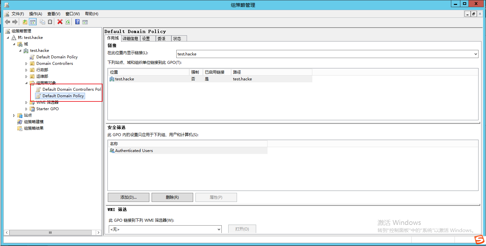

对于组策略，我们一般关心两点：

- 这条组策略链接到哪里。

- 这条组策略的内容是啥。

## 组策略链接

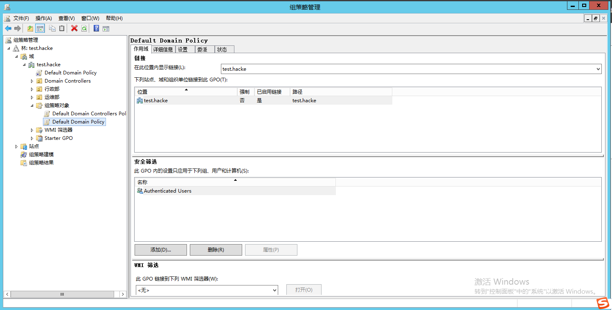

在右边的作用域里面，我们可以看到他链接到test.local整个域，也就是说在test.local域内的所有计算机，用户都会受到这条组策略的影响。链接的位置可以是站点，域，以及OU

## 组策略内容

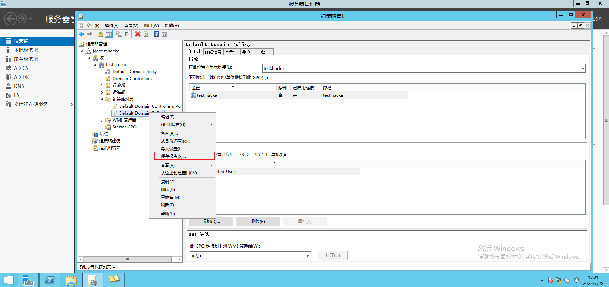

我们右键保存报告，可以将组策略的内容导出为htlm。

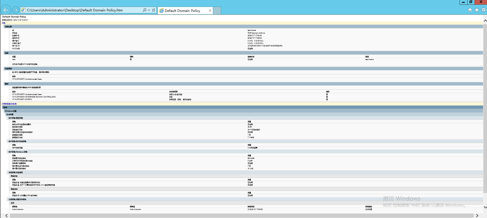

对于`Default Domain Policy`这条组策略，我们可以看到他配置的一些内容，设置密码最长期限为42天。

最短密码长度为7个字符等。如果我们想配置这条组策略的内容，在组策略条目上右键编辑，我们就可以打开组策略编辑器。

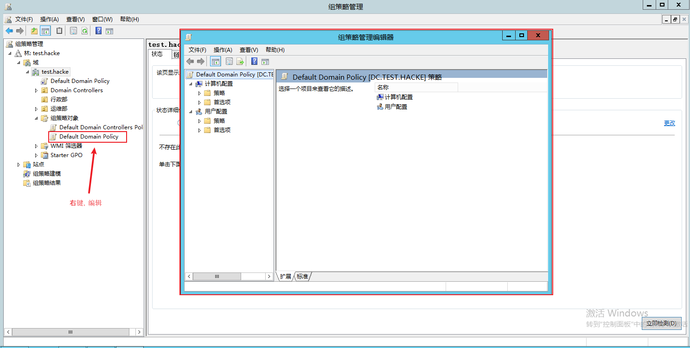

我们可以看到左边分为`计算机配置`以及`用户配置`。在里面的配置分别作用于计算机和用户。

在配置底下又分为策略以及首选项。首选项是Windows Server 2008发布后用来对GPO中的组策略提供额外的功能。策略和首选项的不同之处就在于强制性。策略是受管理的、强制实施的。而首选项则是不受管理的、非强制性的。

对于很多系统设置来说，管理员既可以通过策略设置来实现，也可以通过首选项来实现，二者有相当一部分的重叠。

## 组策略更新

默认情况下，客户端更新组策略的方式主要有：

1. 后台轮询，查看sysvol 里面GPT.ini，如果版本高于本地保存的组策略版本，客户端将会更新本地的组策略。轮询的时间是，默认情况下，计算机组策略会在后台每隔 90 分钟更新一次，并将时间作 0 到 30 分钟的随机调整。域控制器上的组策略会每隔 5 分钟更新一次。

2. 计算机开机，用户登录时，查看sysvol 里面GPT.ini，如果版本高于本地保存的组策略版本，客户端将会更新本地的组策略。

3. 客户端强制更新，执行`gupdate /force`。域控强制客户端更新，执行 `Invoke-GPUpdate -Computer "TEST\win10" -Target "User"`

**如果域控制器强制客户端刷新组策略，那么不会比较域共享目录中组策略的版本**

# 组策略高级介绍

## 组策略存储

每条组策略，可以看做是存储在域级别的一个虚拟对象。我们叫做GPO，每个GPO有唯一标志。用来标识每条组策略(或者说每个GPO)

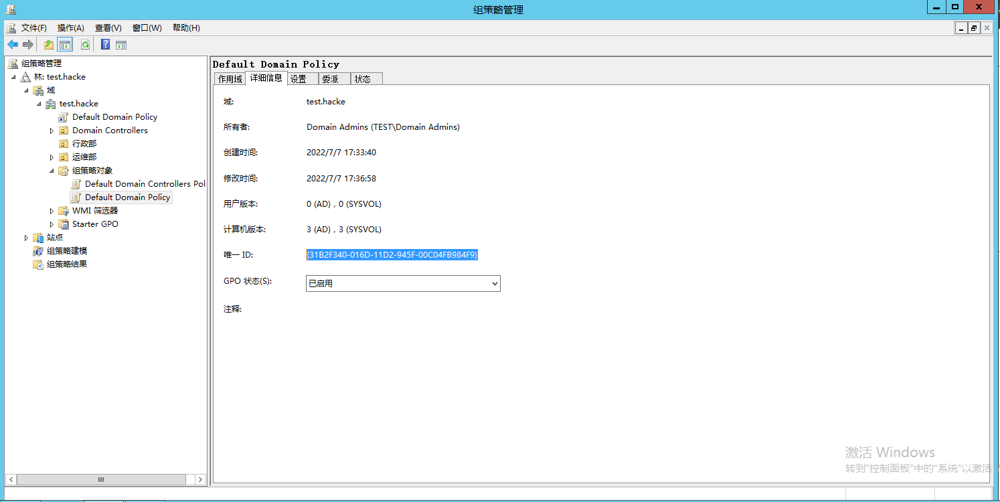

那GPO 在域内的怎么存储的，他分为两个部分：

- GPC
- GPT

GPC 位于LDAP中，`CN=Policies,CN=System,<BaseDn>`底下，每个条目对应一个GPC，其中包含GPO属性，例如版本信息，GPO状态和其他组件设置。

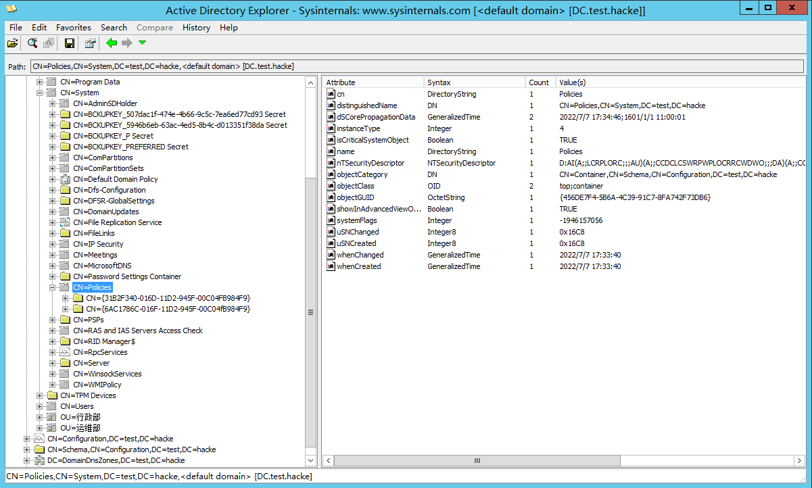

GPC 里面的属性gPCFileSysPath链接到GPT里面。GPT 是是一个文件系统文件夹，其中包含由.adm文件，安全设置，脚本文件以及有关可用于安装的应用程序的信息指定的策略数据。GPT位于域\Policies子文件夹中的SysVol中。基本上组策略的配制信息都位于GPT里面。

以`Default Domain Policy`为例。他对应的GPC是`CN={31B2F340-016D-11D2-945F-00C04FB984F9},CN=Policies,CN=System,DC=test,DC=hcake`,`displayName`是`Default Domain Policy`。

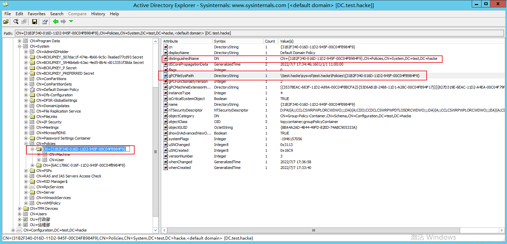

通过`gPCFileSysPath`关联到GPT`\\test.hacke\sysvol\test.hacke\Policies\{31B2F340-016D-11D2-945F-00C04FB984F9}`这个文件夹。GPT里面包含了一些策略数据。`\\test.hacke\sysvol\test.hacke\Policies\{31B2F340-016D-11D2-945F-00C04FB984F9}\MACHINE\Microsoft\Windows NT\SecEdit`

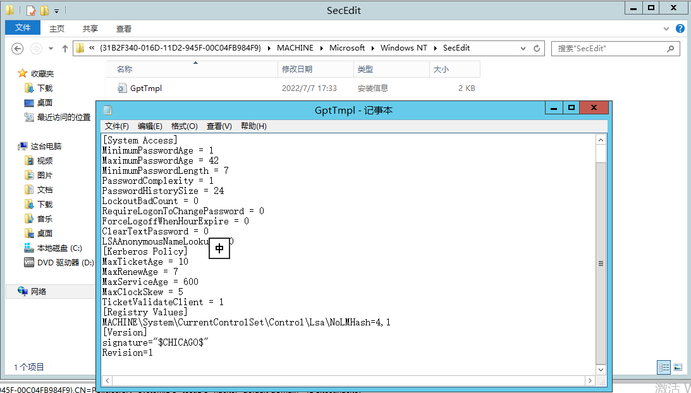

## WMI筛选

在之前，我们通过链接，将组策略链接到站点，工作组，OU。然后作用于链接对象的计算机，用户。但是如果有新的需求，我要作用于部分计算机，用户。比如说作用于所有WIN7 的电脑，这个时候微软提供了另外一项技术，叫WMI筛选。他复用了windows 本身的wmic 技术，每一个建立的WMI筛选器都可以连接到不同的现有组策略对象，一旦产生关联与应用之后，只要组织单位中的目标计算机符合WMI筛选器所设置的条件，那么这项组策略对象将会生效。

举个例子，作用于所有大于Windows 8.1的电脑。

```
Select BuildNumber from Win32_OperatingSystem WHERE BuildNumber >= 9200
```

# 组策略相关的ACL

我们主要关心以下权限。有个需要注意的是，底下有一些权限是对某个属性的WriteProperty，但是 不管啥属性的WriteProperty，拥有(WriteDacl，WriteOwner，GenericWrite，GenericAll，Full Control)这 些权限，都包括了对某个属性的WriteProperty。

## 创建GPO权限

创建GPO的权限其实就是对`CN=Policies,CN=System,<BaseDn>`具备CreateChild的权限

## GPO链接的权限

之前我们说到在域，站点，OU上面有个属性gPLink来标识链接到这里的组策略。所以我们只要遍历所有的域，站点，OU 上面的所有ACE，如果有对gPLink属性或者gPOpptions属性的修改权限，就可以修改这个这个域/站点/OU链接的OU

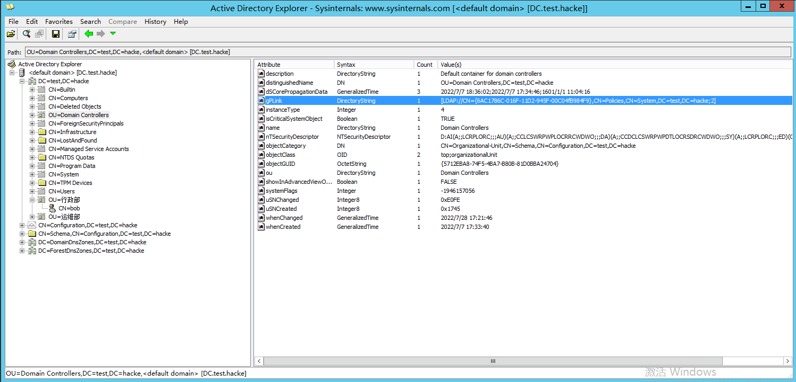

## 修改现有的GPO的权限

修改现有的GPO权限主要关注连个问题

- GPC链接到GPT的权限
- 修改GPT的权限

上面提到过，GPC 与 GPT之间的关联是GPC有个属性`gPCFileSysPath`关联到GPT。我们只需要查找对这个属性的WriteProperty就行。

修改GPT的权限，由于GPT 是文件夹的形式，并不在LDAP里面，因此我们得使用一款能查看文件夹ACL的工具，这里我使用系统自带的icacls。

```
icacls \\test.hacke\sysvol\test.hacke\scripts\*
icacls \\test.hacke\sysvol\test.hacke\policies\*
```

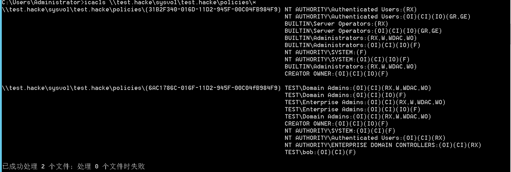

从图片不难看出，administrator对`{31B2F340-016D-11D2-945F-00C04FB984F9}`这条组策略的GPT具有完全控制的权限

bob对`{6AC1786C-016F-11D2-945F-00C04fB984F9}`这条组策略的GPT具有完全控制的权限

前面我们又说到基本上组策略的配制信息都位于GPT里面。因为可以修改GPT，就等同于可以随意修改组策略配置。

# 组策略扩展

在拿到域控之后，有时候可能网络ACL 到达不了目标电脑，可以通过组策略进行横向。下面列举几种横向的方法。

- 在软件安装下推出.msi

- 推出特定的启动脚本
- 计划任务